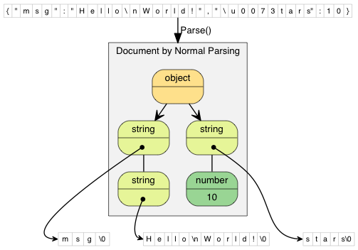
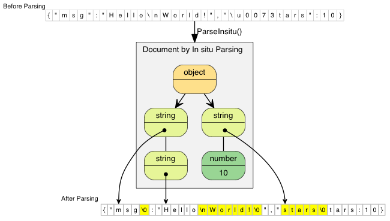

# DOM

Document Object Model(DOM) is an in-memory representation of JSON for query and manipulation. The basic usage of DOM is described in [Tutorial](doc/tutorial.md). This section will describe some details and more advanced usages.

[TOC]

# Template {#Template}

In the tutorial,  `Value` and `Document` was used. Similarly to `std::string`, these are actually `typedef` of template classes:

~~~~~~~~~~cpp
namespace rapidjson {

template <typename Encoding, typename Allocator = MemoryPoolAllocator<> >
class GenericValue {
    // ...
};

template <typename Encoding, typename Allocator = MemoryPoolAllocator<> >
class GenericDocument : public GenericValue<Encoding, Allocator> {
    // ...
};

typedef GenericValue<UTF8<> > Value;
typedef GenericDocument<UTF8<> > Document;

} // namespace rapidjson
~~~~~~~~~~

User can customize these template parameters.

## Encoding {#Encoding}

The `Encoding` parameter specifies the encoding of JSON String value in memory. Possible options are `UTF8`, `UTF16`, `UTF32`. Note that, these 3 types are also template class. `UTF8<>` is `UTF8<char>`, which means using char to store the characters. You may refer to [Encoding](doc/encoding.md) for details.

Suppose a Windows application would query localization strings stored in JSON files. Unicode-enabled functions in Windows use UTF-16 (wide character) encoding. No matter what encoding was used in JSON files, we can store the strings in UTF-16 in memory.

~~~~~~~~~~cpp
using namespace rapidjson;

typedef GenericDocument<UTF16<> > WDocument;
typedef GenericValue<UTF16<> > WValue;

FILE* fp = fopen("localization.json", "rb"); // non-Windows use "r"

char readBuffer[256];
FileReadStream bis(fp, readBuffer, sizeof(readBuffer));

AutoUTFInputStream<unsigned, FileReadStream> eis(bis);  // wraps bis into eis

WDocument d;
d.ParseStream<0, AutoUTF<unsigned> >(eis);

const WValue locale(L"ja"); // Japanese

MessageBoxW(hWnd, d[locale].GetString(), L"Test", MB_OK);
~~~~~~~~~~

## Allocator {#Allocator}

The `Allocator` defines which allocator class is used when allocating/deallocating memory for `Document`/`Value`. `Document` owns, or references to an `Allocator` instance. On the other hand, `Value` does not do so, in order to reduce memory consumption.

The default allocator used in `GenericDocument` is `MemoryPoolAllocator`. This allocator actually allocate memory sequentially, and cannot deallocate one by one. This is very suitable when parsing a JSON into a DOM tree.

Another allocator is `CrtAllocator`, of which CRT is short for C RunTime library. This allocator simply calls the standard `malloc()`/`realloc()`/`free()`. When there is a lot of add and remove operations, this allocator may be preferred. But this allocator is far less efficient than `MemoryPoolAllocator`.

# Parsing {#Parsing}

`Document` provides several functions for parsing. In below, (1) is the fundamental function, while the others are helpers which call (1).

~~~~~~~~~~cpp
using namespace rapidjson;

// (1) Fundamental
template <unsigned parseFlags, typename SourceEncoding, typename InputStream>
GenericDocument& GenericDocument::ParseStream(InputStream& is);

// (2) Using the same Encoding for stream
template <unsigned parseFlags, typename InputStream>
GenericDocument& GenericDocument::ParseStream(InputStream& is);

// (3) Using default parse flags
template <typename InputStream>
GenericDocument& GenericDocument::ParseStream(InputStream& is);

// (4) In situ parsing
template <unsigned parseFlags>
GenericDocument& GenericDocument::ParseInsitu(Ch* str);

// (5) In situ parsing, using default parse flags
GenericDocument& GenericDocument::ParseInsitu(Ch* str);

// (6) Normal parsing of a string
template <unsigned parseFlags, typename SourceEncoding>
GenericDocument& GenericDocument::Parse(const Ch* str);

// (7) Normal parsing of a string, using same Encoding of Document
template <unsigned parseFlags>
GenericDocument& GenericDocument::Parse(const Ch* str);

// (8) Normal parsing of a string, using default parse flags
GenericDocument& GenericDocument::Parse(const Ch* str);
~~~~~~~~~~

The examples of [tutorial](doc/tutorial.md) uses (8) for normal parsing of string. The examples of [stream](doc/stream.md) uses the first three. *In situ* parsing will be described soon.

The `parseFlags` are combination of the following bit-flags:

Parse flags                   | Meaning
------------------------------|-----------------------------------
`kParseNoFlags`               | No flag is set.
`kParseDefaultFlags`          | Default parse flags. It is equal to macro `RAPIDJSON_PARSE_DEFAULT_FLAGS`, which is defined as `kParseNoFlags`.
`kParseInsituFlag`            | In-situ(destructive) parsing.
`kParseValidateEncodingFlag`  | Validate encoding of JSON strings.
`kParseIterativeFlag`         | Iterative(constant complexity in terms of function call stack size) parsing.
`kParseStopWhenDoneFlag`      | After parsing a complete JSON root from stream, stop further processing the rest of stream. When this flag is used, parser will not generate `kParseErrorDocumentRootNotSingular` error. Using this flag for parsing multiple JSONs in the same stream.
`kParseFullPrecisionFlag`     | Parse number in full precision (slower). If this flag is not set, the normal precision (faster) is used. Normal precision has maximum 3 [ULP](http://en.wikipedia.org/wiki/Unit_in_the_last_place) error.
`kParseCommentsFlag`          | Allow one-line `// ...` and multi-line `/* ... */` comments (relaxed JSON syntax).
`kParseNumbersAsStringsFlag`  | Parse numerical type values as strings.
`kParseTrailingCommasFlag`    | Allow trailing commas at the end of objects and arrays (relaxed JSON syntax).
`kParseNanAndInfFlag`         | Allow parsing `NaN`, `Inf`, `Infinity`, `-Inf` and `-Infinity` as `double` values (relaxed JSON syntax).
`kParseEscapedApostropheFlag` | Allow escaped apostrophe `\'` in strings (relaxed JSON syntax).

By using a non-type template parameter, instead of a function parameter, C++ compiler can generate code which is optimized for specified combinations, improving speed, and reducing code size (if only using a single specialization). The downside is the flags needed to be determined in compile-time.

The `SourceEncoding` parameter defines what encoding is in the stream. This can be differed to the `Encoding` of the `Document`. See [Transcoding and Validation](#TranscodingAndValidation) section for details.

And the `InputStream` is type of input stream.

## Parse Error {#ParseError}

When the parse processing succeeded, the `Document` contains the parse results. When there is an error, the original DOM is *unchanged*. And the error state of parsing can be obtained by `bool HasParseError()`,  `ParseErrorCode GetParseError()` and `size_t GetErrorOffset()`.

Parse Error Code                            | Description
--------------------------------------------|---------------------------------------------------
`kParseErrorNone`                           | No error.
`kParseErrorDocumentEmpty`                  | The document is empty.
`kParseErrorDocumentRootNotSingular`        | The document root must not follow by other values.
`kParseErrorValueInvalid`                   | Invalid value.
`kParseErrorObjectMissName`                 | Missing a name for object member.
`kParseErrorObjectMissColon`                | Missing a colon after a name of object member.
`kParseErrorObjectMissCommaOrCurlyBracket`  | Missing a comma or `}` after an object member.
`kParseErrorArrayMissCommaOrSquareBracket`  | Missing a comma or `]` after an array element.
`kParseErrorStringUnicodeEscapeInvalidHex`  | Incorrect hex digit after `\\u` escape in string.
`kParseErrorStringUnicodeSurrogateInvalid`  | The surrogate pair in string is invalid.
`kParseErrorStringEscapeInvalid`            | Invalid escape character in string.
`kParseErrorStringMissQuotationMark`        | Missing a closing quotation mark in string.
`kParseErrorStringInvalidEncoding`          | Invalid encoding in string.
`kParseErrorNumberTooBig`                   | Number too big to be stored in `double`.
`kParseErrorNumberMissFraction`             | Miss fraction part in number.
`kParseErrorNumberMissExponent`             | Miss exponent in number.

The offset of error is defined as the character number from beginning of stream. Currently RapidJSON does not keep track of line number.

To get an error message, RapidJSON provided a English messages in `rapidjson/error/en.h`. User can customize it for other locales, or use a custom localization system.

Here shows an example of parse error handling.

~~~~~~~~~~cpp
#include "rapidjson/document.h"
#include "rapidjson/error/en.h"

// ...
Document d;
if (d.Parse(json).HasParseError()) {
    fprintf(stderr, "\nError(offset %u): %s\n", 
        (unsigned)d.GetErrorOffset(),
        GetParseError_En(d.GetParseError()));
    // ...
}
~~~~~~~~~~

## In Situ Parsing {#InSituParsing}

From [Wikipedia](http://en.wikipedia.org/wiki/In_situ):

> *In situ* ... is a Latin phrase that translates literally to "on site" or "in position". It means "locally", "on site", "on the premises" or "in place" to describe an event where it takes place, and is used in many different contexts.
> ...
> (In computer science) An algorithm is said to be an in situ algorithm, or in-place algorithm, if the extra amount of memory required to execute the algorithm is O(1), that is, does not exceed a constant no matter how large the input. For example, heapsort is an in situ sorting algorithm.

In normal parsing process, a large overhead is to decode JSON strings and copy them to other buffers. *In situ* parsing decodes those JSON string at the place where it is stored. It is possible in JSON because the length of decoded string is always shorter than or equal to the one in JSON. In this context, decoding a JSON string means to process the escapes, such as `"\n"`, `"\u1234"`, etc., and add a null terminator (`'\0'`)at the end of string.

The following diagrams compare normal and *in situ* parsing. The JSON string values contain pointers to the decoded string.

In normal parsing, the decoded string are copied to freshly allocated buffers. `"\\n"` (2 characters) is decoded as `"\n"` (1 character). `"\\u0073"` (6 characters) is decoded as `"s"` (1 character).

*In situ* parsing just modified the original JSON. Updated characters are highlighted in the diagram. If the JSON string does not contain escape character, such as `"msg"`, the parsing process merely replace the closing double quotation mark with a null character.

Since *in situ* parsing modify the input, the parsing API needs `char*` instead of `const char*`.

~~~~~~~~~~cpp
// Read whole file into a buffer
FILE* fp = fopen("test.json", "r");
fseek(fp, 0, SEEK_END);
size_t filesize = (size_t)ftell(fp);
fseek(fp, 0, SEEK_SET);
char* buffer = (char*)malloc(filesize + 1);
size_t readLength = fread(buffer, 1, filesize, fp);
buffer[readLength] = '\0';
fclose(fp);

// In situ parsing the buffer into d, buffer will also be modified
Document d;
d.ParseInsitu(buffer);

// Query/manipulate the DOM here...

free(buffer);
// Note: At this point, d may have dangling pointers pointed to the deallocated buffer.
~~~~~~~~~~

The JSON strings are marked as const-string. But they may not be really "constant". The life cycle of it depends on the JSON buffer.

In situ parsing minimizes allocation overheads and memory copying. Generally this improves cache coherence, which is an important factor of performance in modern computer.

There are some limitations of *in situ* parsing:

1. The whole JSON is in memory.
2. The source encoding in stream and target encoding in document must be the same.
3. The buffer need to be retained until the document is no longer used.
4. If the DOM need to be used for long period after parsing, and there are few JSON strings in the DOM, retaining the buffer may be a memory waste.

*In situ* parsing is mostly suitable for short-term JSON that only need to be processed once, and then be released from memory. In practice, these situation is very common, for example, deserializing JSON to C++ objects, processing web requests represented in JSON, etc.

## Transcoding and Validation {#TranscodingAndValidation}

RapidJSON supports conversion between Unicode formats (officially termed UCS Transformation Format) internally. During DOM parsing, the source encoding of the stream can be different from the encoding of the DOM. For example, the source stream contains a UTF-8 JSON, while the DOM is using UTF-16 encoding. There is an example code in [EncodedInputStream](doc/stream.md).

When writing a JSON from DOM to output stream, transcoding can also be used. An example is in [EncodedOutputStream](doc/stream.md).

During transcoding, the source string is decoded to into Unicode code points, and then the code points are encoded in the target format. During decoding, it will validate the byte sequence in the source string. If it is not a valid sequence, the parser will be stopped with `kParseErrorStringInvalidEncoding` error.

When the source encoding of stream is the same as encoding of DOM, by default, the parser will *not* validate the sequence. User may use `kParseValidateEncodingFlag` to force validation.

# Techniques {#Techniques}

Some techniques about using DOM API is discussed here.

## DOM as SAX Event Publisher

In RapidJSON, stringifying a DOM with `Writer` may be look a little bit weird.

~~~~~~~~~~cpp
// ...
Writer<StringBuffer> writer(buffer);
d.Accept(writer);
~~~~~~~~~~

Actually, `Value::Accept()` is responsible for publishing SAX events about the value to the handler. With this design, `Value` and `Writer` are decoupled. `Value` can generate SAX events, and `Writer` can handle those events.

User may create custom handlers for transforming the DOM into other formats. For example, a handler which converts the DOM into XML.

For more about SAX events and handler, please refer to [SAX](doc/sax.md).

## User Buffer {#UserBuffer}

Some applications may try to avoid memory allocations whenever possible.

`MemoryPoolAllocator` can support this by letting user to provide a buffer. The buffer can be on the program stack, or a "scratch buffer" which is statically allocated (a static/global array) for storing temporary data.

`MemoryPoolAllocator` will use the user buffer to satisfy allocations. When the user buffer is used up, it will allocate a chunk of memory from the base allocator (by default the `CrtAllocator`).

Here is an example of using stack memory. The first allocator is for storing values, while the second allocator is for storing temporary data during parsing.

~~~~~~~~~~cpp
typedef GenericDocument<UTF8<>, MemoryPoolAllocator<>, MemoryPoolAllocator<>> DocumentType;
char valueBuffer[4096];
char parseBuffer[1024];
MemoryPoolAllocator<> valueAllocator(valueBuffer, sizeof(valueBuffer));
MemoryPoolAllocator<> parseAllocator(parseBuffer, sizeof(parseBuffer));
DocumentType d(&valueAllocator, sizeof(parseBuffer), &parseAllocator);
d.Parse(json);
~~~~~~~~~~

If the total size of allocation is less than 4096+1024 bytes during parsing, this code does not invoke any heap allocation (via `new` or `malloc()`) at all.

User can query the current memory consumption in bytes via `MemoryPoolAllocator::Size()`. And then user can determine a suitable size of user buffer.
