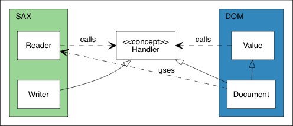
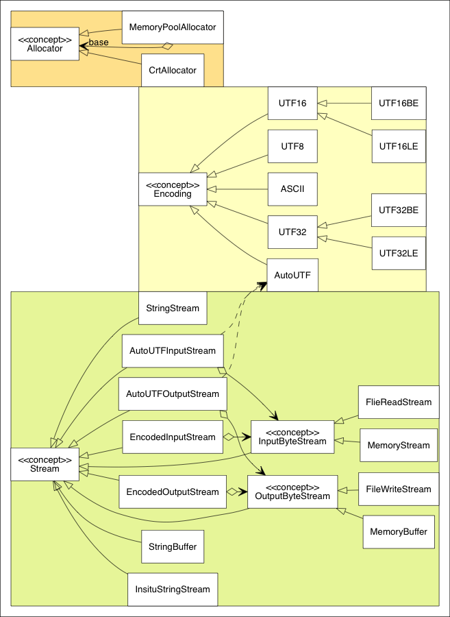
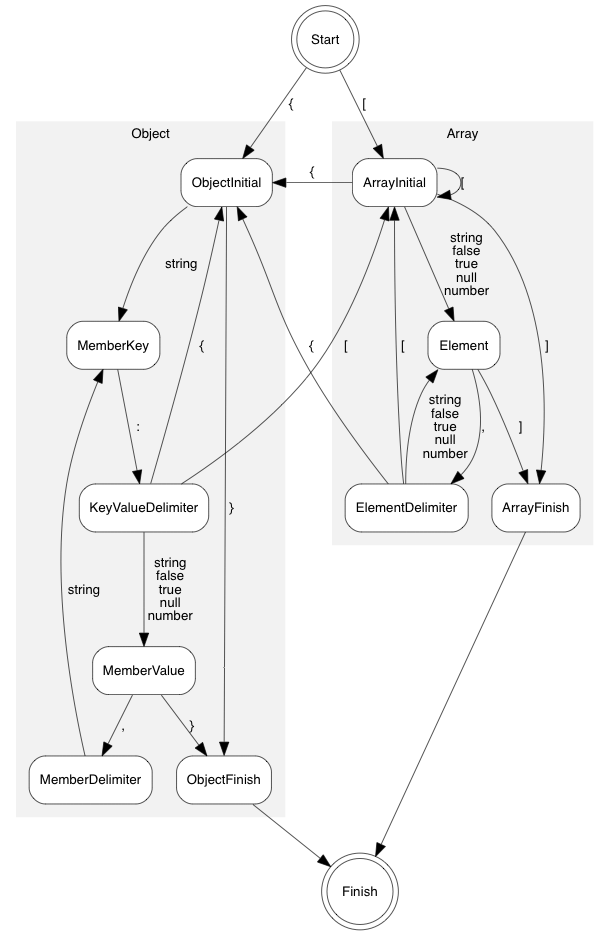

# 内部架构

本部分记录了一些设计和实现细节。

[TOC]

# 架构 {#Architecture}

## SAX 和 DOM

下面的 UML 图显示了 SAX 和 DOM 的基本关系。

关系的核心是 `Handler` 概念。在 SAX 一边，`Reader` 从流解析 JSON 并将事件发送到 `Handler`。`Writer` 实现了 `Handler` 概念，用于处理相同的事件。在 DOM 一边，`Document` 实现了 `Handler` 概念，用于通过这些时间来构建 DOM。`Value` 支持了 `Value::Accept(Handler&)` 函数，它可以将 DOM 转换为事件进行发送。

在这个设计，SAX 是不依赖于 DOM 的。甚至 `Reader` 和 `Writer` 之间也没有依赖。这提供了连接事件发送器和处理器的灵活性。除此之外，`Value` 也是不依赖于 SAX 的。所以，除了将 DOM 序列化为 JSON 之外，用户也可以将其序列化为 XML，或者做任何其他事情。

## 工具类

SAX 和 DOM API 都依赖于3个额外的概念：`Allocator`、`Encoding` 和 `Stream`。它们的继承层次结构如下图所示。

# 值（Value） {#Value}

`Value` （实际上被定义为 `GenericValue<UTF8<>>`）是 DOM API 的核心。本部分描述了它的设计。

## 数据布局 {#DataLayout}

`Value` 是[可变类型](http://en.wikipedia.org/wiki/Variant_type)。在 RapidJSON 的上下文中，一个 `Value` 的实例可以包含6种 JSON 数据类型之一。通过使用 `union` ，这是可能实现的。每一个 `Value` 包含两个成员：`union Data data_` 和 `unsigned flags_`。`flags_` 表明了 JSON 类型，以及附加的信息。

下表显示了所有类型的数据布局。32位/64位列表明了字段所占用的字节数。

| Null              |                                  | 32位 | 64位 |
|-------------------|----------------------------------|:----:|:----:|
| （未使用）        |                                  |4     |8     |
| （未使用）        |                                  |4     |4     |
| （未使用）        |                                  |4     |4     |
| `unsigned flags_` | `kNullType kNullFlag`            |4     |4     |

| Bool              |                                                    | 32位 | 64位 |
|-------------------|----------------------------------------------------|:----:|:----:|
| （未使用）        |                                                    |4     |8     |
| （未使用）        |                                                    |4     |4     |
| （未使用）        |                                                    |4     |4     |
| `unsigned flags_` | `kBoolType` (either `kTrueFlag` or `kFalseFlag`)   |4     |4     |

| String              |                                     | 32位 | 64位 |
|---------------------|-------------------------------------|:----:|:----:|
| `Ch* str`           | 指向字符串的指针（可能拥有所有权）  |4     |8     |
| `SizeType length`   | 字符串长度                          |4     |4     |
| （未使用）          |                                     |4     |4     |
| `unsigned flags_`   | `kStringType kStringFlag ...`       |4     |4     |

| Object              |                                     | 32位 | 64位 |
|---------------------|-------------------------------------|:----:|:----:|
| `Member* members`   | 指向成员数组的指针（拥有所有权）    |4     |8     |
| `SizeType size`     | 成员数量                            |4     |4     |
| `SizeType capacity` | 成员容量                            |4     |4     |
| `unsigned flags_`   | `kObjectType kObjectFlag`           |4     |4     |

| Array               |                                     | 32位 | 64位 |
|---------------------|-------------------------------------|:----:|:----:|
| `Value* values`     | 指向值数组的指针（拥有所有权）      |4     |8     |
| `SizeType size`     | 值数量                              |4     |4     |
| `SizeType capacity` | 值容量                              |4     |4     |
| `unsigned flags_`   | `kArrayType kArrayFlag`             |4     |4     |

| Number (Int)        |                                     | 32位 | 64位 |
|---------------------|-------------------------------------|:----:|:----:|
| `int i`             | 32位有符号整数                      |4     |4     |
| （零填充）          | 0                                   |4     |4     |
| （未使用）          |                                     |4     |8     |
| `unsigned flags_`   | `kNumberType kNumberFlag kIntFlag kInt64Flag ...` |4     |4     |

| Number (UInt)       |                                     | 32位 | 64位 |
|---------------------|-------------------------------------|:----:|:----:|
| `unsigned u`        | 32位无符号整数                      |4     |4     |
| （零填充）          | 0                                   |4     |4     |
| （未使用）          |                                     |4     |8     |
| `unsigned flags_`   | `kNumberType kNumberFlag kUintFlag kUint64Flag ...` |4     |4     |

| Number (Int64)      |                                     | 32位 | 64位 |
|---------------------|-------------------------------------|:----:|:----:|
| `int64_t i64`       | 64位有符号整数                      |8     |8     |
| （未使用）          |                                     |4     |8     |
| `unsigned flags_`   | `kNumberType kNumberFlag kInt64Flag ...`          |4     |4     |

| Number (Uint64)     |                                     | 32位 | 64位 |
|---------------------|-------------------------------------|:----:|:----:|
| `uint64_t i64`      | 64位无符号整数                      |8     |8     |
| （未使用）          |                                     |4     |8     |
| `unsigned flags_`   | `kNumberType kNumberFlag kInt64Flag ...`          |4     |4     |

| Number (Double)     |                                     | 32位 | 64位 |
|---------------------|-------------------------------------|:----:|:----:|
| `uint64_t i64`      | 双精度浮点数                        |8     |8     |
| （未使用）          |                                     |4     |8     |
| `unsigned flags_`   |`kNumberType kNumberFlag kDoubleFlag`|4     |4     |

这里有一些需要注意的地方：
* 为了减少在64位架构上的内存消耗，`SizeType` 被定义为 `unsigned` 而不是 `size_t`。
* 32位整数的零填充可能被放在实际类型的前面或后面，这依赖于字节序。这使得它可以将32位整数不经过任何转换就可以解释为64位整数。
* `Int` 永远是 `Int64`，反之不然。

## 标志 {#Flags}

32位的 `flags_` 包含了 JSON 类型和其他信息。如前文中的表所述，每一种 JSON 类型包含了冗余的 `kXXXType` 和 `kXXXFlag`。这个设计是为了优化测试位标志（`IsNumber()`）和获取每一种类型的序列号（`GetType()`）。

字符串有两个可选的标志。`kCopyFlag` 表明这个字符串拥有字符串拷贝的所有权。而 `kInlineStrFlag` 意味着使用了[短字符串优化](#ShortString)。

数字更加复杂一些。对于普通的整数值，它可以包含 `kIntFlag`、`kUintFlag`、 `kInt64Flag` 和/或 `kUint64Flag`，这由整数的范围决定。带有小数或者超过64位所能表达的范围的整数的数字会被存储为带有 `kDoubleFlag` 的 `double`。

## 短字符串优化 {#ShortString}

[Kosta](https://github.com/Kosta-Github) 提供了很棒的短字符串优化。这个优化的xxx如下所述。除去 `flags_` ，`Value` 有12或16字节（对于32位或64位）来存储实际的数据。这为在其内部直接存储短字符串而不是存储字符串的指针创造了可能。对于1字节的字符类型（例如 `char`），它可以在 `Value` 类型内部存储至多11或15个字符的字符串。

|ShortString (Ch=char)|                                     | 32位 | 64位 |
|---------------------|-------------------------------------|:----:|:----:|
| `Ch str[MaxChars]`  | 字符串缓冲区                        |11    |15    |
| `Ch invLength`      | MaxChars - Length                   |1     |1     |
| `unsigned flags_`   | `kStringType kStringFlag ...`       |4     |4     |

这里使用了一项特殊的技术。它存储了 (MaxChars - length) 而不直接存储字符串的长度。这使得存储11个字符并且带有后缀 `\0` 成为可能。

这个优化可以减少字符串拷贝内存占用。它也改善了缓存一致性，并进一步提高了运行时性能。

# 分配器（Allocator） {#InternalAllocator}

`Allocator` 是 RapidJSON 中的概念：
~~~cpp
concept Allocator {
    static const bool kNeedFree;    //!< 表明这个分配器是否需要调用 Free()。

    // 申请内存块。
    // \param size 内存块的大小，以字节记。
    // \returns 指向内存块的指针。
    void* Malloc(size_t size);

    // 调整内存块的大小。
    // \param originalPtr 当前内存块的指针。空指针是被允许的。
    // \param originalSize 当前大小，以字节记。（设计问题：因为有些分配器可能不会记录它，显示的传递它可以节约内存。）
    // \param newSize 新大小，以字节记。
    void* Realloc(void* originalPtr, size_t originalSize, size_t newSize);

    // 释放内存块。
    // \param ptr 指向内存块的指针。空指针是被允许的。
    static void Free(void *ptr);
};
~~~

需要注意的是 `Malloc()` 和 `Realloc()` 是成员函数而 `Free()` 是静态成员函数。

## MemoryPoolAllocator {#MemoryPoolAllocator}

`MemoryPoolAllocator` 是 DOM 的默认内存分配器。它只申请内存而不释放内存。这对于构建 DOM 树非常合适。

在它的内部，它从基础的内存分配器申请内存块（默认为 `CrtAllocator`）并将这些内存块存储为单向链表。当用户请求申请内存，它会遵循下列步骤来申请内存：

1. 如果可用，使用用户提供的缓冲区。（见 [User Buffer section in DOM](doc/dom.md)）
2. 如果用户提供的缓冲区已满，使用当前内存块。
3. 如果当前内存块已满，申请新的内存块。

# 解析优化 {#ParsingOptimization}

## 使用 SIMD 跳过空格 {#SkipwhitespaceWithSIMD}

当从流中解析 JSON 时，解析器需要跳过4种空格字符：

1. 空格 (`U+0020`)
2. 制表符 (`U+000B`)
3. 换行 (`U+000A`)
4. 回车 (`U+000D`)

这是一份简单的实现：
~~~cpp
void SkipWhitespace(InputStream& s) {
    while (s.Peek() == ' ' || s.Peek() == '\n' || s.Peek() == '\r' || s.Peek() == '\t')
        s.Take();
}
~~~

但是，这需要对每个字符进行4次比较以及一些分支。这被发现是一个热点。

为了加速这一处理，RapidJSON 使用 SIMD 来在一次迭代中比较16个字符和4个空格。目前 RapidJSON 支持 SSE2 ， SSE4.2 和 ARM Neon 指令。同时它也只会对 UTF-8 内存流启用，包括字符串流或 *原位* 解析。

你可以通过在包含 `rapidjson.h` 之前定义 `RAPIDJSON_SSE2` ， `RAPIDJSON_SSE42` 或 `RAPIDJSON_NEON` 来启用这个优化。一些编译器可以检测这个设置，如 `perftest.h`：

~~~cpp
// __SSE2__ 和 __SSE4_2__ 可被 gcc、clang 和 Intel 编译器识别：
// 如果支持的话，我们在 gmake 中使用了 -march=native 来启用 -msse2 和 -msse4.2
// 同样的， __ARM_NEON 被用于识别Neon
#if defined(__SSE4_2__)
#  define RAPIDJSON_SSE42
#elif defined(__SSE2__)
#  define RAPIDJSON_SSE2
#elif defined(__ARM_NEON)
#  define RAPIDJSON_NEON
#endif
~~~

需要注意的是，这是编译期的设置。在不支持这些指令的机器上运行可执行文件会使它崩溃。

### 页面对齐问题

在 RapidJSON 的早期版本中，被报告了[一个问题](https://code.google.com/archive/p/rapidjson/issues/104)：`SkipWhitespace_SIMD()` 会罕见地导致崩溃（约五十万分之一的几率）。在调查之后，怀疑是 `_mm_loadu_si128()` 访问了 `'\0'` 之后的内存，并越过被保护的页面边界。

在 [Intel® 64 and IA-32 Architectures Optimization Reference Manual
](http://www.intel.com/content/www/us/en/architecture-and-technology/64-ia-32-architectures-optimization-manual.html) 中，章节 10.2.1：

> 为了支持需要费对齐的128位 SIMD 内存访问的算法，调用者的内存缓冲区申请应当考虑添加一些填充空间，这样被调用的函数可以安全地将地址指针用于未对齐的128位 SIMD 内存操作。
> 在结合非对齐的 SIMD 内存操作中，最小的对齐大小应该等于 SIMD 寄存器的大小。

对于 RapidJSON 来说，这显然是不可行的，因为 RapidJSON 不应当强迫用户进行内存对齐。

为了修复这个问题，当前的代码会先按字节处理直到下一个对齐的地址。在这之后，使用对齐读取来进行 SIMD 处理。见 [#85](https://github.com/Tencent/rapidjson/issues/85)。

## 局部流拷贝 {#LocalStreamCopy}

在优化的过程中，我们发现一些编译器不能将访问流的一些成员数据放入局部变量或者寄存器中。测试结果显示，对于一些流类型，创建流的拷贝并将其用于内层循环中可以改善性能。例如，实际（非 SIMD）的 `SkipWhitespace()` 被实现为：

~~~cpp
template<typename InputStream>
void SkipWhitespace(InputStream& is) {
    internal::StreamLocalCopy<InputStream> copy(is);
    InputStream& s(copy.s);

    while (s.Peek() == ' ' || s.Peek() == '\n' || s.Peek() == '\r' || s.Peek() == '\t')
        s.Take();
}
~~~

基于流的特征，`StreamLocalCopy` 会创建（或不创建）流对象的拷贝，在局部使用它并将流的状态拷贝回原来的流。

## 解析为双精度浮点数 {#ParsingDouble}

将字符串解析为 `double` 并不简单。标准库函数 `strtod()` 可以胜任这项工作，但它比较缓慢。默认情况下，解析器使用默认的精度设置。这最多有 3[ULP](http://en.wikipedia.org/wiki/Unit_in_the_last_place) 的误差，并实现在 `internal::StrtodNormalPrecision()` 中。

当使用 `kParseFullPrecisionFlag` 时，编译器会改为调用 `internal::StrtodFullPrecision()` ，这个函数会自动调用三个版本的转换。
1. [Fast-Path](http://www.exploringbinary.com/fast-path-decimal-to-floating-point-conversion/)。
2. [double-conversion](https://github.com/floitsch/double-conversion) 中的自定义 DIY-FP 实现。
3. （Clinger, William D. How to read floating point numbers accurately. Vol. 25. No. 6. ACM, 1990） 中的大整数算法。

如果第一个转换方法失败，则尝试使用第二种方法，以此类推。

# 生成优化 {#GenerationOptimization}

## 整数到字符串的转换 {#itoa}

整数到字符串转换的朴素算法需要对每一个十进制位进行一次除法。我们实现了若干版本并在 [itoa-benchmark](https://github.com/miloyip/itoa-benchmark) 中对它们进行了评估。

虽然 SSE2 版本是最快的，但它和第二快的 `branchlut` 差距不大。而且 `branchlut` 是纯C++实现，所以我们在 RapidJSON 中使用了 `branchlut`。

## 双精度浮点数到字符串的转换 {#dtoa}

原来 RapidJSON 使用 `snprintf(..., ..., "%g")` 来进行双精度浮点数到字符串的转换。这是不准确的，因为默认的精度是6。随后我们发现它很缓慢，而且有其它的替代品。

Google 的 V8 [double-conversion](https://github.com/floitsch/double-conversion
) 实现了更新的、快速的被称为 Grisu3 的算法（Loitsch, Florian. "Printing floating-point numbers quickly and accurately with integers." ACM Sigplan Notices 45.6 (2010): 233-243.）。

然而，这个实现不是仅头文件的，所以我们实现了一个仅头文件的 Grisu2 版本。这个算法保证了结果永远精确。而且在大多数情况下，它会生成最短的（可选）字符串表示。

这个仅头文件的转换函数在 [dtoa-benchmark](https://github.com/miloyip/dtoa-benchmark) 中进行评估。

# 解析器 {#Parser}

## 迭代解析 {#IterativeParser}

迭代解析器是一个以非递归方式实现的递归下降的 LL(1) 解析器。

### 语法 {#IterativeParserGrammar}

解析器使用的语法是基于严格 JSON 语法的：
~~~~~~~~~~
S -> array | object
array -> [ values ]
object -> { members }
values -> non-empty-values | ε
non-empty-values -> value addition-values
addition-values -> ε | , non-empty-values
members -> non-empty-members | ε
non-empty-members -> member addition-members
addition-members -> ε | , non-empty-members
member -> STRING : value
value -> STRING | NUMBER | NULL | BOOLEAN | object | array
~~~~~~~~~~

注意到左因子被加入了非终结符的 `values` 和 `members` 来保证语法是 LL(1) 的。

### 解析表 {#IterativeParserParsingTable}

基于这份语法，我们可以构造 FIRST 和 FOLLOW 集合。

非终结符的 FIRST 集合如下所示：

|    NON-TERMINAL   |               FIRST              |
|:-----------------:|:--------------------------------:|
|       array       |                 [                |
|       object      |                 {                |
|       values      | ε STRING NUMBER NULL BOOLEAN { [ |
|  addition-values  |              ε COMMA             |
|      members      |             ε STRING             |
|  addition-members |              ε COMMA             |
|       member      |              STRING              |
|       value       |  STRING NUMBER NULL BOOLEAN { [  |
|         S         |                [ {               |
| non-empty-members |              STRING              |
|  non-empty-values |  STRING NUMBER NULL BOOLEAN { [  |

FOLLOW 集合如下所示：

|    NON-TERMINAL   |  FOLLOW |
|:-----------------:|:-------:|
|         S         |    $    |
|       array       | , $ } ] |
|       object      | , $ } ] |
|       values      |    ]    |
|  non-empty-values |    ]    |
|  addition-values  |    ]    |
|      members      |    }    |
| non-empty-members |    }    |
|  addition-members |    }    |
|       member      |   , }   |
|       value       |  , } ]  |

最终可以从 FIRST 和 FOLLOW 集合生成解析表：

|    NON-TERMINAL   |           [           |           {           |          ,          | : | ] | } |          STRING         |         NUMBER        |          NULL         |        BOOLEAN        |
|:-----------------:|:---------------------:|:---------------------:|:-------------------:|:-:|:-:|:-:|:-----------------------:|:---------------------:|:---------------------:|:---------------------:|
|         S         |         array         |         object        |                     |   |   |   |                         |                       |                       |                       |
|       array       |       [ values ]      |                       |                     |   |   |   |                         |                       |                       |                       |
|       object      |                       |      { members }      |                     |   |   |   |                         |                       |                       |                       |
|       values      |    non-empty-values   |    non-empty-values   |                     |   | ε |   |     non-empty-values    |    non-empty-values   |    non-empty-values   |    non-empty-values   |
|  non-empty-values | value addition-values | value addition-values |                     |   |   |   |  value addition-values  | value addition-values | value addition-values | value addition-values |
|  addition-values  |                       |                       |  , non-empty-values |   | ε |   |                         |                       |                       |                       |
|      members      |                       |                       |                     |   |   | ε |    non-empty-members    |                       |                       |                       |
| non-empty-members |                       |                       |                     |   |   |   | member addition-members |                       |                       |                       |
|  addition-members |                       |                       | , non-empty-members |   |   | ε |                         |                       |                       |                       |
|       member      |                       |                       |                     |   |   |   |      STRING : value     |                       |                       |                       |
|       value       |         array         |         object        |                     |   |   |   |          STRING         |         NUMBER        |          NULL         |        BOOLEAN        |

对于上面的语法分析，这里有一个很棒的[工具](http://hackingoff.com/compilers/predict-first-follow-set)。

### 实现 {#IterativeParserImplementation}

基于这份解析表，一个直接的（常规的）将规则反向入栈的实现可以正常工作。

在 RapidJSON 中，对直接的实现进行了一些修改：

首先，在 RapidJSON 中，这份解析表被编码为状态机。
规则由头部和主体组成。
状态转换由规则构造。
除此之外，额外的状态被添加到与 `array` 和 `object` 有关的规则。
通过这种方式，生成数组值或对象成员可以只用一次状态转移便可完成，
而不需要在直接的实现中的多次出栈/入栈操作。
这也使得估计栈的大小更加容易。

状态图如如下所示：

第二，迭代解析器也在内部栈保存了数组的值个数和对象成员的数量，这也与传统的实现不同。
