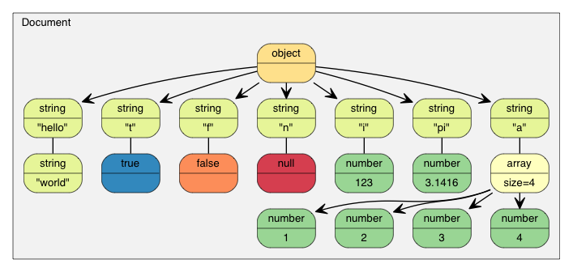
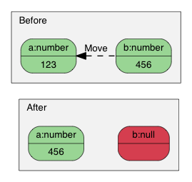
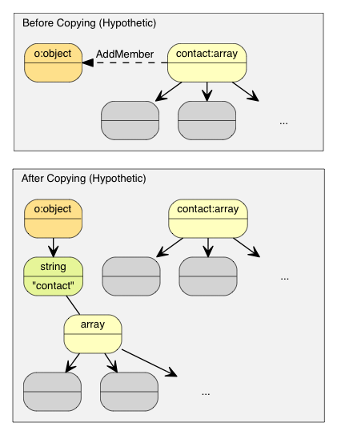
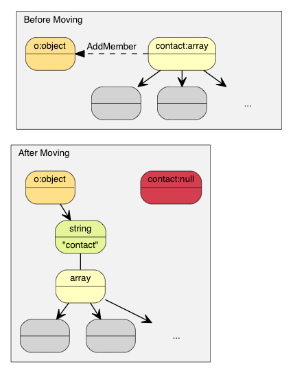

# 教程

本教程简介文件对象模型（Document Object Model, DOM）API。

如 [用法一览](../readme.zh-cn.md#用法一览) 中所示，可以解析一个 JSON 至 DOM，然后就可以轻松查询及修改 DOM，并最终转换回 JSON。

[TOC]

# Value 及 Document {#ValueDocument}

每个 JSON 值都储存为 `Value` 类，而 `Document` 类则表示整个 DOM，它存储了一个 DOM 树的根 `Value`。RapidJSON 的所有公开类型及函数都在 `rapidjson` 命名空间中。

# 查询 Value {#QueryValue}

在本节中，我们会使用到 `example/tutorial/tutorial.cpp` 中的代码片段。

假设我们用 C 语言的字符串储存一个 JSON（`const char* json`）：
~~~~~~~~~~js
{
    "hello": "world",
    "t": true ,
    "f": false,
    "n": null,
    "i": 123,
    "pi": 3.1416,
    "a": [1, 2, 3, 4]
}
~~~~~~~~~~

把它解析至一个 `Document`：
~~~~~~~~~~cpp
#include "rapidjson/document.h"

using namespace rapidjson;

// ...
Document document;
document.Parse(json);
~~~~~~~~~~

那么现在该 JSON 就会被解析至 `document` 中，成为一棵 *DOM 树 *:

自从 RFC 7159 作出更新，合法 JSON 文件的根可以是任何类型的 JSON 值。而在较早的 RFC 4627 中，根值只允许是 Object 或 Array。而在上述例子中，根是一个 Object。
~~~~~~~~~~cpp
assert(document.IsObject());
~~~~~~~~~~

让我们查询一下根 Object 中有没有 `"hello"` 成员。由于一个 `Value` 可包含不同类型的值，我们可能需要验证它的类型，并使用合适的 API 去获取其值。在此例中，`"hello"` 成员关联到一个 JSON String。
~~~~~~~~~~cpp
assert(document.HasMember("hello"));
assert(document["hello"].IsString());
printf("hello = %s\n", document["hello"].GetString());
~~~~~~~~~~

~~~~~~~~~~
world
~~~~~~~~~~

JSON True/False 值是以 `bool` 表示的。
~~~~~~~~~~cpp
assert(document["t"].IsBool());
printf("t = %s\n", document["t"].GetBool() ? "true" : "false");
~~~~~~~~~~

~~~~~~~~~~
true
~~~~~~~~~~

JSON Null 值可用 `IsNull()` 查询。
~~~~~~~~~~cpp
printf("n = %s\n", document["n"].IsNull() ? "null" : "?");
~~~~~~~~~~

~~~~~~~~~~
null
~~~~~~~~~~

JSON Number 类型表示所有数值。然而，C++ 需要使用更专门的类型。

~~~~~~~~~~cpp
assert(document["i"].IsNumber());

// 在此情况下，IsUint()/IsInt64()/IsUint64() 也会返回 true
assert(document["i"].IsInt());          
printf("i = %d\n", document["i"].GetInt());
// 另一种用法： (int)document["i"]

assert(document["pi"].IsNumber());
assert(document["pi"].IsDouble());
printf("pi = %g\n", document["pi"].GetDouble());
~~~~~~~~~~

~~~~~~~~~~
i = 123
pi = 3.1416
~~~~~~~~~~

JSON Array 包含一些元素。
~~~~~~~~~~cpp
// 使用引用来连续访问，方便之余还更高效。
const Value& a = document["a"];
assert(a.IsArray());
for (SizeType i = 0; i < a.Size(); i++) // 使用 SizeType 而不是 size_t
        printf("a[%d] = %d\n", i, a[i].GetInt());
~~~~~~~~~~

~~~~~~~~~~
a[0] = 1
a[1] = 2
a[2] = 3
a[3] = 4
~~~~~~~~~~

注意，RapidJSON 并不自动转换各种 JSON 类型。例如，对一个 String 的 Value 调用 `GetInt()` 是非法的。在调试模式下，它会被断言失败。在发布模式下，其行为是未定义的。

以下将会讨论有关查询各类型的细节。

## 查询 Array {#QueryArray}

缺省情况下，`SizeType` 是 `unsigned` 的 typedef。在多数系统中，Array 最多能存储 2^32-1 个元素。

你可以用整数字面量访问元素，如 `a[0]`、`a[1]`、`a[2]`。

Array 与 `std::vector` 相似，除了使用索引，也可使用迭代器来访问所有元素。
~~~~~~~~~~cpp
for (Value::ConstValueIterator itr = a.Begin(); itr != a.End(); ++itr)
    printf("%d ", itr->GetInt());
~~~~~~~~~~

还有一些熟悉的查询函数：
* `SizeType Capacity() const`
* `bool Empty() const`

### 范围 for 循环 (v1.1.0 中的新功能)

当使用 C++11 功能时，你可使用范围 for 循环去访问 Array 内的所有元素。

~~~~~~~~~~cpp
for (auto& v : a.GetArray())
    printf("%d ", v.GetInt());
~~~~~~~~~~

## 查询 Object {#QueryObject}

和 Array 相似，我们可以用迭代器去访问所有 Object 成员：

~~~~~~~~~~cpp
static const char* kTypeNames[] = 
    { "Null", "False", "True", "Object", "Array", "String", "Number" };

for (Value::ConstMemberIterator itr = document.MemberBegin();
    itr != document.MemberEnd(); ++itr)
{
    printf("Type of member %s is %s\n",
        itr->name.GetString(), kTypeNames[itr->value.GetType()]);
}
~~~~~~~~~~

~~~~~~~~~~
Type of member hello is String
Type of member t is True
Type of member f is False
Type of member n is Null
Type of member i is Number
Type of member pi is Number
Type of member a is Array
~~~~~~~~~~

注意，当 `operator` 找不到成员，它会断言失败。

若我们不确定一个成员是否存在，便需要在调用 `operator` 前先调用 `HasMember()`。然而，这会导致两次查找。更好的做法是调用 `FindMember()`，它能同时检查成员是否存在并返回它的 Value：

~~~~~~~~~~cpp
Value::ConstMemberIterator itr = document.FindMember("hello");
if (itr != document.MemberEnd())
    printf("%s\n", itr->value.GetString());
~~~~~~~~~~

### 范围 for 循环 (v1.1.0 中的新功能)

当使用 C++11 功能时，你可使用范围 for 循环去访问 Object 内的所有成员。

~~~~~~~~~~cpp
for (auto& m : document.GetObject())
    printf("Type of member %s is %s\n",
        m.name.GetString(), kTypeNames[m.value.GetType()]);
~~~~~~~~~~

## 查询 Number {#QueryNumber}

JSON 只提供一种数值类型──Number。数字可以是整数或实数。RFC 4627 规定数字的范围由解析器指定。

由于 C++ 提供多种整数及浮点数类型，DOM 尝试尽量提供最广的范围及良好性能。

当解析一个 Number 时, 它会被存储在 DOM 之中，成为下列其中一个类型：

类型       | 描述
-----------|---------------------------------------
`unsigned` | 32 位无号整数
`int`      | 32 位有号整数
`uint64_t` | 64 位无号整数
`int64_t`  | 64 位有号整数
`double`   | 64 位双精度浮点数

当查询一个 Number 时, 你可以检查该数字是否能以目标类型来提取：

查检              | 提取
------------------|---------------------
`bool IsNumber()` | 不适用
`bool IsUint()`   | `unsigned GetUint()`
`bool IsInt()`    | `int GetInt()`
`bool IsUint64()` | `uint64_t GetUint64()`
`bool IsInt64()`  | `int64_t GetInt64()`
`bool IsDouble()` | `double GetDouble()`

注意，一个整数可能用几种类型来提取，而无需转换。例如，一个名为 `x` 的 Value 包含 123，那么 `x.IsInt() == x.IsUint() == x.IsInt64() == x.IsUint64() == true`。但如果一个名为 `y` 的 Value 包含 -3000000000，那么仅会令 `x.IsInt64() == true`。

当要提取 Number 类型，`GetDouble()` 是会把内部整数的表示转换成 `double`。注意 `int` 和 `unsigned` 可以安全地转换至 `double`，但 `int64_t` 及 `uint64_t` 可能会丧失精度（因为 `double` 的尾数只有 52 位）。

## 查询 String {#QueryString}

除了 `GetString()`，`Value` 类也有一个 `GetStringLength()`。这里会解释个中原因。

根据 RFC 4627，JSON String 可包含 Unicode 字符 `U+0000`，在 JSON 中会表示为 `"\u0000"`。问题是，C/C++ 通常使用空字符结尾字符串（null-terminated string），这种字符串把 ``\0'` 作为结束符号。

为了符合 RFC 4627，RapidJSON 支持包含 `U+0000` 的 String。若你需要处理这些 String，便可使用 `GetStringLength()` 去获得正确的字符串长度。

例如，当解析以下的 JSON 至 `Document d` 之后：

~~~~~~~~~~js
{ "s" :  "a\u0000b" }
~~~~~~~~~~
`"a\u0000b"` 值的正确长度应该是 3。但 `strlen()` 会返回 1。

`GetStringLength()` 也可以提高性能，因为用户可能需要调用 `strlen()` 去分配缓冲。

此外，`std::string` 也支持这个构造函数：

~~~~~~~~~~cpp
string(const char* s, size_t count);
~~~~~~~~~~

此构造函数接受字符串长度作为参数。它支持在字符串中存储空字符，也应该会有更好的性能。

## 比较两个 Value

你可使用 `==` 及 `!=` 去比较两个 Value。当且仅当两个 Value 的类型及内容相同，它们才当作相等。你也可以比较 Value 和它的原生类型值。以下是一个例子。

~~~~~~~~~~cpp
if (document["hello"] == document["n"]) /*...*/;    // 比较两个值
if (document["hello"] == "world") /*...*/;          // 与字符串字面量作比较
if (document["i"] != 123) /*...*/;                  // 与整数作比较
if (document["pi"] != 3.14) /*...*/;                // 与 double 作比较
~~~~~~~~~~

Array／Object 顺序以它们的元素／成员作比较。当且仅当它们的整个子树相等，它们才当作相等。

注意，现时若一个 Object 含有重复命名的成员，它与任何 Object 作比较都总会返回 `false`。

# 创建／修改值 {#CreateModifyValues}

有多种方法去创建值。 当一个 DOM 树被创建或修改后，可使用 `Writer` 再次存储为 JSON。

## 改变 Value 类型 {#ChangeValueType}
当使用默认构造函数创建一个 Value 或 Document，它的类型便会是 Null。要改变其类型，需调用 `SetXXX()` 或赋值操作，例如：

~~~~~~~~~~cpp
Document d; // Null
d.SetObject();

Value v;    // Null
v.SetInt(10);
v = 10;     // 简写，和上面的相同
~~~~~~~~~~

### 构造函数的各个重载
几个类型也有重载构造函数：

~~~~~~~~~~cpp
Value b(true);    // 调用 Value(bool)
Value i(-123);    // 调用 Value(int)
Value u(123u);    // 调用 Value(unsigned)
Value d(1.5);     // 调用 Value(double)
~~~~~~~~~~

要重建空 Object 或 Array，可在默认构造函数后使用 `SetObject()`/`SetArray()`，或一次性使用 `Value(Type)`：

~~~~~~~~~~cpp
Value o(kObjectType);
Value a(kArrayType);
~~~~~~~~~~

## 转移语义（Move Semantics） {#MoveSemantics}

在设计 RapidJSON 时有一个非常特别的决定，就是 Value 赋值并不是把来源 Value 复制至目的 Value，而是把来源 Value 转移（move）至目的 Value。例如：

~~~~~~~~~~cpp
Value a(123);
Value b(456);
b = a;         // a 变成 Null，b 变成数字 123。
~~~~~~~~~~

为什么？此语义有何优点？

最简单的答案就是性能。对于固定大小的 JSON 类型（Number、True、False、Null），复制它们是简单快捷。然而，对于可变大小的 JSON 类型（String、Array、Object），复制它们会产生大量开销，而且这些开销常常不被察觉。尤其是当我们需要创建临时 Object，把它复制至另一变量，然后再析构它。

例如，若使用正常 * 复制 * 语义：

~~~~~~~~~~cpp
Value o(kObjectType);
{
    Value contacts(kArrayType);
    // 把元素加进 contacts 数组。
    // ...
    o.AddMember("contacts", contacts, d.GetAllocator());  // 深度复制 contacts （可能有大量内存分配）
    // 析构 contacts。
}
~~~~~~~~~~

那个 `o` Object 需要分配一个和 contacts 相同大小的缓冲区，对 conacts 做深度复制，并最终要析构 contacts。这样会产生大量无必要的内存分配／释放，以及内存复制。

有一些方案可避免实质地复制这些数据，例如引用计数（reference counting）、垃圾回收（garbage collection, GC）。

为了使 RapidJSON 简单及快速，我们选择了对赋值采用 * 转移 * 语义。这方法与 `std::auto_ptr` 相似，都是在赋值时转移拥有权。转移快得多简单得多，只需要析构原来的 Value，把来源 `memcpy()` 至目标，最后把来源设置为 Null 类型。

因此，使用转移语义后，上面的例子变成：

~~~~~~~~~~cpp
Value o(kObjectType);
{
    Value contacts(kArrayType);
    // adding elements to contacts array.
    o.AddMember("contacts", contacts, d.GetAllocator());  // 只需 memcpy() contacts 本身至新成员的 Value（16 字节）
    // contacts 在这里变成 Null。它的析构是平凡的。
}
~~~~~~~~~~

在 C++11 中这称为转移赋值操作（move assignment operator）。由于 RapidJSON 支持 C++03，它在赋值操作采用转移语义，其它修改型函数如 `AddMember()`, `PushBack()` 也采用转移语义。

### 转移语义及临时值 {#TemporaryValues}

有时候，我们想直接构造一个 Value 并传递给一个“转移”函数（如 `PushBack()`、`AddMember()`）。由于临时对象是不能转换为正常的 Value 引用，我们加入了一个方便的 `Move()` 函数：

~~~~~~~~~~cpp
Value a(kArrayType);
Document::AllocatorType& allocator = document.GetAllocator();
// a.PushBack(Value(42), allocator);       // 不能通过编译
a.PushBack(Value().SetInt(42), allocator); // fluent API
a.PushBack(Value(42).Move(), allocator);   // 和上一行相同
~~~~~~~~~~

## 创建 String {#CreateString}
RapidJSON 提供两个 String 的存储策略。

1. copy-string: 分配缓冲区，然后把来源数据复制至它。
2. const-string: 简单地储存字符串的指针。

Copy-string 总是安全的，因为它拥有数据的克隆。Const-string 可用于存储字符串字面量，以及用于在 DOM 一节中将会提到的 in-situ 解析中。

为了让用户自定义内存分配方式，当一个操作可能需要内存分配时，RapidJSON 要求用户传递一个 allocator 实例作为 API 参数。此设计避免了在每个 Value 存储 allocator（或 document）的指针。

因此，当我们把一个 copy-string 赋值时, 调用含有 allocator 的 `SetString()` 重载函数：

~~~~~~~~~~cpp
Document document;
Value author;
char buffer[10];
int len = sprintf(buffer, "%s %s", "Milo", "Yip"); // 动态创建的字符串。
author.SetString(buffer, len, document.GetAllocator());
memset(buffer, 0, sizeof(buffer));
// 清空 buffer 后 author.GetString() 仍然包含 "Milo Yip"
~~~~~~~~~~

在此例子中，我们使用 `Document` 实例的 allocator。这是使用 RapidJSON 时常用的惯用法。但你也可以用其他 allocator 实例。

另外，上面的 `SetString()` 需要长度参数。这个 API 能处理含有空字符的字符串。另一个 `SetString()` 重载函数没有长度参数，它假设输入是空字符结尾的，并会调用类似 `strlen()` 的函数去获取长度。

最后，对于字符串字面量或有安全生命周期的字符串，可以使用 const-string 版本的 `SetString()`，它没有
allocator 参数。对于字符串字面量（或字符数组常量），只需简单地传递字面量，又安全又高效：

~~~~~~~~~~cpp
Value s;
s.SetString("rapidjson");    // 可包含空字符，长度在编译期推导
s = "rapidjson";             // 上行的缩写
~~~~~~~~~~

对于字符指针，RapidJSON 需要作一个标记，代表它不复制也是安全的。可以使用 `StringRef` 函数：

~~~~~~~~~cpp
const char * cstr = getenv("USER");
size_t cstr_len = ...;                 // 如果有长度
Value s;
// s.SetString(cstr);                  // 这不能通过编译
s.SetString(StringRef(cstr));          // 可以，假设它的生命周期安全，并且是以空字符结尾的
s = StringRef(cstr);                   // 上行的缩写
s.SetString(StringRef(cstr, cstr_len));// 更快，可处理空字符
s = StringRef(cstr, cstr_len);         // 上行的缩写

~~~~~~~~~

## 修改 Array {#ModifyArray}
Array 类型的 Value 提供与 `std::vector` 相似的 API。

* `Clear()`
* `Reserve(SizeType, Allocator&)`
* `Value& PushBack(Value&, Allocator&)`
* `template <typename T> GenericValue& PushBack(T, Allocator&)`
* `Value& PopBack()`
* `ValueIterator Erase(ConstValueIterator pos)`
* `ValueIterator Erase(ConstValueIterator first, ConstValueIterator last)`

注意，`Reserve(...)` 及 `PushBack(...)` 可能会为数组元素分配内存，所以需要一个 allocator。

以下是 `PushBack()` 的例子：

~~~~~~~~~~cpp
Value a(kArrayType);
Document::AllocatorType& allocator = document.GetAllocator();

for (int i = 5; i <= 10; i++)
    a.PushBack(i, allocator);   // 可能需要调用 realloc() 所以需要 allocator

// 流畅接口（Fluent interface）
a.PushBack("Lua", allocator).PushBack("Mio", allocator);
~~~~~~~~~~

与 STL 不一样的是，`PushBack()`/`PopBack()` 返回 Array 本身的引用。这称为流畅接口（_fluent interface_）。

如果你想在 Array 中加入一个非常量字符串，或是一个没有足够生命周期的字符串（见 [Create String](#CreateString)），你需要使用 copy-string API 去创建一个 String。为了避免加入中间变量，可以就地使用一个 [临时值](#TemporaryValues)：

~~~~~~~~~~cpp
// 就地 Value 参数
contact.PushBack(Value("copy", document.GetAllocator()).Move(), // copy string
                 document.GetAllocator());

// 显式 Value 参数
Value val("key", document.GetAllocator()); // copy string
contact.PushBack(val, document.GetAllocator());
~~~~~~~~~~

## 修改 Object {#ModifyObject}
Object 是键值对的集合。每个键必须为 String。要修改 Object，方法是增加或移除成员。以下的 API 用来增加成员：

* `Value& AddMember(Value&, Value&, Allocator& allocator)`
* `Value& AddMember(StringRefType, Value&, Allocator&)`
* `template <typename T> Value& AddMember(StringRefType, T value, Allocator&)`

以下是一个例子。

~~~~~~~~~~cpp
Value contact(kObject);
contact.AddMember("name", "Milo", document.GetAllocator());
contact.AddMember("married", true, document.GetAllocator());
~~~~~~~~~~

使用 `StringRefType` 作为 name 参数的重载版本与字符串的 `SetString` 的接口相似。 这些重载是为了避免复制 `name` 字符串，因为 JSON object 中经常会使用常数键名。

如果你需要从非常数字符串或生命周期不足的字符串创建键名（见 [创建 String](#CreateString)），你需要使用 copy-string API。为了避免中间变量，可以就地使用 [临时值](#TemporaryValues)：

~~~~~~~~~~cpp
// 就地 Value 参数
contact.AddMember(Value("copy", document.GetAllocator()).Move(), // copy string
                  Value().Move(),                                // null value
                  document.GetAllocator());

// 显式参数
Value key("key", document.GetAllocator()); // copy string name
Value val(42);                             // 某 Value
contact.AddMember(key, val, document.GetAllocator());
~~~~~~~~~~

移除成员有几个选择：

* `bool RemoveMember(const Ch* name)`：使用键名来移除成员（线性时间复杂度）。
* `bool RemoveMember(const Value& name)`：除了 `name` 是一个 Value，和上一行相同。
* `MemberIterator RemoveMember(MemberIterator)`：使用迭代器移除成员（_ 常数 _ 时间复杂度）。
* `MemberIterator EraseMember(MemberIterator)`：和上行相似但维持成员次序（线性时间复杂度）。
* `MemberIterator EraseMember(MemberIterator first, MemberIterator last)`：移除一个范围内的成员，维持次序（线性时间复杂度）。

`MemberIterator RemoveMember(MemberIterator)` 使用了“转移最后”手法来达成常数时间复杂度。基本上就是析构迭代器位置的成员，然后把最后的成员转移至迭代器位置。因此，成员的次序会被改变。

## 深复制 Value {#DeepCopyValue}
若我们真的要复制一个 DOM 树，我们可使用两个 APIs 作深复制：含 allocator 的构造函数及 `CopyFrom()`。

~~~~~~~~~~cpp
Document d;
Document::AllocatorType& a = d.GetAllocator();
Value v1("foo");
// Value v2(v1); // 不容许

Value v2(v1, a);                      // 制造一个克隆
assert(v1.IsString());                // v1 不变
d.SetArray().PushBack(v1, a).PushBack(v2, a);
assert(v1.IsNull() && v2.IsNull());   // 两个都转移动 d

v2.CopyFrom(d, a);                    // 把整个 document 复制至 v2
assert(d.IsArray() && d.Size() == 2); // d 不变
v1.SetObject().AddMember("array", v2, a);
d.PushBack(v1, a);
~~~~~~~~~~

## 交换 Value {#SwapValues}

RapidJSON 也提供 `Swap()`。

~~~~~~~~~~cpp
Value a(123);
Value b("Hello");
a.Swap(b);
assert(a.IsString());
assert(b.IsInt());
~~~~~~~~~~

无论两棵 DOM 树有多复杂，交换是很快的（常数时间）。

# 下一部分 {#WhatsNext}

本教程展示了如何询查及修改 DOM 树。RapidJSON 还有一个重要概念：

1. [流](doc/stream.zh-cn.md) 是读写 JSON 的通道。流可以是内存字符串、文件流等。用户也可以自定义流。
2. [编码](doc/encoding.zh-cn.md) 定义在流或内存中使用的字符编码。RapidJSON 也在内部提供 Unicode 转换及校验功能。
3. [DOM](doc/dom.zh-cn.md) 的基本功能已在本教程里介绍。还有更高级的功能，如原位（*in situ*）解析、其他解析选项及高级用法。
4. [SAX](doc/sax.zh-cn.md) 是 RapidJSON 解析／生成功能的基础。学习使用 `Reader`/`Writer` 去实现更高性能的应用程序。也可以使用 `PrettyWriter` 去格式化 JSON。
5. [性能](doc/performance.zh-cn.md) 展示一些我们做的及第三方的性能测试。
6. [技术内幕](doc/internals.md) 讲述一些 RapidJSON 内部的设计及技术。

你也可以参考 [常见问题](doc/faq.zh-cn.md)、API 文档、例子及单元测试。
