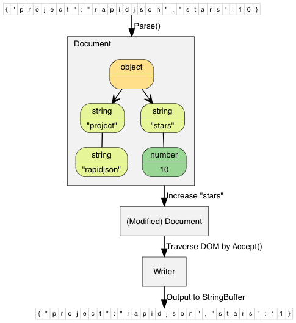

## 高效的 C++ JSON 解析／生成器，提供 SAX 及 DOM 风格 API

Tencent is pleased to support the open source community by making RapidJSON available.

Copyright (C) 2015 THL A29 Limited, a Tencent company, and Milo Yip.

* [RapidJSON GitHub](https://github.com/Tencent/rapidjson/)
* RapidJSON 文档
  * [English](http://rapidjson.org/)
  * [简体中文](http://rapidjson.org/zh-cn/)
  * [GitBook](https://www.gitbook.com/book/miloyip/rapidjson/details/zh-cn) 可下载 PDF/EPUB/MOBI，但不含 API 参考手册。

## Build 状态

| [Linux][lin-link] | [Windows][win-link] | [Coveralls][cov-link] |
| :---------------: | :-----------------: | :-------------------: |
| ![lin-badge]      | ![win-badge]        | ![cov-badge]          |

[lin-badge]: https://travis-ci.org/Tencent/rapidjson.svg?branch=master "Travis build status"
[lin-link]:  https://travis-ci.org/Tencent/rapidjson "Travis build status"
[win-badge]: https://ci.appveyor.com/api/projects/status/l6qulgqahcayidrf/branch/master?svg=true "AppVeyor build status"
[win-link]:  https://ci.appveyor.com/project/miloyip/rapidjson-0fdqj/branch/master "AppVeyor build status"
[cov-badge]: https://coveralls.io/repos/Tencent/rapidjson/badge.svg?branch=master "Coveralls coverage"
[cov-link]:  https://coveralls.io/r/Tencent/rapidjson?branch=master "Coveralls coverage"

## 简介

RapidJSON 是一个 C++ 的 JSON 解析器及生成器。它的灵感来自 [RapidXml](http://rapidxml.sourceforge.net/)。

* RapidJSON 小而全。它同时支持 SAX 和 DOM 风格的 API。SAX 解析器只有约 500 行代码。

* RapidJSON 快。它的性能可与 `strlen()` 相比。可支持 SSE2/SSE4.2 加速。

* RapidJSON 独立。它不依赖于 BOOST 等外部库。它甚至不依赖于 STL。

* RapidJSON 对内存友好。在大部分 32/64 位机器上，每个 JSON 值只占 16 字节（除字符串外）。它预设使用一个快速的内存分配器，令分析器可以紧凑地分配内存。

* RapidJSON 对 Unicode 友好。它支持 UTF-8、UTF-16、UTF-32 (大端序／小端序)，并内部支持这些编码的检测、校验及转码。例如，RapidJSON 可以在分析一个 UTF-8 文件至 DOM 时，把当中的 JSON 字符串转码至 UTF-16。它也支持代理对（surrogate pair）及 `"\u0000"`（空字符）。

在 [这里](doc/features.zh-cn.md) 可读取更多特点。

JSON（JavaScript Object Notation）是一个轻量的数据交换格式。RapidJSON 应该完全遵从 RFC7159/ECMA-404，并支持可选的放宽语法。 关于 JSON 的更多信息可参考：
* [Introducing JSON](http://json.org/)
* [RFC7159: The JavaScript Object Notation (JSON) Data Interchange Format](https://tools.ietf.org/html/rfc7159)
* [Standard ECMA-404: The JSON Data Interchange Format](https://www.ecma-international.org/publications/standards/Ecma-404.htm)

## v1.1 中的亮点 (2016-8-25)

* 加入 [JSON Pointer](doc/pointer.zh-cn.md) 功能，可更简单地访问及更改 DOM。
* 加入 [JSON Schema](doc/schema.zh-cn.md) 功能，可在解析或生成 JSON 时进行校验。
* 加入 [放宽的 JSON 语法](doc/dom.zh-cn.md) （注释、尾随逗号、NaN/Infinity）
* 使用 [C++11 范围 for 循环](doc/tutorial.zh-cn.md) 去遍历 array 和 object。
* 在 x86-64 架构下，缩减每个 `Value` 的内存开销从 24 字节至 16 字节。

其他改动请参考 [change log](CHANGELOG.md).

## 兼容性

RapidJSON 是跨平台的。以下是一些曾测试的平台／编译器组合：
* Visual C++ 2008/2010/2013 在 Windows (32/64-bit)
* GNU C++ 3.8.x 在 Cygwin
* Clang 3.4 在 Mac OS X (32/64-bit) 及 iOS
* Clang 3.4 在 Android NDK

用户也可以在他们的平台上生成及执行单元测试。

## 安装

RapidJSON 是只有头文件的 C++ 库。只需把 `include/rapidjson` 目录复制至系统或项目的 include 目录中。

RapidJSON 依赖于以下软件：
* [CMake](https://cmake.org/) 作为通用生成工具
* (optional) [Doxygen](http://www.doxygen.org) 用于生成文档
* (optional) [googletest](https://github.com/google/googletest) 用于单元及性能测试

生成测试及例子的步骤：

1. 执行 `git submodule update --init` 去获取 thirdparty submodules (google test)。
2. 在 rapidjson 目录下，建立一个 `build` 目录。
3. 在 `build` 目录下执行 `cmake ..` 命令以设置生成。Windows 用户可使用 cmake-gui 应用程序。
4. 在 Windows 下，编译生成在 build 目录中的 solution。在 Linux 下，于 build 目录运行 `make`。

成功生成后，你会在 `bin` 的目录下找到编译后的测试及例子可执行文件。而生成的文档将位于 build 下的 `doc/html` 目录。要执行测试，请在 build 下执行 `make test` 或 `ctest`。使用 `ctest -V` 命令可获取详细的输出。

我们也可以把程序库安装至全系统中，只要在具管理权限下从 build 目录执行 `make install` 命令。这样会按系统的偏好设置安装所有文件。当安装 RapidJSON 后，其他的 CMake 项目需要使用它时，可以通过在 `CMakeLists.txt` 加入一句 `find_package(RapidJSON)`。

## 用法一览

此简单例子解析一个 JSON 字符串至一个 document (DOM)，对 DOM 作出简单修改，最终把 DOM 转换（stringify）至 JSON 字符串。

~~~~~~~~~~cpp
// rapidjson/example/simpledom/simpledom.cpp`
#include "rapidjson/document.h"
#include "rapidjson/writer.h"
#include "rapidjson/stringbuffer.h"
#include <iostream>

using namespace rapidjson;

int main() {
    // 1. 把 JSON 解析至 DOM。
    const char* json = "{\"project\":\"rapidjson\",\"stars\":10}";
    Document d;
    d.Parse(json);

    // 2. 利用 DOM 作出修改。
    Value& s = d["stars"];
    s.SetInt(s.GetInt() + 1);

    // 3. 把 DOM 转换（stringify）成 JSON。
    StringBuffer buffer;
    Writer<StringBuffer> writer(buffer);
    d.Accept(writer);

    // Output {"project":"rapidjson","stars":11}
    std::cout << buffer.GetString() << std::endl;
    return 0;
}
~~~~~~~~~~

注意此例子并没有处理潜在错误。

下图展示执行过程。

还有许多 [例子](https://github.com/Tencent/rapidjson/tree/master/example) 可供参考：

* DOM API
  * [tutorial](https://github.com/Tencent/rapidjson/blob/master/example/tutorial/tutorial.cpp): DOM API 的基本使用方法。

* SAX API
  * [simplereader](https://github.com/Tencent/rapidjson/blob/master/example/simplereader/simplereader.cpp): 使用 `Reader` 解析 JSON 时，打印所有 SAX 事件。
  * [condense](https://github.com/Tencent/rapidjson/blob/master/example/condense/condense.cpp): 移除 JSON 中所有空白符的命令行工具。
  * [pretty](https://github.com/Tencent/rapidjson/blob/master/example/pretty/pretty.cpp): 为 JSON 加入缩进与换行的命令行工具，当中使用了 `PrettyWriter`。
  * [capitalize](https://github.com/Tencent/rapidjson/blob/master/example/capitalize/capitalize.cpp): 把 JSON 中所有字符串改为大写的命令行工具。
  * [messagereader](https://github.com/Tencent/rapidjson/blob/master/example/messagereader/messagereader.cpp): 使用 SAX API 去解析一个 JSON 报文。
  * [serialize](https://github.com/Tencent/rapidjson/blob/master/example/serialize/serialize.cpp): 使用 SAX API 去序列化 C++ 对象，生成 JSON。
  * [jsonx](https://github.com/Tencent/rapidjson/blob/master/example/jsonx/jsonx.cpp): 实现了一个 `JsonxWriter`，它能把 SAX 事件写成 [JSONx](https://www-01.ibm.com/support/knowledgecenter/SS9H2Y_7.1.0/com.ibm.dp.doc/json_jsonx.html)（一种 XML）格式。这个例子是把 JSON 输入转换成 JSONx 格式的命令行工具。

* Schema API
  * [schemavalidator](https://github.com/Tencent/rapidjson/blob/master/example/schemavalidator/schemavalidator.cpp): 使用 JSON Schema 去校验 JSON 的命令行工具。

* 进阶
  * [prettyauto](https://github.com/Tencent/rapidjson/blob/master/example/prettyauto/prettyauto.cpp): [pretty](https://github.com/Tencent/rapidjson/blob/master/example/pretty/pretty.cpp) 的修改版本，可自动处理任何 UTF 编码的 JSON。
  * [parsebyparts](https://github.com/Tencent/rapidjson/blob/master/example/parsebyparts/parsebyparts.cpp): 这例子中的 `AsyncDocumentParser` 类使用 C++ 线程来逐段解析 JSON。
  * [filterkey](https://github.com/Tencent/rapidjson/blob/master/example/filterkey/filterkey.cpp): 移取使用者指定的键值的命令行工具。
  * [filterkeydom](https://github.com/Tencent/rapidjson/blob/master/example/filterkey/filterkey.cpp): 如上的工具，但展示如何使用生成器（generator）去填充一个 `Document`。
