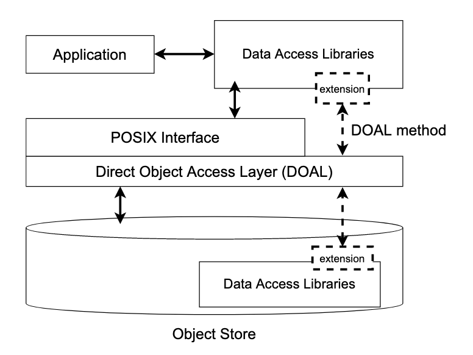
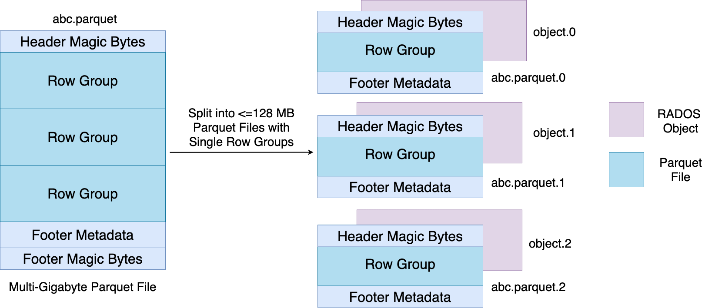

<!---
  Licensed to the Apache Software Foundation (ASF) under one
  or more contributor license agreements.  See the NOTICE file
  distributed with this work for additional information
  regarding copyright ownership.  The ASF licenses this file
  to you under the Apache License, Version 2.0 (the
  "License"); you may not use this file except in compliance
  with the License.  You may obtain a copy of the License at

    http://www.apache.org/licenses/LICENSE-2.0

  Unless required by applicable law or agreed to in writing,
  software distributed under the License is distributed on an
  "AS IS" BASIS, WITHOUT WARRANTIES OR CONDITIONS OF ANY
  KIND, either express or implied.  See the License for the
  specific language governing permissions and limitations
  under the License.
-->

# Design Paradigm

One of the most important aspects of the design of SkyhookDM is that it allows building in-storage data processing systems with minimal implementation effort. The design allows extending the client and storage layers with widely-used data access libraries requiring minimal modifications. We achieve this by (1) creating a file system shim in the object storage layer so that access libraries embedded in the storage layer can continue to operate on files, (2) mapping client requests-to- be-offloaded directly to objects using file system striping metadata, and (3) mapping files to logically self-contained fragments by using standard file system striping.

# Architecture

SkyhookDM is the approach that allows extending both the client and storage layers of "programmable object storage systems" with plugins to be able to provide data management and processing tasks directly within the storage layer.
The goal of SkyhookDM is to allow users to transparently grow and shrink their data storage and processing needs as demands change, offloading computation and other data management tasks to the storage layer in order to reduce client-side resources needed for data processing in terms of CPU, memory, I/O, and network traffic. Our implementation of SkyhookDM is currently within Ceph, but is not Ceph specific, rather the approach is applicable to any object storage system with extensibility features such as user-defined object classes. The overall architecture of SkyhookDM is shown below.

* **Storage Layer:** SkyhookDM is built by extending both the filesystem and object storage layers in the Ceph storage system. Ceph allows extending its object storage interface, RADOS, with C++ plugins (built using the Ceph Object Class SDK) which inturn allows embedding application specific methods inside the Ceph OSDs for direct access and manipulation of objects within the storage layer. We leverage this feature of Ceph and extend RADOS by implementing Object Class methods that utilize Arrow APIs to scan objects containing Parquet binary data inside the storage layer. Since the Arrow APIs expect a file-like object to work on, we implement a random access interface between the Arrow access and RADOS layers. This random access interface is analogous to the `ObjectInputFile` interface in the Arrow S3FS module and provides a similar file-like view over RADOS objects.

* **Client Layer:** Apache Arrow provides a `Dataset` API which provides a dataset abstraction over a collection of files in different storage backend like S3 and HDFS and allows scanning them. The `Dataset` API supports scanning files of different formats via its `FileFormat` abstraction. We extend the `ParquetFileFormat` API to create a `SkyhookFileFormat` API which when plugged into the `Dataset` API enables offloading Parquet dataset scans to the storage layer. In SkyhookDM, we store datasets in the Ceph filesystem, CephFS, to utilize the filesystem metadata support it provides via Ceph Metadata Servers (Ceph MDS) for doing dataset discovery. While scanning, we leverage the filesystem metadata, especially the striping strategy information, to translate filenames in CephFS to object IDs in RADOS and call Object Class methods on these objects, essentially bypassing the filesystem layer.

# Lifetime of a Dataset Scan in SkyhookDM

* **Write Path:** Datasets containing Parquet files or a directory heirarchy of Parquet files are written to a CephFS mount. While writing, each Parquet file is splitted into several smaller Parquet files of size `<= 128 MB` by the `SplittedParquetWriter`. We configure the stripe unit in CephFS to be 128 MB to ensure a `1:1 mapping` between a file and an object. The file layout is shown in the figure below. The reason behing choosing 128 MB as the stripe size is because Ceph doesn't perform well with objects any larger than 128 MB. Also, some of our performance experiments have shown most optimal performance with 128 MB Parquet files. Once the Parquet files are written to CephFS, they are ready to be scanned via the `SkyhookFileFormat`.

* **Read Path:** At the time of scanning, when the `Execute` method is called on a `ScanTask`, first the size of the target file is read via a `stat` system call and the `ScanOptions` containing the scan `Expression` and `Projection Schema` is serialized into a `ceph::bufferlist` along with the file size for sending it to the storage layer. Next, the `SkyhookDirectObjectAccess` interface is invoked with the serialized `ScanOptions` to scan the file within the Ceph OSDs bypassing the filesystem layer. Inside the `SkyhookDirectObjectAccess` layer, the file inode value is converted to the corresponding object ID in RADOS and then using the `librados` library, a CLS method call is invoked over the object. Inside the CLS method, first the `ScanOptions` is deserialized back into the `Expression` and `Schema` objects. Then the `RandomAccessObject` interface is intialized over the object to get a file-like instance which is plugged into the `ParquetFileFragment` API for scanning the object. The resultant Arrow `Table` is written into an LZ4 compressed Arrow IPC buffer and is sent back to the client. Finally, on the client, the buffer is decompressed and the resulting `RecordBatches` are returned.
