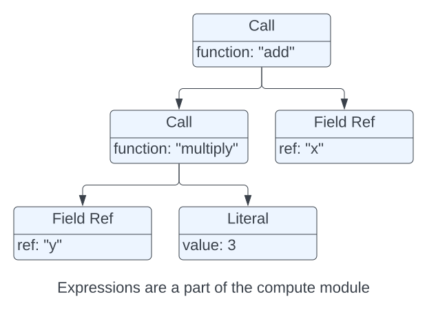

.. Licensed to the Apache Software Foundation (ASF) under one
.. or more contributor license agreements.  See the NOTICE file
.. distributed with this work for additional information
.. regarding copyright ownership.  The ASF licenses this file
.. to you under the Apache License, Version 2.0 (the
.. "License"); you may not use this file except in compliance
.. with the License.  You may obtain a copy of the License at

..   http://www.apache.org/licenses/LICENSE-2.0

.. Unless required by applicable law or agreed to in writing,
.. software distributed under the License is distributed on an
.. "AS IS" BASIS, WITHOUT WARRANTIES OR CONDITIONS OF ANY
.. KIND, either express or implied.  See the License for the
.. specific language governing permissions and limitations
.. under the License.

.. default-domain:: cpp
.. highlight:: cpp
.. cpp:namespace:: arrow::acero

==============
Acero Overview
==============

This page gives an overview of the basic Acero concepts and helps distinguish Acero
from other modules in the Arrow code base.  It's intended for users, developers,
potential contributors, and for those that would like to extend Acero, either for
research or for business use.  This page assumes the reader is already familiar with
core Arrow concepts.  This page does not expect any existing knowledge in relational
algebra.

What is Acero?
==============

Acero is a C++ library that can be used to analyze large (potentially infinite) streams
of data.  Acero allows computation to be expressed as an "execution plan" (:class:`ExecPlan`).
An execution plan takes in zero or more streams of input data and emits a single
stream of output data.  The plan describes how the data will be transformed as it
passes through.  For example, a plan might:

* Merge two streams of data using a common column

* Create additional columns by evaluating expressions against the existing columns

* Consume a stream of data by writing it to disk in a partitioned layout

.. image:: simple_graph.svg
   :alt: A sample execution plan that joins three streams of data and writes to disk
   :align: center

Acero is not...
---------------

A Library for Data Scientists
^^^^^^^^^^^^^^^^^^^^^^^^^^^^^

Acero is not intended to be used directly by data scientists.  It is expected that
end users will typically be using some kind of frontend.  For example, Pandas, Ibis,
or SQL.  The API for Acero is focused around capabilities and available algorithms.
However, such users may be intersted in knowing more about how Acero works so that
they can better understand how the backend processing for their libraries operates.

A Database
^^^^^^^^^^

A database (or DBMS) is typically a much more expansive application and often packaged
as a standalone service.  Acero could be a component in a database (most databases have
some kind of execution engine) or could be a component in some other data processing
application that hardly resembles a database.  Acero does not concern itself with
user management, external communication, isolation, durability, or consistency.  In
addition, Acero is focused primarily on the read path, and the write utilities lack
any sort of transaction support.

An Optimizer
^^^^^^^^^^^^

Acero does not have an SQL parser.  It does not have a query planner.  It does not have
any sort of optimizer.  Acero expects to be given very detailed and low-level instructions
on how to manipulate data and then it will perform that manipulation exactly as described.

Creating the best execution plan is very hard.  Small details can have a big impact on
performance.  We do think an optimizer is important but we believe it should be
implemented independent of acero, hopefully in a composable way through standards such
as Substrait so that any backend could leverage it.

Distributed
^^^^^^^^^^^

Acero does not provide distributed execution.  However, Acero aims to be usable by a distributed
query execution engine.  In other words, Acero will not configure and coordinate workers but
it does expect to be used as a worker.  Sometimes, the distinction is a bit fuzzy.  For example,
an Acero source may be a smart storage device that is capable of performing filtering or other
advanced analytics.  One might consider this a distributed plan.  The key distinction is Acero
does not have the capability of transforming a logical plan into a distributed execution plan.
That step will need to be done elsewhere.

Acero vs...
-----------

Arrow Compute
^^^^^^^^^^^^^

This is described in more detail in :ref:`cpp-vs-acero` but the key difference
is that Acero handles streams of data and Arrow Compute handles situations where all the
data is in memory.

Arrow Datasets
^^^^^^^^^^^^^^

The Arrow datasets library provides some basic routines for discovering, scanning, and
writing collections of files.  The datasets module depends on Acero.  Both scanning and
writing datasets uses Acero.  The scan node and the write node are part of the datasets
module.  This helps to keep the complexity of file formats and filesystems out of the core
Acero logic.

Substrait
^^^^^^^^^

Substrait is a project establishing standards for query plans.  Acero executes query plans
and generates data.  This makes Acero a Substrait consumer.  There are more details on the
Substrait capabilities in :ref:`acero-substrait`.

Datafusion / DuckDb / Velox / Etc.
^^^^^^^^^^^^^^^^^^^^^^^^^^^^^^^^^^

There are many columnar data engines emerging. We view this as a good thing and encourage
projects like Substrait to help allow switching between engines as needed.  We generally
discourage comparative benchmarks as they are almost inevitably going to be workload-driven
and rarely manage to capture an apples-vs-apples comparison.  Discussions of the pros and
cons of each is beyond the scope of this guide.

.. _cpp-vs-acero:

Relation to Arrow C++
=====================

The Acero module is part of the Arrow C++ implementation.  It is built as a separate
module but it depends on core Arrow modules and does not stand alone.  Acero uses
and extends the capabilities from the core Arrow module and the Arrow compute kernels.

.. image:: layers.svg
   :alt: A diagram of layers with core on the left, compute in the middle, and acero on the right

The core Arrow library provides containers for buffers and arrays that are laid out according
to the Arrow columnar format.  With few exceptions the core Arrow library does not examine
or modify the contents of buffers.  For example, converting a string array from lowercase
strings to uppercase strings would not be a part of the core Arrow library because that would
require examining the contents of the array.

The compute module expands on the core library and provides functions which analyze and
transform data.  The compute module's capabilites are all exposed via a function registry.
An Arrow "function" accepts zero or more arrays, batches, or tables, and produces an array,
batch, or table.  In addition, function calls can be combined, along with field references
and literals, to form an expression (a tree of function calls) which the compute module can
evaluate.  For example, calculating ``x + (y * 3)`` given a table with columns ``x`` and ``y``.

Acero expands on these capabilities by adding compute operations for streams of data.  For
example, a project node can apply a compute expression on a stream of batches.  This will
create a new stream of batches with the result of the expression added as a new column.  These
nodes can be combined into a graph to form a more complex execution plan.  This is very similar
to the way functions are combined into a tree to form a complex expression.

.. note::
   Acero does not use the :class:`arrow::Table` or :class:`arrow::ChunkedArray` containers
   from the core Arrow library.  This is because Acero operates on streams of batches and
   so there is no need for a multi-batch container of data.  This helps to reduce the
   complexity of Acero and avoids tricky situations that can arise from tables whose
   columns have different chunk sizes.  Acero will often use :class:`arrow::Datum`
   which is a variant from the core module that can hold many different types.  Within
   Acero, a datum will always hold either an :class:`arrow::Array` or a :class:`arrow::Scalar`.

Core Concepts
=============

ExecNode
--------

The most basic concept in Acero is the ExecNode.  An ExecNode has zero or more inputs and
zero or one outputs.  If an ExecNode has zero inputs we call it a source and if an ExecNode
does not have an output then we call it a sink.  There are many different kinds of nodes and
each one transforms its inputs in different ways.  For example:

* A scan node is a source node that reads data from files
* An aggregate node accumulates batches of data to compute summary statistics
* A filter node removes rows from the data according to a filter expression
* A table sink node accumulates data into a table

.. note::
   A full list of the available compute modules is included in the :ref:`user's guide<ExecNode List>`

.. _exec-batch:

ExecBatch
---------

Batches of data are represented by the ExecBatch class.  An ExecBatch is a 2D structure that
is very similar to a RecordBatch.  It can have zero or more columns and all of the columns
must have the same length.  There are a few key differences from ExecBatch:

.. figure:: rb_vs_eb.svg
   
   Both the record batch and the exec batch have strong ownership of the arrays & buffers

* An `ExecBatch` does not have a schema.  This is because an `ExecBatch` is assumed to be
  part of a stream of batches and the stream is assumed to have a consistent schema.  So
  the schema for an `ExecBatch` is typically stored in the ExecNode.
* Columns in an `ExecBatch` are either an `Array` or a `Scalar`.  When a column is a `Scalar`
  this means that the column has a single value for every row in the batch.  An `ExecBatch`
  also has a length property which describes how many rows are in a batch.  So another way to
  view a `Scalar` is a constant array with `length` elements.
* An `ExecBatch` contains additional information used by the exec plan.  For example, an
  `index` can be used to describe a batch's position in an ordered stream.  We expect 
  that `ExecBatch` will also evolve to contain additional fields such as a selection vector.

   There are four different ways to represent the given batch of data using different combinations
   of arrays and scalars.  All four exec batches should be considered semantically equivalent.

Converting from a record batch to an exec batch is always zero copy.  Both RecordBatch and ExecBatch
refer to the exact same underlying arrays.  Converting from an exec batch to a record batch is
only zero copy if there are no scalars in the exec batch.

.. note::
   Both Acero and the compute module have "lightweight" versions of batches and arrays.
   In the compute module these are called `BatchSpan`, `ArraySpan`, and `BufferSpan`.  In
   Acero the concept is called `KeyColumnArray`.  These types were developed concurrently
   and serve the same purpose.  They aim to provide an array container that can be completely
   stack allocated (provided the data type is non-nested) in order to avoid heap allocation
   overhead.  Ideally these two concepts will be merged someday.

ExecPlan
--------

An ExecPlan represents a graph of ExecNode objects.  A valid ExecPlan must always have at
least one source node but it does not technically need to have a sink node.  The ExecPlan contains
resources shared by all of the nodes and has utility functions to control starting and stopping
execution of the nodes.  Both ExecPlan and ExecNode are tied to the lifecycle of a single execution.
They have state and are not expected to be restartable.

.. warning::
   The structures within Acero, including `ExecBatch`, are still experimental.  The `ExecBatch`
   class should not be used outside of Acero.  Instead, an `ExecBatch` should be converted to
   a more standard structure such as a `RecordBatch`.

   Similarly, an ExecPlan is an internal concept.  Users creating plans should be using Declaration
   objects.  APIs for consuming and executing plans should abstract away the details of the underlying
   plan and not expose the object itself.

Declaration
-----------

A Declaration is a blueprint for an ExecNode.  Declarations can be combined into a graph to
form the blueprint for an ExecPlan.  A Declaration describes the computation that needs to be
done but is not actually responsible for carrying out the computation.  In this way, a Declaration is
analogous to an expression.  It is expected that Declarations will need to be converted to and from
various query representations (e.g. Substrait).  The Declaration objects are the public API, combined
with the DeclarationToXyz methods, are the current public API for Acero.

.. figure:: decl_vs_ep.svg
   
   A declaration is a blueprint that is used to instantiate exec plan instances