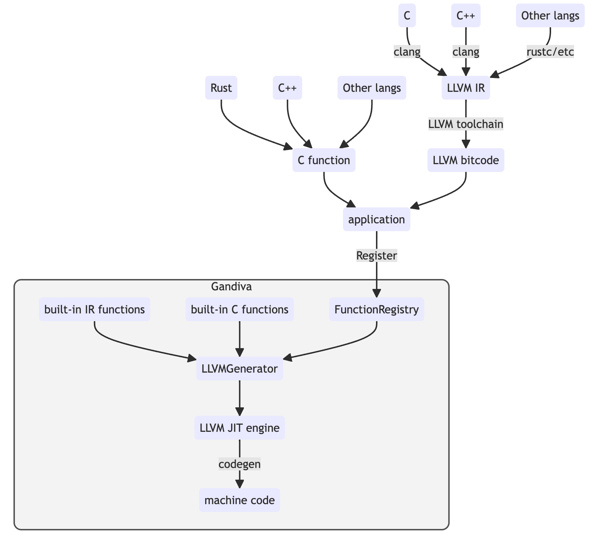

.. Licensed to the Apache Software Foundation (ASF) under one
.. or more contributor license agreements.  See the NOTICE file
.. distributed with this work for additional information
.. regarding copyright ownership.  The ASF licenses this file
.. to you under the Apache License, Version 2.0 (the
.. "License"); you may not use this file except in compliance
.. with the License.  You may obtain a copy of the License at
..
.. http://www.apache.org/licenses/LICENSE-2.0
..
.. Unless required by applicable law or agreed to in writing,
.. software distributed under the License is distributed on an
.. "AS IS" BASIS, WITHOUT WARRANTIES OR CONDITIONS OF ANY
.. KIND, either express or implied.  See the License for the
.. specific language governing permissions and limitations
.. under the License.

============================================
Gandiva External Functions Development Guide
============================================

Introduction
============

Gandiva, as an analytical expression compiler framework, extends its functionality through external functions. This guide is focused on helping developers understand, create, and integrate external functions into Gandiva. External functions are user-defined, third-party functions that can be used in Gandiva expressions.

Overview of External Function Types in Gandiva
==============================================

Gandiva supports two primary types of external functions:

* C Functions: Functions conforming to the C calling convention. Developers can implement functions in various languages (like C++, Rust, C, or Zig) and expose them as C functions to Gandiva.

* IR Functions: Functions implemented in LLVM Intermediate Representation (LLVM IR). These can be written in multiple languages and then compiled into LLVM IR to be registered in Gandiva.

Choosing the Right Type of External Function for Your Needs
-----------------------------------------------------------

When integrating external functions into Gandiva, it's crucial to select the type that best fits your specific requirements. Here are the key distinctions between C Functions and IR Functions to guide your decision:

* C Functions
    * **Language Flexibility:** C functions offer the flexibility to implement your logic in a preferred programming language and subsequently expose them as C functions.
    * **Broad Applicability:** They are generally a go-to choice for a wide range of use cases due to their compatibility and ease of integration.

* IR Functions
    * **Recommended Use Cases:** IR functions excel in handling straightforward tasks that do not require elaborate logic or dependence on sophisticated third-party libraries. Unlike C functions, IR functions have the advantage of being inlinable, which is particularly beneficial for simple operations where the invocation overhead constitutes a significant expense. Additionally, they are an ideal choice for projects that are already integrated with the LLVM toolchain.
    * **IR Compilation Requirement:** For IR functions, the entire implementation, including any third-party libraries used, must be compiled into LLVM IR. This might affect performance, especially if the dependent libraries are complex.
    * **Limitations in Capabilities:** Certain advanced features, such as using thread-local variables, are not supported in IR functions. This is due to the limitations of the current JIT (Just-In-Time) engine utilized internally by Gandiva.

External function registration
==============================

To make a function available to Gandiva, you need to register it as an external function, providing both a function's metadata and its implementation to Gandiva.

Metadata Registration Using the ``NativeFunction`` Class
--------------------------------------------------------

To register a function in Gandiva, use the ``gandiva::NativeFunction`` class. This class captures both the signature and metadata of the external function.

Constructor Details for ``gandiva::NativeFunction``:

.. code-block:: cpp

    NativeFunction(const std::string& base_name, const std::vector<std::string>& aliases,
                   const DataTypeVector& param_types, const DataTypePtr& ret_type,
                   the ResultNullableType& result_nullable_type, std::string pc_name,
                   int32_t flags = 0);

The ``NativeFunction`` class is used to define the metadata for an external function. Here is a breakdown of its constructor parameters:

* ``base_name``: The name of the function as it will be used in expressions.
* ``aliases``: A list of alternative names for the function.
* ``param_types``: A vector of ``arrow::DataType`` objects representing the types of the parameters that the function accepts.
* ``ret_type``: A ``std::shared_ptr<arrow::DataType>`` representing the return type of the function.
* ``result_nullable_type``: This parameter indicates whether the result can be null, based on the nullability of the input arguments. It can take one of the following values:
    * ``ResultNullableType::kResultNullIfNull``: result validity is an intersection of the validity of the children.
    * ``ResultNullableType::kResultNullNever``: result is always valid.
    * ``ResultNullableType::kResultNullInternal``: result validity depends on some internal logic.
* ``pc_name``: The name of the corresponding precompiled function. 
  * Typically, this name follows the convention ``{base_name}`` + ``_{param1_type}`` + ``{param2_type}`` + ... + ``{paramN_type}``. For example, if the base name is ``add`` and the function takes two ``int32`` parameters and returns an ``int32``, the precompiled function name would be ``add_int32_int32``, but this convention is not mandatory as long as you can guarantee its uniqueness.
* ``flags``: Optional flags for additional function attributes (default is 0). Please check out ``NativeFunction::kNeedsContext``, ``NativeFunction::kNeedsFunctionHolder``, and ``NativeFunction::kCanReturnErrors`` for more details.

After the function is registered, its implementation needs to be provided via either a C function pointer or a LLVM IR function.

External C functions
--------------------

External C functions can be authored in different languages and exposed as C functions. Compatibility with Gandiva's type system is crucial.

C Function Signature
********************

Signature Mapping
~~~~~~~~~~~~~~~~~

Not all Arrow data types are supported in Gandiva. The following table lists the mapping between Gandiva external function signature types and the C function signature types:

+-------------------------------------+-------------------+
| Gandiva type (arrow data type)      | C function type   |
+=====================================+===================+
| int8                                | int8_t            |
+-------------------------------------+-------------------+
| int16                               | int16_t           |
+-------------------------------------+-------------------+
| int32                               | int32_t           |
+-------------------------------------+-------------------+
| int64                               | int64_t           |
+-------------------------------------+-------------------+
| uint8                               | uint8_t           |
+-------------------------------------+-------------------+
| uint16                              | uint16_t          |
+-------------------------------------+-------------------+
| uint32                              | uint32_t          |
+-------------------------------------+-------------------+
| uint64                              | uint64_t          |
+-------------------------------------+-------------------+
| float32                             | float             |
+-------------------------------------+-------------------+
| float64                             | double            |
+-------------------------------------+-------------------+
| boolean                             | bool              |
+-------------------------------------+-------------------+
| date32                              | int32_t           |
+-------------------------------------+-------------------+
| date64                              | int64_t           |
+-------------------------------------+-------------------+
| timestamp                           | int64_t           |
+-------------------------------------+-------------------+
| time32                              | int32_t           |
+-------------------------------------+-------------------+
| time64                              | int64_t           |
+-------------------------------------+-------------------+
| interval_month                      | int32_t           |
+-------------------------------------+-------------------+
| interval_day_time                   | int64_t           |
+-------------------------------------+-------------------+
| utf8 (as parameter type)            | const char*,      |
|                                     | uint32_t          |
|                                     | [see next section]|
+-------------------------------------+-------------------+
| utf8 (as return type)               | int64_t context,  |
|                                     | const char*,      |
|                                     | uint32_t*         |
|                                     | [see next section]|
+-------------------------------------+-------------------+
| binary (as parameter type)          | const char*,      |
|                                     | uint32_t          |
|                                     | [see next section]|
+-------------------------------------+-------------------+
| utf8 (as return type)               | int64_t context,  |
|                                     | const char*,      |
|                                     | uint32_t*         |
|                                     | [see next section]| 
+-------------------------------------+-------------------+

Handling arrow::StringType (utf8 type) and arrow::BinaryType 
~~~~~~~~~~~~~~~~~~~~~~~~~~~~~~~~~~~~~~~~~~~~~~~~~~~~~~~~~~~~
Both ``arrow::StringType`` and ``arrow::BinaryType`` are variable-length types. And they are handled similarly in external functions. Since ``arrow::StringType`` (utf8 type) is more commonly used, we will use it below as the example to explain how to handle variable-length types in external functions.

Using ``arrow::StringType`` (also known as the ``utf8`` type) as function parameter or return value needs special handling in external functions. This section provides details on how to handle ``arrow::StringType``.

**As a Parameter:**

When ``arrow::StringType`` is used as a parameter type in a function signature, the corresponding C function should be defined to accept two parameters:

* ``const char*``: This parameter serves as a pointer to the string data.
* ``uint32_t``: This parameter represents the length of the string data.

**As a Return Type:**

When ``arrow::StringType`` (``utf8`` type) is used as the return type in a function signature, several specific considerations apply:

1. **NativeFunction Metadata Flag:**
   * The ``NativeFunction`` metadata for this function must include the ``NativeFunction::kNeedsContext`` flag. This flag is critical for ensuring proper context management in the function.

2. **Function Parameters:**
    * **Context Parameter**: The C function should begin with an additional parameter, ``int64_t context``. This parameter is crucial for context management within the function.
    * **String Length Output Parameter**: The function should also include a ``uint32_t*`` parameter at the end. This output parameter will store the length of the returned string data.
3. **Return Value**: The function should return a ``const char*`` pointer, pointing to the string data. 
4. **Function Implementation:**
   * **Memory Allocation and Error Messaging:** Within the function's implementation, use ``gdv_fn_context_arena_malloc`` and ``gdv_fn_context_set_error_msg`` for memory allocation and error messaging, respectively. Both functions take ``int64_t context`` as their first parameter, facilitating efficient context utilization.

External C function registration APIs
-------------------------------------

You can use ``gandiva::FunctionRegistry``'s APIs to register external C functions:

.. code-block:: cpp

    /// \brief register a C function into the function registry
    /// @param func the registered function's metadata
    /// @param c_function_ptr the function pointer to the
    /// registered function's implementation
    /// @param function_holder_maker this will be used as the function holder if the
    /// function requires a function holder
    arrow::Status Register(
        NativeFunction func, void* c_function_ptr,
        std::optional<FunctionHolderMaker> function_holder_maker = std::nullopt);

The above API allows you to register an external C function. 

* The ``NativeFunction`` object describes the metadata of the external C function. 
* The ``c_function_ptr`` is the function pointer to the external C function's implementation. 
* The optional ``function_holder_maker`` is used to create a function holder for the external C function if the external C function requires a function holder. Check out the ``gandiva::FunctionHolder`` class and its several sub-classes for more details.

External IR functions
---------------------

IR function implementation
**************************

Gandiva's support for IR (Intermediate Representation) functions provides the flexibility to implement these functions in various programming languages, depending on your specific needs.

Examples and Tools for Compilation
~~~~~~~~~~~~~~~~~~~~~~~~~~~~~~~~~~

1. **Using C++ or C:**

   * If your IR functions are implemented in C++ or C, they can be compiled into LLVM bitcode, which is the intermediate representation understood by Gandiva.
   * Compilation with Clang: For C++ implementations, you can utilize clang with the ``-emit-llvm`` option. This approach compiles your IR functions directly into LLVM bitcode, making them ready for integration with Gandiva.

2. **Integrating with CMake:**

   * In projects where C++ is used alongside CMake, consider leveraging the ``GandivaAddBitcode.cmake`` module from the Arrow repository. This module can streamline the process of adding your custom bitcode to Gandiva.

Consistency in Parameter and Return Types
~~~~~~~~~~~~~~~~~~~~~~~~~~~~~~~~~~~~~~~~~

It is important to maintain consistency with the parameter and return types as established in C functions. Adhering to the rules discussed in the previous section ensures compatibility with Gandiva's type system.

Registering External IR Functions in Gandiva
********************************************

1. **Post-Implementation and Compilation:**

   After successfully implementing and compiling your IR functions into LLVM bitcode, the next critical step is their registration within Gandiva.

2. **Utilizing Gandiva's FunctionRegistry APIs:**

   Gandiva offers specific APIs within the ``gandiva::FunctionRegistry`` class to facilitate this registration process.

   **Registration APIs**

   * Registering from a Bitcode File:

     .. code-block:: cpp

        // Registers a set of functions from a specified bitcode file
        arrow::Status Register(const std::vector<NativeFunction>& funcs,
                               const std::string& bitcode_path);

   * Registering from a Bitcode Buffer:

     .. code-block:: cpp

        // Registers a set of functions from a bitcode buffer
        arrow::Status Register(const std::vector<NativeFunction>& funcs,
                               std::shared_ptr<arrow::Buffer> bitcode_buffer);

   **Key Points**

   * These APIs are designed to register a collection of external IR functions, either from a specified bitcode file or a preloaded bitcode buffer.
   * It is essential to ensure that the bitcode file or buffer contains the correctly compiled IR functions.
   * The ``NativeFunction`` instances play a crucial role in this process, serving to define the metadata for each of the external IR functions being registered.

Conclusion
==========

This guide provides an overview and detailed steps for integrating external functions into Gandiva. It covers both C and IR functions, and their registration in Gandiva. For more complex scenarios, refer to Gandiva's documentation and example implementations in source code.
