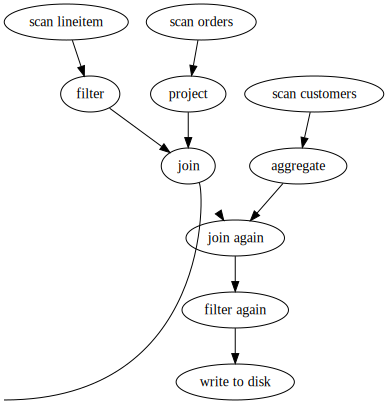

.. Licensed to the Apache Software Foundation (ASF) under one
.. or more contributor license agreements.  See the NOTICE file
.. distributed with this work for additional information
.. regarding copyright ownership.  The ASF licenses this file
.. to you under the Apache License, Version 2.0 (the
.. "License"); you may not use this file except in compliance
.. with the License.  You may obtain a copy of the License at

..   http://www.apache.org/licenses/LICENSE-2.0

.. Unless required by applicable law or agreed to in writing,
.. software distributed under the License is distributed on an
.. "AS IS" BASIS, WITHOUT WARRANTIES OR CONDITIONS OF ANY
.. KIND, either express or implied.  See the License for the
.. specific language governing permissions and limitations
.. under the License.

.. default-domain:: cpp
.. highlight:: cpp
.. cpp:namespace:: arrow::compute

=======================================
Acero: A C++ streaming execution engine
=======================================

.. warning::

    Acero is experimental and a stable API is not yet guaranteed.

Motivation
==========

For many complex computations, successive direct :ref:`invocation of
compute functions <invoking-compute-functions>` is not feasible
in either memory or computation time. Doing so causes all intermediate
data to be fully materialized. To facilitate arbitrarily large inputs
and more efficient resource usage, the Arrow C++ implementation also
provides Acero, a streaming query engine with which computations can
be formulated and executed.

Acero allows computation to be expressed as an "execution plan"
(:class:`ExecPlan`) which is a directed graph of operators.  Each operator
(:class:`ExecNode`) provides, transforms, or consumes the data passing
through it.  Batches of data (:struct:`ExecBatch`) flow along edges of
the graph from node to node. Structuring the API around streams of batches
allows the working set for each node to be tuned for optimal performance
independent of any other nodes in the graph. Each :class:`ExecNode`
processes batches as they are pushed to it along an edge of the graph by
upstream nodes (its inputs), and pushes batches along an edge of the graph
to downstream nodes (its outputs) as they are finalized.

.. seealso::

   `SHAIKHHA, A., DASHTI, M., & KOCH, C.
   (2018). Push versus pull-based loop fusion in query engines.
   Journal of Functional Programming, 28.
   <https://doi.org/10.1017/s0956796818000102>`_

Substrait
=========

In order to use Acero you will need to create an execution plan.  This is the
model that describes the computation you want to apply to your data.  Acero has
its own internal representation for execution plans but most users should not
interact with this directly as it will couple their code to Acero.

`Substrait <https://substrait.io>`_ is an open standard for execution plans.
Acero implements the Substrait "consumer" interface.  This means that Acero can
accept a Substrait plan and fulfill the plan, loading the requested data and
applying the desired computation.  By using Substrait plans users can easily
switch out to a different execution engine at a later time.

Substrait Conformance
---------------------

Substrait defines a broad set of operators and functions for many different
situations and it is unlikely that Acero will ever completely satisfy all
defined Substrait operators and functions.  To help understand what features
are available the following sections define which features have been currently
implemented in Acero and any caveats that apply.

Plans
^^^^^

 * A plan should have a single top-level relation.
 * The consumer is currently based on version 0.20.0 of Substrait.
   Any features added that are newer will not be supported.
 * Due to a breaking change in 0.20.0 any Substrait plan older than 0.20.0
   will be rejected.

Extensions
^^^^^^^^^^

 * If a plan contains any extension type variations it will be rejected.
 * Advanced extensions can be provided by supplying a custom implementation of
   :class:`arrow::engine::ExtensionProvider`.

Relations (in general)
^^^^^^^^^^^^^^^^^^^^^^

 * Any relation not explicitly listed below will not be supported
   and will cause the plan to be rejected.

Read Relations
^^^^^^^^^^^^^^

 * The ``projection`` property is not supported and plans containing this
   property will be rejected.
 * The ``VirtualTable`` and ``ExtensionTable``read types are not supported.
   Plans containing these types will be rejected.
 * Only the parquet and arrow file formats are currently supported.
 * All URIs must use the ``file`` scheme
 * ``partition_index``, ``start``, and ``length`` are not supported.  Plans containing
   non-default values for these properties will be rejected.
 * The Substrait spec requires that a ``filter`` be completely satisfied by a read
   relation.  However, Acero only uses a read filter for pushdown projection and
   it may not be fully satisfied.  Users should generally attach an additional
   filter relation with the same filter expression after the read relation.

Filter Relations
^^^^^^^^^^^^^^^^

 * No known caveats

Project Relations
^^^^^^^^^^^^^^^^^

 * No known caveats

Join Relations
^^^^^^^^^^^^^^

 * The join type ``JOIN_TYPE_SINGLE`` is not supported and plans containing this
   will be rejected.
 * The join expression must be a call to either the ``equal`` or ``is_not_distinct_from``
   functions.  Both arguments to the call must be direct references.  Only a single
   join key is supported.
 * The ``post_join_filter`` property is not supported and will be ignored.

Aggregate Relations
^^^^^^^^^^^^^^^^^^^

 * At most one grouping set is supported.
 * Each grouping expression must be a direct reference.
 * Each measure's arguments must be direct references.
 * A measure may not have a filter
 * A measure may not have sorts
 * A measure's invocation must be AGGREGATION_INVOCATION_ALL or 
   AGGREGATION_INVOCATION_UNSPECIFIED
 * A measure's phase must be AGGREGATION_PHASE_INITIAL_TO_RESULT

Expressions (general)
^^^^^^^^^^^^^^^^^^^^^

 * Various places in the Substrait spec allow for expressions to be used outside
   of a filter or project relation.  For example, a join expression or an aggregate
   grouping set.  Acero typically expects these expressions to be direct references.
   Planners should extract the implicit projection into a formal project relation
   before delivering the plan to Acero.

Literals
^^^^^^^^

 * A literal with non-default nullability will cause a plan to be rejected.

Types
^^^^^

 * Acero does not have full support for non-nullable types and may allow input
   to have nulls without rejecting it.
 * The table below shows the mapping between Arrow types and Substrait type
   classes that are currently supported

.. list-table:: Substrait / Arrow Type Mapping
   :widths: 25 25 50
   :header-rows: 1

   * - Substrait Type
     - Arrow Type
     - Caveat
   * - boolean
     - boolean
     - 
   * - i8
     - int8
     - 
   * - i16
     - int16
     - 
   * - i32
     - int32
     - 
   * - i64
     - int64
     - 
   * - fp32
     - float32
     - 
   * - fp64
     - float64
     - 
   * - string
     - string
     - 
   * - binary
     - binary
     - 
   * - timestamp
     - timestamp<MICRO,"">
     - 
   * - timestamp_tz
     - timestamp<MICRO,"UTC">
     - 
   * - date
     - date32<DAY>
     - 
   * - time
     - time64<MICRO>
     - 
   * - interval_year
     - 
     - Not currently supported
   * - interval_day
     - 
     - Not currently supported
   * - uuid
     - 
     - Not currently supported
   * - FIXEDCHAR<L>
     - 
     - Not currently supported
   * - VARCHAR<L>
     - 
     - Not currently supported
   * - FIXEDBINARY<L>
     - fixed_size_binary<L>
     - 
   * - DECIMAL<P,S>
     - decimal128<P,S>
     - 
   * - STRUCT<T1...TN>
     - struct<T1...TN>
     - Arrow struct fields will have no name (empty string)
   * - NSTRUCT<N:T1...N:Tn>
     - 
     - Not currently supported
   * - LIST<T>
     - list<T>
     - 
   * - MAP<K,V>
     - map<K,V>
     - K must not be nullable

Functions
^^^^^^^^^

 * The following functions have caveats or are not supported at all.  Note that
   this is not a comprehensive list.  Functions are being added to Substrait at
   a rapid pace and new functions may be missing.

   * Acero does not support the SATURATE option for overflow
   * Acero does not support kernels that take more than two arguments
     for the functions ``and``, ``or``, ``xor``
   * Acero does not support temporal arithmetic
   * Acero does not support the following standard functions:

     * ``is_not_distinct_from``
     * ``like``
     * ``substring``
     * ``starts_with``
     * ``ends_with``
     * ``contains``
     * ``count``
     * ``count_distinct``
     * ``approx_count_distinct``

 * The functions above should be referenced using the URI
   ``https://github.com/apache/arrow/blob/main/format/substrait/extension_types.yaml``
     * Alternatively, the URI can be left completely empty and Acero will match
       based only on function name.  This fallback mechanism is non-standard and should
       be avoided if possible.

Architecture Overview
=====================

:class:`ExecNode`
  Each node in the graph is an implementation of the :class:`ExecNode` interface.

:class:`ExecPlan`
  A set of :class:`ExecNode` is contained and (to an extent) coordinated by an
  :class:`ExecPlan`.

:class:`ExecFactoryRegistry`
  Instances of :class:`ExecNode` are constructed by factory functions held
  in a :class:`ExecFactoryRegistry`.

:class:`ExecNodeOptions`
  Heterogenous parameters for factories of :class:`ExecNode` are bundled in an
  :class:`ExecNodeOptions`.

:struct:`Declaration`
  ``dplyr``-inspired helper for efficient construction of an :class:`ExecPlan`.

:struct:`ExecBatch`
  A lightweight container for a single chunk of data in the Arrow format. In
  contrast to :class:`RecordBatch`, :struct:`ExecBatch` is intended for use
  exclusively in a streaming execution context (for example, it doesn't have a
  corresponding Python binding). Furthermore columns which happen to have a
  constant value may be represented by a :class:`Scalar` instead of an
  :class:`Array`. In addition, :struct:`ExecBatch` may carry
  execution-relevant properties including a guaranteed-true-filter
  for :class:`Expression` simplification.

An example :class:`ExecNode` implementation which simply passes all input batches
through unchanged::

    class PassthruNode : public ExecNode {
     public:
      // InputReceived is the main entry point for ExecNodes. It is invoked
      // by an input of this node to push a batch here for processing.
      void InputReceived(ExecNode* input, ExecBatch batch) override {
        // Since this is a passthru node we simply push the batch to our
        // only output here.
        outputs_[0]->InputReceived(this, batch);
      }

      // ErrorReceived is called by an input of this node to report an error.
      // ExecNodes should always forward errors to their outputs unless they
      // are able to fully handle the error (this is rare).
      void ErrorReceived(ExecNode* input, Status error) override {
        outputs_[0]->ErrorReceived(this, error);
      }

      // InputFinished is used to signal how many batches will ultimately arrive.
      // It may be called with any ordering relative to InputReceived/ErrorReceived.
      void InputFinished(ExecNode* input, int total_batches) override {
        outputs_[0]->InputFinished(this, total_batches);
      }

      // ExecNodes may request that their inputs throttle production of batches
      // until they are ready for more, or stop production if no further batches
      // are required.  These signals should typically be forwarded to the inputs
      // of the ExecNode.
      void ResumeProducing(ExecNode* output) override { inputs_[0]->ResumeProducing(this); }
      void PauseProducing(ExecNode* output) override { inputs_[0]->PauseProducing(this); }
      void StopProducing(ExecNode* output) override { inputs_[0]->StopProducing(this); }

      // An ExecNode has a single output schema to which all its batches conform.
      using ExecNode::output_schema;

      // ExecNodes carry basic introspection for debugging purposes
      const char* kind_name() const override { return "PassthruNode"; }
      using ExecNode::label;
      using ExecNode::SetLabel;
      using ExecNode::ToString;

      // An ExecNode holds references to its inputs and outputs, so it is possible
      // to walk the graph of execution if necessary.
      using ExecNode::inputs;
      using ExecNode::outputs;

      // StartProducing() and StopProducing() are invoked by an ExecPlan to
      // coordinate the graph-wide execution state.  These do not need to be
      // forwarded to inputs or outputs.
      Status StartProducing() override { return Status::OK(); }
      void StopProducing() override {}
      Future<> finished() override { return inputs_[0]->finished(); }
    };

Note that each method which is associated with an edge of the graph must be invoked
with an ``ExecNode*`` to identify the node which invoked it. For example, in an
:class:`ExecNode` which implements ``JOIN`` this tagging might be used to differentiate
between batches from the left or right inputs.
``InputReceived``, ``ErrorReceived``, ``InputFinished`` may only be invoked by
the inputs of a node, while ``ResumeProducing``, ``PauseProducing``, ``StopProducing``
may only be invoked by outputs of a node.

:class:`ExecPlan` contains the associated instances of :class:`ExecNode`
and is used to start and stop execution of all nodes and for querying/awaiting
their completion::

    // construct an ExecPlan first to hold your nodes
    ARROW_ASSIGN_OR_RAISE(auto plan, ExecPlan::Make(default_exec_context()));

    // ... add nodes to your ExecPlan

    // start all nodes in the graph
    ARROW_RETURN_NOT_OK(plan->StartProducing());

    SetUserCancellationCallback([plan] {
      // stop all nodes in the graph
      plan->StopProducing();
    });

    // Complete will be marked finished when all nodes have run to completion
    // or acknowledged a StopProducing() signal. The ExecPlan should be kept
    // alive until this future is marked finished.
    Future<> complete = plan->finished();

Constructing ``ExecPlan`` objects
=================================

None of the concrete implementations of :class:`ExecNode` are exposed
in headers, so they can't be constructed directly outside the
translation unit where they are defined. Instead, factories to
create them are provided in an extensible registry. This structure
provides a number of benefits:

- This enforces consistent construction.
- It decouples implementations from consumers of the interface
  (for example: we have two classes for scalar and grouped aggregate,
  we can choose which to construct within the single factory by
  checking whether grouping keys are provided)
- This expedites integration with out-of-library extensions. For example
  "scan" nodes are implemented in the separate ``libarrow_dataset.so`` library.
- Since the class is not referencable outside the translation unit in which it
  is defined, compilers can optimize more aggressively.

Factories of :class:`ExecNode` can be retrieved by name from the registry.
The default registry is available through
:func:`arrow::compute::default_exec_factory_registry()`
and can be queried for the built-in factories::

    // get the factory for "filter" nodes:
    ARROW_ASSIGN_OR_RAISE(auto make_filter,
                          default_exec_factory_registry()->GetFactory("filter"));

    // factories take three arguments:
    ARROW_ASSIGN_OR_RAISE(ExecNode* filter_node, *make_filter(
        // the ExecPlan which should own this node
        plan.get(),

        // nodes which will send batches to this node (inputs)
        {scan_node},

        // parameters unique to "filter" nodes
        FilterNodeOptions{filter_expression}));

    // alternative shorthand:
    ARROW_ASSIGN_OR_RAISE(filter_node, MakeExecNode("filter",
        plan.get(), {scan_node}, FilterNodeOptions{filter_expression});

Factories can also be added to the default registry as long as they are
convertible to ``std::function<Result<ExecNode*>(
ExecPlan*, std::vector<ExecNode*>, const ExecNodeOptions&)>``.

To build an :class:`ExecPlan` representing a simple pipeline which
reads from a :class:`RecordBatchReader` then filters, projects, and
writes to disk::

    std::shared_ptr<RecordBatchReader> reader = GetStreamOfBatches();
    ExecNode* source_node = *MakeExecNode("source", plan.get(), {},
                                          SourceNodeOptions::FromReader(
                                              reader,
                                              GetCpuThreadPool()));

    ExecNode* filter_node = *MakeExecNode("filter", plan.get(), {source_node},
                                          FilterNodeOptions{
                                            greater(field_ref("score"), literal(3))
                                          });

    ExecNode* project_node = *MakeExecNode("project", plan.get(), {filter_node},
                                           ProjectNodeOptions{
                                             {add(field_ref("score"), literal(1))},
                                             {"score + 1"}
                                           });

    arrow::dataset::internal::Initialize();
    MakeExecNode("write", plan.get(), {project_node},
                 WriteNodeOptions{/*base_dir=*/"/dat", /*...*/});

:struct:`Declaration` is a `dplyr <https://dplyr.tidyverse.org>`_-inspired
helper which further decreases the boilerplate associated with populating
an :class:`ExecPlan` from C++::

    arrow::dataset::internal::Initialize();

    std::shared_ptr<RecordBatchReader> reader = GetStreamOfBatches();
    ASSERT_OK(Declaration::Sequence(
                  {
                      {"source", SourceNodeOptions::FromReader(
                           reader,
                           GetCpuThreadPool())},
                      {"filter", FilterNodeOptions{
                           greater(field_ref("score"), literal(3))}},
                      {"project", ProjectNodeOptions{
                           {add(field_ref("score"), literal(1))},
                           {"score + 1"}}},
                      {"write", WriteNodeOptions{/*base_dir=*/"/dat", /*...*/}},
                  })
                  .AddToPlan(plan.get()));

Note that a source node can wrap anything which resembles a stream of batches.
For example, `PR#11032 <https://github.com/apache/arrow/pull/11032>`_ adds
support for use of a `DuckDB <https://duckdb.org>`_ query as a source node.
Similarly, a sink node can wrap anything which absorbs a stream of batches.
In the example above we're writing completed
batches to disk. However we can also collect these in memory into a :class:`Table`
or forward them to a :class:`RecordBatchReader` as an out-of-graph stream.
This flexibility allows an :class:`ExecPlan` to be used as streaming middleware
between any endpoints which support Arrow formatted batches.

An :class:`arrow::dataset::Dataset` can also be wrapped as a source node which
pushes all the dataset's batches into an :class:`ExecPlan`. This factory is added
to the default registry with the name ``"scan"`` by calling
``arrow::dataset::internal::Initialize()``::

    arrow::dataset::internal::Initialize();

    std::shared_ptr<Dataset> dataset = GetDataset();

    ASSERT_OK(Declaration::Sequence(
                  {
                      {"scan", ScanNodeOptions{dataset,
                         /* push down predicate, projection, ... */}},
                      {"filter", FilterNodeOptions{/* ... */}},
                      // ...
                  })
                  .AddToPlan(plan.get()));

Datasets may be scanned multiple times; just make multiple scan
nodes from that dataset. (Useful for a self-join, for example.)
Note that producing two scan nodes like this will perform all
reads and decodes twice.

Constructing ``ExecNode`` using Options
=======================================

:class:`ExecNode` is the component we use as a building block 
containing in-built operations with various functionalities. 

This is the list of operations associated with the execution plan:

.. list-table:: Operations and Options
   :widths: 50 50
   :header-rows: 1

   * - Operation
     - Options
   * - ``source``
     - :class:`arrow::compute::SourceNodeOptions`
   * - ``table_source``
     - :class:`arrow::compute::TableSourceNodeOptions`
   * - ``filter``
     - :class:`arrow::compute::FilterNodeOptions`
   * - ``project``
     - :class:`arrow::compute::ProjectNodeOptions`
   * - ``aggregate``
     - :class:`arrow::compute::AggregateNodeOptions`
   * - ``sink``
     - :class:`arrow::compute::SinkNodeOptions`
   * - ``consuming_sink``
     - :class:`arrow::compute::ConsumingSinkNodeOptions`
   * - ``order_by_sink``
     - :class:`arrow::compute::OrderBySinkNodeOptions`
   * - ``select_k_sink``
     - :class:`arrow::compute::SelectKSinkNodeOptions`
   * - ``scan``
     - :class:`arrow::dataset::ScanNodeOptions` 
   * - ``hash_join``
     - :class:`arrow::compute::HashJoinNodeOptions`
   * - ``write``
     - :class:`arrow::dataset::WriteNodeOptions`
   * - ``union``
     - N/A
   * - ``table_sink``
     - :class:`arrow::compute::TableSinkNodeOptions`

.. _stream_execution_source_docs:

``source``
----------

A ``source`` operation can be considered as an entry point to create a streaming execution plan. 
:class:`arrow::compute::SourceNodeOptions` are used to create the ``source`` operation.  The
``source`` operation is the most generic and flexible type of source currently available but it can
be quite tricky to configure.  To process data from files the scan operation is likely a simpler choice.

The source node requires some kind of function that can be called to poll for more data.  This
function should take no arguments and should return an
``arrow::Future<std::optional<arrow::ExecBatch>>``.
This function might be reading a file, iterating through an in memory structure, or receiving data
from a network connection.  The arrow library refers to these functions as ``arrow::AsyncGenerator``
and there are a number of utilities for working with these functions.  For this example we use 
a vector of record batches that we've already stored in memory.
In addition, the schema of the data must be known up front.  Acero must know the schema of the data
at each stage of the execution graph before any processing has begun.  This means we must supply the
schema for a source node separately from the data itself.

Here we define a struct to hold the data generator definition. This includes in-memory batches, schema
and a function that serves as a data generator :

.. literalinclude:: ../../../cpp/examples/arrow/execution_plan_documentation_examples.cc
  :language: cpp
  :start-after: (Doc section: BatchesWithSchema Definition)
  :end-before: (Doc section: BatchesWithSchema Definition)
  :linenos:
  :lineno-match:

Generating sample batches for computation:

.. literalinclude:: ../../../cpp/examples/arrow/execution_plan_documentation_examples.cc
  :language: cpp
  :start-after: (Doc section: MakeBasicBatches Definition)
  :end-before: (Doc section: MakeBasicBatches Definition)
  :linenos:
  :lineno-match:

Example of using ``source`` (usage of sink is explained in detail in :ref:`sink<stream_execution_sink_docs>`):

.. literalinclude:: ../../../cpp/examples/arrow/execution_plan_documentation_examples.cc
  :language: cpp
  :start-after: (Doc section: Source Example)
  :end-before: (Doc section: Source Example)
  :linenos:
  :lineno-match:

``table_source``
----------------

.. _stream_execution_table_source_docs:

In the previous example, :ref:`source node <stream_execution_source_docs>`, a source node
was used to input the data.  But when developing an application, if the data is already in memory
as a table, it is much easier, and more performant to use :class:`arrow::compute::TableSourceNodeOptions`.
Here the input data can be passed as a ``std::shared_ptr<arrow::Table>`` along with a ``max_batch_size``. 
The ``max_batch_size`` is to break up large record batches so that they can be processed in parallel.
It is important to note that the table batches will not get merged to form larger batches when the source
table has a smaller batch size. 

Example of using ``table_source``

.. literalinclude:: ../../../cpp/examples/arrow/execution_plan_documentation_examples.cc
  :language: cpp
  :start-after: (Doc section: Table Source Example)
  :end-before: (Doc section: Table Source Example)
  :linenos:
  :lineno-match:

.. _stream_execution_filter_docs:

``filter``
----------

``filter`` operation, as the name suggests, provides an option to define data filtering 
criteria. It selects rows where the given expression evaluates to true. Filters can be written using
:class:`arrow::compute::Expression`, and the expression should have a return type of boolean.
For example, if we wish to keep rows where the value
of column ``b`` is greater than 3,  then we can use the following expression.

Filter example:

.. literalinclude:: ../../../cpp/examples/arrow/execution_plan_documentation_examples.cc
  :language: cpp
  :start-after: (Doc section: Filter Example)
  :end-before: (Doc section: Filter Example)
  :linenos:
  :lineno-match:

.. _stream_execution_project_docs:

``project``
-----------

``project`` operation rearranges, deletes, transforms, and creates columns.
Each output column is computed by evaluating an expression
against the source record batch. These must be scalar expressions
(expressions consisting of scalar literals, field references and scalar
functions, i.e. elementwise functions that return one value for each input
row independent of the value of all other rows).
This is exposed via :class:`arrow::compute::ProjectNodeOptions` which requires,
an :class:`arrow::compute::Expression` and name for each of the output columns (if names are not
provided, the string representations of exprs will be used).  

Project example:

.. literalinclude:: ../../../cpp/examples/arrow/execution_plan_documentation_examples.cc
  :language: cpp
  :start-after: (Doc section: Project Example)
  :end-before: (Doc section: Project Example)
  :linenos:
  :lineno-match:

.. _stream_execution_aggregate_docs:

``aggregate``
-------------

The ``aggregate`` node computes various types of aggregates over data.

Arrow supports two types of aggregates: "scalar" aggregates, and
"hash" aggregates. Scalar aggregates reduce an array or scalar input
to a single scalar output (e.g. computing the mean of a column). Hash
aggregates act like ``GROUP BY`` in SQL and first partition data based
on one or more key columns, then reduce the data in each
partition. The ``aggregate`` node supports both types of computation,
and can compute any number of aggregations at once.

:class:`arrow::compute::AggregateNodeOptions` is used to define the
aggregation criteria.  It takes a list of aggregation functions and
their options; a list of target fields to aggregate, one per function;
and a list of names for the output fields, one per function.
Optionally, it takes a list of columns that are used to partition the
data, in the case of a hash aggregation.  The aggregation functions
can be selected from :ref:`this list of aggregation functions
<aggregation-option-list>`.

.. note:: This node is a "pipeline breaker" and will fully materialize
          the dataset in memory.  In the future, spillover mechanisms
          will be added which should alleviate this constraint.

The aggregation can provide results as a group or scalar. For instances,
an operation like `hash_count` provides the counts per each unique record
as a grouped result while an operation like `sum` provides a single record. 

Scalar Aggregation example:

.. literalinclude:: ../../../cpp/examples/arrow/execution_plan_documentation_examples.cc
  :language: cpp
  :start-after: (Doc section: Scalar Aggregate Example)
  :end-before: (Doc section: Scalar Aggregate Example)
  :linenos:
  :lineno-match:

Group Aggregation example:

.. literalinclude:: ../../../cpp/examples/arrow/execution_plan_documentation_examples.cc
  :language: cpp
  :start-after: (Doc section: Group Aggregate Example)
  :end-before: (Doc section: Group Aggregate Example)
  :linenos:
  :lineno-match:

.. _stream_execution_sink_docs:

``sink``
--------

``sink`` operation provides output and is the final node of a streaming 
execution definition. :class:`arrow::compute::SinkNodeOptions` interface is used to pass 
the required options. Similar to the source operator the sink operator exposes the output
with a function that returns a record batch future each time it is called.  It is expected the
caller will repeatedly call this function until the generator function is exhausted (returns
``std::optional::nullopt``).  If this function is not called often enough then record batches
will accumulate in memory.  An execution plan should only have one
"terminal" node (one sink node).  An :class:`ExecPlan` can terminate early due to cancellation or 
an error, before the output is fully consumed. However, the plan can be safely destroyed independently
of the sink, which will hold the unconsumed batches by `exec_plan->finished()`.

As a part of the Source Example, the Sink operation is also included;

.. literalinclude:: ../../../cpp/examples/arrow/execution_plan_documentation_examples.cc
  :language: cpp
  :start-after: (Doc section: Source Example)
  :end-before: (Doc section: Source Example)
  :linenos:
  :lineno-match:

.. _stream_execution_consuming_sink_docs:

``consuming_sink``
------------------

``consuming_sink`` operator is a sink operation containing consuming operation within the
execution plan (i.e. the exec plan should not complete until the consumption has completed).
Unlike the ``sink`` node this node takes in a callback function that is expected to consume the
batch.  Once this callback has finished the execution plan will no longer hold any reference to
the batch.
The consuming function may be called before a previous invocation has completed.  If the consuming
function does not run quickly enough then many concurrent executions could pile up, blocking the
CPU thread pool.  The execution plan will not be marked finished until all consuming function callbacks
have been completed.
Once all batches have been delivered the execution plan will wait for the `finish` future to complete
before marking the execution plan finished.  This allows for workflows where the consumption function
converts batches into async tasks (this is currently done internally for the dataset write node).

Example::

  // define a Custom SinkNodeConsumer
  std::atomic<uint32_t> batches_seen{0};
  arrow::Future<> finish = arrow::Future<>::Make();
  struct CustomSinkNodeConsumer : public cp::SinkNodeConsumer {

      CustomSinkNodeConsumer(std::atomic<uint32_t> *batches_seen, arrow::Future<>finish): 
      batches_seen(batches_seen), finish(std::move(finish)) {}
      // Consumption logic can be written here
      arrow::Status Consume(cp::ExecBatch batch) override {
      // data can be consumed in the expected way
      // transfer to another system or just do some work 
      // and write to disk
      (*batches_seen)++;
      return arrow::Status::OK();
      }

      arrow::Future<> Finish() override { return finish; }

      std::atomic<uint32_t> *batches_seen;
      arrow::Future<> finish;
      
  };
  
  std::shared_ptr<CustomSinkNodeConsumer> consumer =
          std::make_shared<CustomSinkNodeConsumer>(&batches_seen, finish);

  arrow::compute::ExecNode *consuming_sink;

  ARROW_ASSIGN_OR_RAISE(consuming_sink, MakeExecNode("consuming_sink", plan.get(),
      {source}, cp::ConsumingSinkNodeOptions(consumer)));

Consuming-Sink example:

.. literalinclude:: ../../../cpp/examples/arrow/execution_plan_documentation_examples.cc
  :language: cpp
  :start-after: (Doc section: ConsumingSink Example)
  :end-before: (Doc section: ConsumingSink Example)
  :linenos:
  :lineno-match:

.. _stream_execution_order_by_sink_docs:

``order_by_sink``
-----------------

``order_by_sink`` operation is an extension to the ``sink`` operation. 
This operation provides the ability to guarantee the ordering of the 
stream by providing the :class:`arrow::compute::OrderBySinkNodeOptions`. 
Here the :class:`arrow::compute::SortOptions` are provided to define which columns 
are used for sorting and whether to sort by ascending or descending values.

.. note:: This node is a "pipeline breaker" and will fully materialize the dataset in memory.
          In the future, spillover mechanisms will be added which should alleviate this 
          constraint.

Order-By-Sink example:

.. literalinclude:: ../../../cpp/examples/arrow/execution_plan_documentation_examples.cc
  :language: cpp
  :start-after: (Doc section: OrderBySink Example)
  :end-before: (Doc section: OrderBySink Example)
  :linenos:
  :lineno-match:

.. _stream_execution_select_k_docs:

``select_k_sink``
-----------------

``select_k_sink`` option enables selecting the top/bottom K elements, 
similar to a SQL ``ORDER BY ... LIMIT K`` clause.  
:class:`arrow::compute::SelectKOptions` which is a defined by 
using :struct:`OrderBySinkNode` definition. This option returns a sink node that receives 
inputs and then compute top_k/bottom_k.

.. note:: This node is a "pipeline breaker" and will fully materialize the input in memory.
          In the future, spillover mechanisms will be added which should alleviate this 
          constraint.

SelectK example:

.. literalinclude:: ../../../cpp/examples/arrow/execution_plan_documentation_examples.cc
  :language: cpp
  :start-after: (Doc section: KSelect Example)
  :end-before: (Doc section: KSelect Example)
  :linenos:
  :lineno-match:

.. _stream_execution_scan_docs:

``table_sink``
----------------

.. _stream_execution_table_sink_docs:

The ``table_sink`` node provides the ability to receive the output as an in-memory table. 
This is simpler to use than the other sink nodes provided by the streaming execution engine
but it only makes sense when the output fits comfortably in memory.
The node is created using :class:`arrow::compute::TableSinkNodeOptions`.

Example of using ``table_sink``

.. literalinclude:: ../../../cpp/examples/arrow/execution_plan_documentation_examples.cc
  :language: cpp
  :start-after: (Doc section: Table Sink Example)
  :end-before: (Doc section: Table Sink Example)
  :linenos:
  :lineno-match:

``scan``
---------

``scan`` is an operation used to load and process datasets.  It should be preferred over the
more generic ``source`` node when your input is a dataset.  The behavior is defined using 
:class:`arrow::dataset::ScanNodeOptions`.  More information on datasets and the various
scan options can be found in :doc:`./dataset`.

This node is capable of applying pushdown filters to the file readers which reduce
the amount of data that needs to be read.  This means you may supply the same
filter expression to the scan node that you also supply to the FilterNode because
the filtering is done in two different places.

Scan example:

.. literalinclude:: ../../../cpp/examples/arrow/execution_plan_documentation_examples.cc
  :language: cpp
  :start-after: (Doc section: Scan Example)
  :end-before: (Doc section: Scan Example)
  :linenos:
  :lineno-match:

``write``
---------

The ``write`` node saves query results as a dataset of files in a
format like Parquet, Feather, CSV, etc. using the :doc:`./dataset`
functionality in Arrow. The write options are provided via the
:class:`arrow::dataset::WriteNodeOptions` which in turn contains
:class:`arrow::dataset::FileSystemDatasetWriteOptions`.
:class:`arrow::dataset::FileSystemDatasetWriteOptions` provides
control over the written dataset, including options like the output
directory, file naming scheme, and so on.

Write example:

.. literalinclude:: ../../../cpp/examples/arrow/execution_plan_documentation_examples.cc
  :language: cpp
  :start-after: (Doc section: Write Example)
  :end-before: (Doc section: Write Example)
  :linenos:
  :lineno-match:

.. _stream_execution_union_docs:

``union``
-------------

``union`` merges multiple data streams with the same schema into one, similar to 
a SQL ``UNION ALL`` clause.

The following example demonstrates how this can be achieved using 
two data sources.

Union example:

.. literalinclude:: ../../../cpp/examples/arrow/execution_plan_documentation_examples.cc
  :language: cpp
  :start-after: (Doc section: Union Example)
  :end-before: (Doc section: Union Example)
  :linenos:
  :lineno-match:

.. _stream_execution_hashjoin_docs:

``hash_join``
-------------

``hash_join`` operation provides the relational algebra operation, join using hash-based
algorithm. :class:`arrow::compute::HashJoinNodeOptions` contains the options required in 
defining a join. The hash_join supports 
`left/right/full semi/anti/outerjoins
<https://en.wikipedia.org/wiki/Join_(SQL)>`_. 
Also the join-key (i.e. the column(s) to join on), and suffixes (i.e a suffix term like "_x"
which can be appended as a suffix for column names duplicated in both left and right 
relations.) can be set via the the join options. 
`Read more on hash-joins
<https://en.wikipedia.org/wiki/Hash_join>`_. 

Hash-Join example:

.. literalinclude:: ../../../cpp/examples/arrow/execution_plan_documentation_examples.cc
  :language: cpp
  :start-after: (Doc section: HashJoin Example)
  :end-before: (Doc section: HashJoin Example)
  :linenos:
  :lineno-match:

.. _stream_execution_write_docs:

Summary
=======

There are examples of these nodes which can be found in 
``cpp/examples/arrow/execution_plan_documentation_examples.cc`` in the Arrow source.

Complete Example:

.. literalinclude:: ../../../cpp/examples/arrow/execution_plan_documentation_examples.cc
  :language: cpp
  :start-after: (Doc section: Execution Plan Documentation Example)
  :end-before: (Doc section: Execution Plan Documentation Example)
  :linenos:
  :lineno-match:
