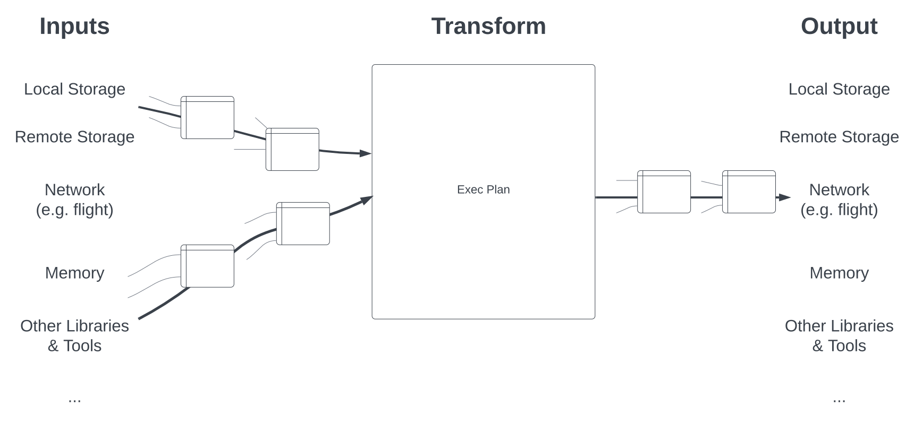

.. Licensed to the Apache Software Foundation (ASF) under one
.. or more contributor license agreements.  See the NOTICE file
.. distributed with this work for additional information
.. regarding copyright ownership.  The ASF licenses this file
.. to you under the Apache License, Version 2.0 (the
.. "License"); you may not use this file except in compliance
.. with the License.  You may obtain a copy of the License at

..   http://www.apache.org/licenses/LICENSE-2.0

.. Unless required by applicable law or agreed to in writing,
.. software distributed under the License is distributed on an
.. "AS IS" BASIS, WITHOUT WARRANTIES OR CONDITIONS OF ANY
.. KIND, either express or implied.  See the License for the
.. specific language governing permissions and limitations
.. under the License.

.. default-domain:: cpp
.. highlight:: cpp
.. cpp:namespace:: arrow::acero

=======================================
Acero: A C++ streaming execution engine
=======================================

.. warning::

    Acero is experimental and a stable API is not yet guaranteed.

For many complex computations, successive direct :ref:`invocation of
compute functions <invoking-compute-functions>` is not feasible
in either memory or computation time. To facilitate arbitrarily large inputs
and more efficient resource usage, the Arrow C++ implementation also
provides Acero, a streaming query engine with which computations can
be formulated and executed.

         and outputs a stream of data.

.. toctree::
   :maxdepth: 2

   acero/overview
   acero/user_guide
   acero/substrait
   acero/developer_guide
