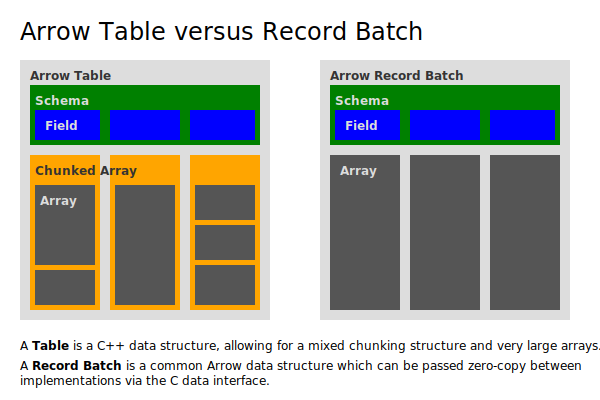

.. Licensed to the Apache Software Foundation (ASF) under one
.. or more contributor license agreements.  See the NOTICE file
.. distributed with this work for additional information
.. regarding copyright ownership.  The ASF licenses this file
.. to you under the Apache License, Version 2.0 (the
.. "License"); you may not use this file except in compliance
.. with the License.  You may obtain a copy of the License at

..   http://www.apache.org/licenses/LICENSE-2.0

.. Unless required by applicable law or agreed to in writing,
.. software distributed under the License is distributed on an
.. "AS IS" BASIS, WITHOUT WARRANTIES OR CONDITIONS OF ANY
.. KIND, either express or implied.  See the License for the
.. specific language governing permissions and limitations
.. under the License.

.. default-domain:: cpp
.. highlight:: cpp

============
Tabular Data
============

.. seealso::
   :doc:`Table and RecordBatch API reference <api/table>`.

While arrays and chunked arrays represent a one-dimensional sequence of
homogeneous values, data often comes in the form of two-dimensional sets of
heterogeneous data (such as database tables, CSV files...).  Arrow provides
several abstractions to handle such data conveniently and efficiently.

Fields
======

Fields are used to denote the particular columns of a table (and also
the particular members of a nested data type such as :class:`arrow::StructType`).
A field, i.e. an instance of :class:`arrow::Field`, holds together a data
type, a field name and some optional metadata.

The recommended way to create a field is to call the :func:`arrow::field`
factory function.

Schemas
=======

A schema describes the overall structure of a two-dimensional dataset such
as a table.  It holds a sequence of fields together with some optional
schema-wide metadata (in addition to per-field metadata).  The recommended
way to create a schema is to call one the :func:`arrow::schema` factory
function overloads::

   // Create a schema describing datasets with two columns:
   // a int32 column "A" and a utf8-encoded string column "B"
   std::shared_ptr<arrow::Field> field_a, field_b;
   std::shared_ptr<arrow::Schema> schema;

   field_a = arrow::field("A", arrow::int32());
   field_b = arrow::field("B", arrow::utf8());
   schema = arrow::schema({field_a, field_b});

Tables
======

A :class:`arrow::Table` is a two-dimensional dataset with chunked arrays for
columns, together with a schema providing field names.  Also, each chunked
column must have the same logical length in number of elements (although each
column can be chunked in a different way).

Record Batches
==============

A :class:`arrow::RecordBatch` is a two-dimensional dataset of a number of
contiguous arrays, each the same length.  Like a table, a record batch also
has a schema which must match its arrays' datatypes.

Record batches are a convenient unit of work for various serialization
and computation functions, possibly incremental.

         structure as described in text above.

Record batches can be sent between implementations, such as via 
:ref:`IPC <format-ipc>` or
via the :doc:`C Data Interface <../format/CDataInterface>`. Tables and 
chunked arrays, on the other hand, are concepts in the C++ implementation,
not in the Arrow format itself, so they aren't directly portable.

However, a table can be converted to and built from a sequence of record 
batches easily without needing to copy the underlying array buffers.
A table can be streamed as an arbitrary number of record batches using
a :class:`arrow::TableBatchReader`.  Conversely, a logical sequence of
record batches can be assembled to form a table using one of the
:func:`arrow::Table::FromRecordBatches` factory function overloads.
