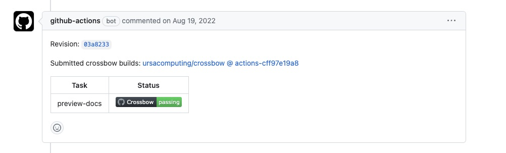
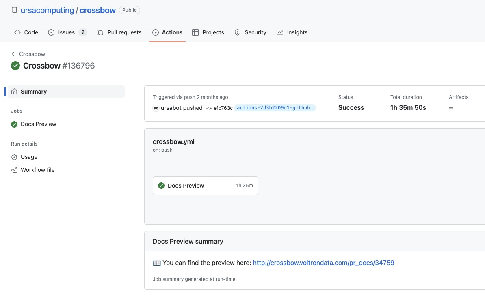

.. Licensed to the Apache Software Foundation (ASF) under one
.. or more contributor license agreements.  See the NOTICE file
.. distributed with this work for additional information
.. regarding copyright ownership.  The ASF licenses this file
.. to you under the Apache License, Version 2.0 (the
.. "License"); you may not use this file except in compliance
.. with the License.  You may obtain a copy of the License at

..   http://www.apache.org/licenses/LICENSE-2.0

.. Unless required by applicable law or agreed to in writing,
.. software distributed under the License is distributed on an
.. "AS IS" BASIS, WITHOUT WARRANTIES OR CONDITIONS OF ANY
.. KIND, either express or implied.  See the License for the
.. specific language governing permissions and limitations
.. under the License.

.. _building-docs:

Building the Documentation
==========================

Prerequisites
-------------

The documentation build process uses `Doxygen <http://www.doxygen.nl/>`_ and
`Sphinx <http://www.sphinx-doc.org/>`_ along with a few extensions.

If you're using Conda, the required software can be installed in a single line:

.. code-block:: shell

   conda install -c conda-forge --file=arrow/ci/conda_env_sphinx.txt

Otherwise, you'll first need to install `Doxygen <http://www.doxygen.nl/>`_
yourself (for example from your distribution's official repositories, if
using Linux).  Then you can install the Python-based requirements with the
following command:

.. code-block:: shell

   pip install -r arrow/docs/requirements.txt

Building
--------

.. note::

   If you are building the documentation on Windows, not all sections
   may build properly.

These two steps are mandatory and must be executed in order.

#. Process the C++ API using Doxygen

   .. code-block:: shell

      pushd arrow/cpp/apidoc
      doxygen
      popd

#. Build the complete documentation using Sphinx.

   .. note::

      This step requires the pyarrow library is installed
      in your python environment.  One way to accomplish
      this is to follow the build instructions at :ref:`python-development`
      and then run ``python setup.py install`` in arrow/python
      (it is best to do this in a dedicated conda/virtual environment).

   .. code-block:: shell

      pushd arrow/docs
      make html
      popd

.. note::

   Note that building the documentation may fail if your build of pyarrow is
   not sufficiently comprehensive. Portions of the Python API documentation
   will also not build without CUDA support having been built.

After these steps are completed, the documentation is rendered in HTML
format in ``arrow/docs/_build/html``.  In particular, you can point your browser
at ``arrow/docs/_build/html/index.html`` to read the docs and review any changes
you made.

Building with Docker
--------------------

You can use :ref:`Archery <archery>` to build the documentation within a
Docker container.

.. code-block:: shell

  archery docker run -v "${PWD}/docs:/build/docs" ubuntu-docs

The final output is located under the ``${PWD}/docs`` directory.

.. seealso::

   :ref:`docker-builds`.

.. _building-docs-pr-preview:

Building a docs preview in a Pull Request
-----------------------------------------

You can build and preview the documentation within a GitHub pull request you are working on.

To do so, post the comment ``@github-actions crossbow submit preview-docs``
to the pull request. The rendered documentation will then be available within the
GitHub Actions response, where you need to click on the Crossbow build badge:

   Crossbow build status

and then in the summary of the workflow you can find the link to the Docs Preview
summary at the bottom of the page:

   Docs Preview summary section

Building for dev purposes
-------------------------

Building subsections
^^^^^^^^^^^^^^^^^^^^

To make it easier for developers to update parts of the documentation, one can
build only a subset of it. You can build:

* Specifications and protocol section (``docs/source/format``) with:

  .. code-block:: shell

     pushd arrow/docs
     make format
     popd

  Rendered HTML format can be found in ``arrow/docs/_build/html/format``.

* Development section (``docs/source/developers``) with:

  .. code-block:: shell

     pushd arrow/docs
     make dev
     popd

  Rendered HTML format can be found in ``arrow/docs/_build/html/developers``.

* C++ section (``docs/source/cpp``) with:

  .. code-block:: shell

     pushd arrow/docs
     make cpp
     popd

  Rendered HTML format can be found in ``arrow/docs/_build/html/cpp``.

* Python section (``docs/source/python``) with:

  .. code-block:: shell

     pushd arrow/docs
     make python
     popd

  Rendered HTML format can be found in ``arrow/docs/_build/html/python``.

.. note::

   When building only a part of the documentation the links will get broken!

   For this reason building only a subset of the documentation should only be
   used in the initial work as it makes the building faster and easier.

   To check for the correctness of the documentation overall one should
   build the whole documentation with ``make html`` or use
   :ref:`GitHub Actions <building-docs-pr-preview>`.

Building live
^^^^^^^^^^^^^

You can also build the documentation (or a part of it) live. This means the
changes saved will automatically trigger the documentation to be rebuilt.

.. code-block:: shell

   pushd arrow/docs
   make html-live

The same way one could use ``make format-live``, ``make dev-live``, ``make cpp-live``
or ``make python-live`` to auto-build part of the documentation.

Building a single directory for dev purposes without all the pre-requisites
^^^^^^^^^^^^^^^^^^^^^^^^^^^^^^^^^^^^^^^^^^^^^^^^^^^^^^^^^^^^^^^^^^^^^^^^^^^

You can build documentation in a single directory without needing to install
all of the pre-requisites by installing sphinx, setting up a temporary
index in the directory you want to build and then building that directory.

The example below shows how to do this in the ``arrow/docs/source/developers`` directory.

Install ``sphinx``:

.. code-block:: shell

   pip install sphinx

Navigate to the ``arrow/docs`` directory:

.. code-block:: shell

   cd arrow/docs

Create an temporary index file ``temp_index.rst`` file in the target directory:

.. code-block:: shell

   echo $'.. toctree::\n\t:glob:\n\n\t*' > ./source/developers/temp_index.rst

Build the docs in the target directory:

.. code-block:: shell

   sphinx-build ./source/developers ./source/developers/_build -c ./source -D master_doc=temp_index

This builds everything in the target directory to a folder inside of it
called ``_build`` using the config file in the `source` directory.

Once you have verified the HTML documents, you can remove temporary index file:

.. code-block:: shell

   rm ./source/developers/temp_index.rst
