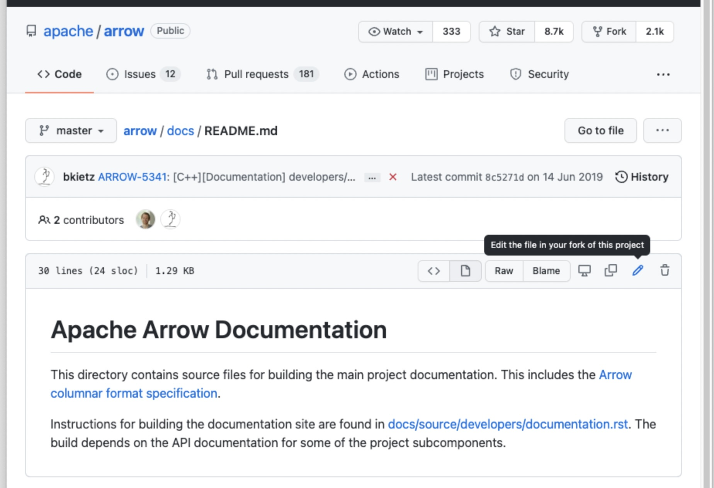

.. Licensed to the Apache Software Foundation (ASF) under one
.. or more contributor license agreements.  See the NOTICE file
.. distributed with this work for additional information
.. regarding copyright ownership.  The ASF licenses this file
.. to you under the Apache License, Version 2.0 (the
.. "License"); you may not use this file except in compliance
.. with the License.  You may obtain a copy of the License at

..   http://www.apache.org/licenses/LICENSE-2.0

.. Unless required by applicable law or agreed to in writing,
.. software distributed under the License is distributed on an
.. "AS IS" BASIS, WITHOUT WARRANTIES OR CONDITIONS OF ANY
.. KIND, either express or implied.  See the License for the
.. specific language governing permissions and limitations
.. under the License.

.. SCOPE OF THIS SECTION
.. To expose that help with existing documentation is a
.. very good way to start and also a very important part of
.. the project! If possible add summary of the structure of
.. the existing documentation, including different Cookbooks.

.. _documentation:

**************************
Helping with documentation
**************************

A great way to contribute to the project is to improve
documentation. 

If you are an Arrow user and you found some docs to be
incomplete or inaccurate, share your hard-earned knowledge
with the rest of the community.

If you haven't come across an error in the documentation
it is hard to find one and going through the docs in search
for corrections is not a good way to go. In this case you can
search for an issue that is dealing with the documentation
on JIRA.

.. note::
	When searching for JIRA issue that deals with documentation
	try selecting **Components** from **More** tab in JIRA search
	and there find **Documentation** from the list.

	See `Example search. <https://issues.apache.org/jira/browse/ARROW-14280?jql=project%20%3D%20ARROW%20AND%20status%20%3D%20Open%20AND%20resolution%20%3D%20Unresolved%20AND%20component%20%3D%20Documentation%20AND%20assignee%20in%20(EMPTY)%20ORDER%20BY%20priority%20DESC%2C%20updated%20DESC>`_

.. figure:: jira_doc_1.jpeg
   :scale: 40 %
   :alt: selecting Components in JIRA search

   First select Components tab in JIRA.

.. figure:: jira_doc_2.jpeg
   :scale: 40 %
   :alt: selecting Documentation in JIRA search

   Then choose Documentation from the Components list.

Documentation improvements are also a great way to gain some
experience with our submission and review process without
requiring a lot of local development environment setup. 

.. note::
	Many documentation-only changes can be made directly in the
	GitHub web interface by clicking the **edit** icon. This
	will handle making a fork and a pull request for you.

   On the right corner of the file in GitHub click on pen icon.

.. figure:: github_edit_2.jpeg
   :scale: 30 %
   :alt: edit file in GitHub.

   Now you can edit the file in GitHub.

You could also build the entire project, make the change locally on
your branch and make the PR this way. But it is by no means superior
to simply editing via GitHub.

If you wish to build the documentation also, follow detailed instructions
on :ref:`building-docs`.