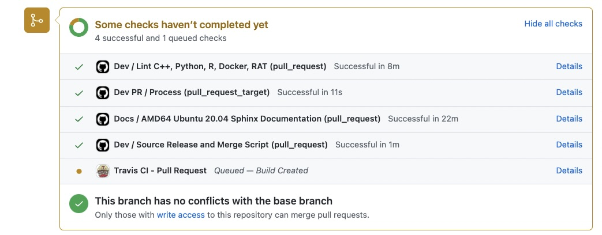
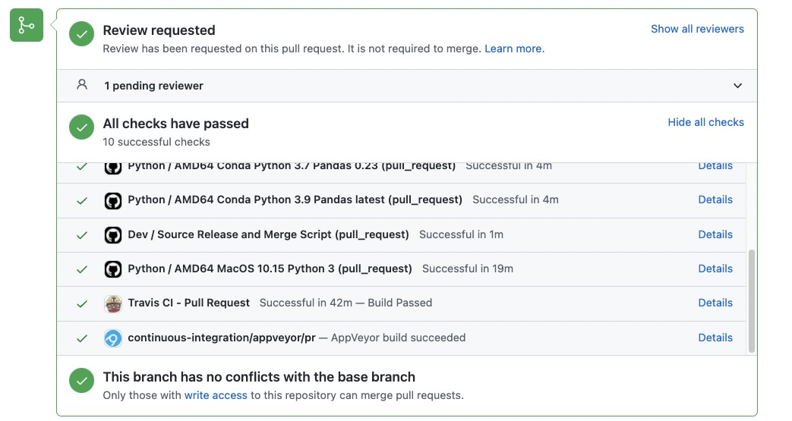
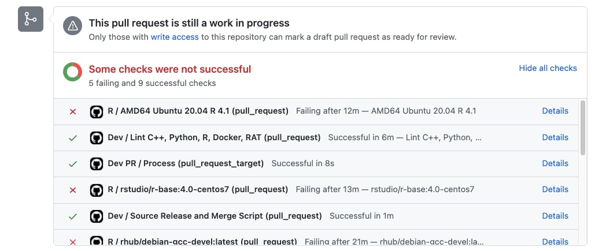

.. Licensed to the Apache Software Foundation (ASF) under one
.. or more contributor license agreements.  See the NOTICE file
.. distributed with this work for additional information
.. regarding copyright ownership.  The ASF licenses this file
.. to you under the Apache License, Version 2.0 (the
.. "License"); you may not use this file except in compliance
.. with the License.  You may obtain a copy of the License at

..   http://www.apache.org/licenses/LICENSE-2.0

.. Unless required by applicable law or agreed to in writing,
.. software distributed under the License is distributed on an
.. "AS IS" BASIS, WITHOUT WARRANTIES OR CONDITIONS OF ANY
.. KIND, either express or implied.  See the License for the
.. specific language governing permissions and limitations
.. under the License.

.. SCOPE OF THIS SECTION
.. This section should include all steps in making a pull
.. request (until it is merged) on Arrow GitHub repository
.. using git.

.. _pr_lifecycle:

***************************
Lifecycle of a pull request
***************************

:ref:`As mentioned before<set-up>`, the Arrow project uses Git
for version control and a workflow based on pull requests. That
means that you contribute the changes, or "patches", to the code
by creating a branch in Git, make changes to the code, push the
changes to your ``origin`` which is your fork of the Arrow
repository on GitHub and then you create a **pull request** against
the official Arrow repository which is saved in your set up as
``upstream``.

You should have Git set up by now, have cloned the repository,
have successfully built Arrow and have a GitHub issue to work on.

**Before making changes to the code, you should create a new
branch in Git.**

1. Update your fork’s main branch with ``upstream/main``.
   Run this in the shell from the ``arrow`` directory.

   .. code:: console

      $ git checkout main # select the main Arrow branch
      $ git fetch upstream # check for changes in upstream/main
      $ git pull --ff-only upstream main # save the changes from upstream/main

   Note: ``--ff-only`` applies changes only if they can be fast-forwarded
   without conflicts or creating merge commits.

2. Create a new branch

   .. code:: console

      $ git checkout -b <branch-name>

   or (does the same thing)

   .. code:: console

      $ git switch --create <branch-name>

Now you can make changes to the code. To see the changes
made in the library use this two commands:

.. code:: console

   $ git status # to see what files are changed
   $ git diff # to see code change per file

.. _create_pr:

Creating a pull request
==========================

Once you are satisfied with the changes, run the :ref:`tests <testing>`
and :ref:`linters<styling>` and then go ahead and commit the changes.

3. Add and commit the changes

   .. code:: console

      $ git add <filenames>
      $ git commit -m "<message>"

   Alternatively, you can add and commit in one step, if all the files changed
   are to be committed (-a to add all, -m for message)

   .. code:: console

      $ git commit -am "<message>"

4. Then push your work to your Arrow fork

   .. code:: console

      $ git push origin <branch-name>

.. note::

   Your work is now still under your watchful eye so it's not a problem
   if you see any errors you would like to correct. You can make an
   additional commit to correct, and Git has lots of ways to
   amend, delete, revise, etc. See https://git-scm.com/docs for more
   information.

   Until you make the pull request, nothing is visible on the Arrow
   repository and you are free to experiment.

If all is set, you can make the pull request!

5. Go to ``https://github.com/<your username>/arrow`` where you will see a box with
   the name of the branch that you pushed and next to it a green button
   **Compare & pull request**. After clicking on it, you should add a
   title and description of the pull request. Underneath you can check
   once again the changes you have made.

   .. seealso::

      Get more details on naming the pull request in Arrow repository
      and other additional information :ref:`pull-request-and-review`
      section.

Continuous Integration (CI)
---------------------------

Continuous integration (CI) is an automated way to run tests and
builds on different environments with the changed code made by a
specific pull request. It serves as a stability check before it
gets merged or integrated into the main repository of the project.

Once the pull request is created, the CI will trigger checks on the
code. Depending on what part of the code was changed (documentation,
C++ or other languages for example) the CI is configured to run
the relevant checks.

You will see checks running at the bottom of the pull request page
on GitHub. In case of an error, click on the details and research the cause
of the failing build.

         in case of changes made to the documentation.

   CI checks for changes made to the documentation.

         in case of changes made to the python files

   CI checks for changes made to the python files.

         in case of changes made to the R files.

   CI checks for changes made to the R files.

Besides the CI jobs that check the changes in GitHub repository
(opening or merging of a pull request) we also use CI for nightly
builds and releases of the Apache Arrow library.

Also, extended triggering jobs can be used in your pull request for
example adding a comment with ``@github-actions crossbow submit python``
will run PyArrow tests via GitHub actions. These are mostly used to run
tests on environments that are less common and are normally
not needed in first time contributions.

To read more about this topic visit :ref:`continuous-integration`.

Reviews and merge of the pull request
=====================================

When the pull request is submitted it waits to get reviewed. One of
great things about open source is that your work can get lots of feedback and
so it gets perfected. Do not be discouraged by the time it takes for
the PR to get merged due to reviews and corrections. It is a process
that supports quality and with it you can learn a lot.

If it still takes too long to get merged, do not hesitate to remind
maintainers in the comment section of the pull request and post
reminders on the GitHub issue also.

How to get your pull request to be reviewed?
--------------------------------------------

Arrow maintainers will be notified when a pull request is created and
they will get to it as soon as possible. If days pass and it still had
not been reviewed go ahead and mention the reporter of the GitHub issue
or a developer that you communicated with via mailing list or GitHub.

To put a **mention** in GitHub insert @ in the comment and select the
username from the list.

Commenting on a pull request
----------------------------

When a pull request is open in the repository you and other developers
can comment on the proposed solution.

To create a general comment navigate to the **Conversation** tab of
your pull request and start writing in the comment box at the bottom of
the page.

You can also comment on a section of the file to point out something
specific from your code. To do this navigate to **Files changed** tab and
select a line you want to insert the comment to. Hovering over the beginning
of the line you will see a **blue plus icon**. You can click on it or drag
it to select multiple lines and then click the icon to insert the comment.

Resolve conversation
--------------------

You can resolve a conversion in a pull request review by clicking
**Resolve conversation** in the **Files changed** tab. This way the
conversation will be collapsed and marked as resolved which will make it
easier for you to organize what is done and what still needs to be addressed.

Updating your pull request
--------------------------

The procedure after getting reviews is similar to creating the initial pull request.
You need to update your code locally, make a commit, update the branch to sync
it with upstream and push your code to origin. It will automatically be updated
in your pull request as well.

The steps for updating the pull request would then be as follows:

1. Updating the code locally and making a commit as before:

   .. code:: console

      $ git commit -am "<message>" #if all changed files are to be committed

2. **Important!** In case there are commits from other developers on the pull
   request branch or if you committed suggestions from the GitHub you need
   to update you code with ``origin`` before rebasing! To do this run:

   .. code:: console

      $ git pull origin <branch-name>

   Here we merge the new commits with our local branch and we do not rebase.

3. Now we have to update the branch to sync with upstream main Arrow branch.
   This way the pull request will be able to get merged. We use rebase in this
   case.

   .. code:: console

      $ git pull upstream main --rebase

   This will rebase your local commits on top of the tip of ``upstream/main``.

4. Now you can push the changes by running:

   .. code:: console

         $ git push origin <branch-name> --force

   *Note about force pushing to a branch that is being reviewed:* if you want
   reviewers to look at your updates, please ensure you comment on the PR on
   GitHub as simply force pushing does not trigger a notification in the
   GitHub user interface.

.. seealso::

   See more about updating the branch (we use ``rebase``, not ``merge``)
   and squashing local commits in :ref:`git-conventions`.

If the review process is successful your pull request will get merged.

Congratulations! 🎉
===================
