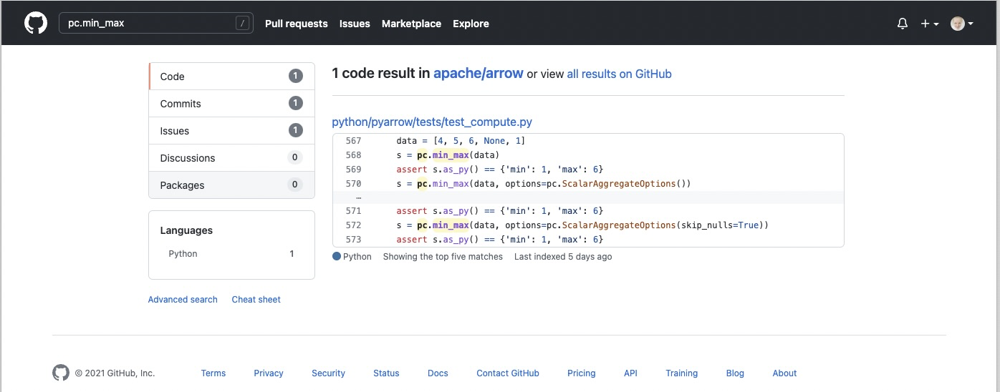
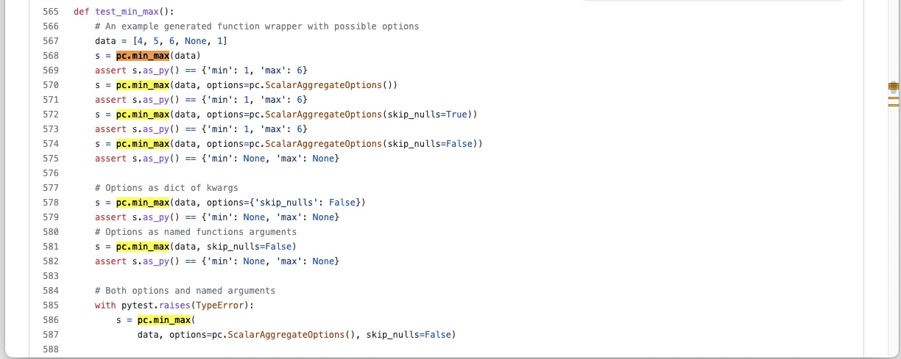

.. Licensed to the Apache Software Foundation (ASF) under one
.. or more contributor license agreements.  See the NOTICE file
.. distributed with this work for additional information
.. regarding copyright ownership.  The ASF licenses this file
.. to you under the Apache License, Version 2.0 (the
.. "License"); you may not use this file except in compliance
.. with the License.  You may obtain a copy of the License at

..   http://www.apache.org/licenses/LICENSE-2.0

.. Unless required by applicable law or agreed to in writing,
.. software distributed under the License is distributed on an
.. "AS IS" BASIS, WITHOUT WARRANTIES OR CONDITIONS OF ANY
.. KIND, either express or implied.  See the License for the
.. specific language governing permissions and limitations
.. under the License.

.. SCOPE OF THIS SECTION
.. Concise tutorial on making a PR for a simple feature.

.. _python_tutorial:

***************
Python tutorial
***************

In this tutorial we will make an actual feature contribution to
Arrow following the steps specified by :ref:`quick-ref-guide`
section of the guide and a more detailed :ref:`step_by_step`
section. Navigate there whenever there is some information
you may find is missing here.

The feature contribution will be added to the compute module
in PyArrow. But you can also follow the steps in case you are
correcting a bug or adding a binding.

This tutorial is different from the :ref:`step_by_step` as we
will be working on a specific case. This tutorial is not meant
as a step-by-step guide.

**Let's start!**

Set up
------

Let's set up the Arrow repository. We presume here that Git is
already installed. Otherwise please see the :ref:`set-up` section.

Once the `Apache Arrow repository <https://github.com/apache/arrow>`_
is forked we will clone it and add the link of the main repository
to our upstream.

.. code:: console

   $ git clone https://github.com/<your username>/arrow.git
   $ cd arrow
   $ git remote add upstream https://github.com/apache/arrow

Building PyArrow
----------------

Script for building PyArrow differs depending on the Operating
System you are using. For this reason we will only refer to
the instructions for the building process in this tutorial.

.. seealso::

   For the **introduction** to the building process refer to the
   :ref:`build-arrow-guide` section.

   For the **instructions** on how to build PyArrow refer to the
   :ref:`build_pyarrow` section.

Create a GitHub issue for the new feature
-----------------------------------------

We will add a new feature that imitates an existing function
``min_max`` from the ``arrow.compute`` module but makes the
interval bigger by 1 in both directions. Note that this is a
made-up function for the purpose of this guide.

See the example of the ``pc.min_max`` in
`this link <https://arrow.apache.org/cookbook/py/data.html#computing-mean-min-max-values-of-an-array>`_.

First we need to create a GitHub issue as it doesn't exist yet.
With a GitHub account created we will navigate to the
`GitHub issue dashboard <https://github.com/apache/arrow/issues>`_
and click on the **New issue** button.

We should make sure to assign ourselves to the issue to let others
know we are working on it. You can do that with adding a comment
``take`` to the issue created.

.. seealso::

   To get more information on GitHub issues go to
   :ref:`finding-issues` part of the guide.

Start the work on a new branch
------------------------------

Before we start working on adding the feature we should
create a new branch from the updated main branch.

.. code:: console

   $ git checkout main
   $ git fetch upstream
   $ git pull --ff-only upstream main
   $ git checkout -b ARROW-14977

Let's research the Arrow library to see where the ``pc.min_max``
function is defined/connected with the C++ and get an idea
where we could implement the new feature.

         searching for a pc.min_max function reference.

   We could try to search for the function reference in a
   GitHub Apache Arrow repository.

         test_compute.py file for the pc.min_max function.

   And search through the ``test_compute.py`` file in ``pyarrow``
   folder.

From the search we can see that the function is tested in the
``python/pyarrow/tests/test_compute.py`` file that would mean the
function is defined in the ``compute.py`` file.

After examining the ``compute.py`` file we can see that together
with ``_compute.pyx`` the functions from C++ get wrapped into Python.
We will define the new feature at the end of the ``compute.py`` file. 

Lets run some code in the Python console from ``arrow/python``
directory in order to learn more about ``pc.min_max``.

.. code:: console

   $ cd python
   $ python

   Python 3.9.7 (default, Oct 22 2021, 13:24:00) 
   [Clang 13.0.0 (clang-1300.0.29.3)] on darwin
   Type "help", "copyright", "credits" or "license" for more information.
   
We have entered into the Python console from the shell and we can
do some research:

.. code-block:: python

   >>> import pyarrow.compute as pc
   >>> data = [4, 5, 6, None, 1]
   >>> data
   [4, 5, 6, None, 1]
   >>> pc.min_max(data)
   <pyarrow.StructScalar: [('min', 1), ('max', 6)]>
   >>> pc.min_max(data, skip_nulls=False)
   <pyarrow.StructScalar: [('min', None), ('max', None)]>

We will call our new feature ``pc.tutorial_min_max``. We want the
result from our function, that takes the same input data, to be
``[('min-', 0), ('max+', 7)]``. If we specify that the null value should be
included, the result should be equal to ``pc.min_max`` that is
``[('min', None), ('max', None)]``.

Lets add the first trial code into ``arrow/python/pyarrow/compute.py``
where we first test the call to the "min_max" function from C++:

.. code-block:: python

   def tutorial_min_max(values, skip_nulls=True):
       """
       Add docstrings

       Parameters
       ----------
       values : Array

       Returns
       -------
       result : TODO

       Examples
       --------
       >>> import pyarrow.compute as pc
       >>> data = [4, 5, 6, None, 1]
       >>> pc.tutorial_min_max(data)
       <pyarrow.StructScalar: [('min-', 0), ('max+', 7)]>
       """

       options = ScalarAggregateOptions(skip_nulls=skip_nulls)
       return call_function("min_max", [values], options)

To see if this works we will need to import ``pyarrow.compute``
again and try:

.. code-block:: python

   >>> import pyarrow.compute as pc
   >>> data = [4, 5, 6, None, 1]
   >>> pc.tutorial_min_max(data)
   <pyarrow.StructScalar: [('min', 1), ('max', 6)]>

It’s working. Now we must correct the limits to get the corrected
interval. To do that we have to do some research on ``pyarrow.StructScalar``.
In `test_scalars.py <https://github.com/apache/arrow/blob/994074d2e7ff073301e0959dbc5bb595a1e2a41b/python/pyarrow/tests/test_scalars.py#L547-L553>`_
under the ``test_struct_duplicate_fields`` we can see an example
of how the ``StructScalar`` is created. We could again run the
Python console and try creating one ourselves.

.. code-block:: python

   >>> import pyarrow as pa
   >>> ty = pa.struct([
   ...      pa.field('min-', pa.int64()),
   ...      pa.field('max+', pa.int64()),
   ...    ])
   >>> pa.scalar([('min-', 3), ('max+', 9)], type=ty)
   <pyarrow.StructScalar: [('min-', 3), ('max+', 9)]>

.. note::

   In cases where we don't yet have good documentation, unit tests
   can be a good place to look for code examples.

With the new gained knowledge about ``StructScalar`` and additional
options for the ``pc.min_max`` function we can finish the work.

.. code-block:: python

   def tutorial_min_max(values, skip_nulls=True):

      """
      Compute the minimum-1 and maximum+1 values of a numeric array.

      This is a made-up feature for the tutorial purposes.

      Parameters
      ----------
      values : Array
      skip_nulls : bool, default True
          If True, ignore nulls in the input.

      Returns
      -------
      result : StructScalar of min-1 and max+1

      Examples
      --------
      >>> import pyarrow.compute as pc
      >>> data = [4, 5, 6, None, 1]
      >>> pc.tutorial_min_max(data)
      <pyarrow.StructScalar: [('min-', 0), ('max+', 7)]>
      """

      options = ScalarAggregateOptions(skip_nulls=skip_nulls)
      min_max = call_function("min_max", [values], options)

      if min_max[0].as_py() is not None:
        min_t = min_max[0].as_py()-1
        max_t = min_max[1].as_py()+1
      else:
        min_t = min_max[0].as_py()
        max_t = min_max[1].as_py()

      ty = pa.struct([
        pa.field('min-', pa.int64()),
        pa.field('max+', pa.int64()),
      ])
      return pa.scalar([('min-', min_t), ('max+', max_t)], type=ty)

.. TODO seealso
   .. For more information about the Arrow codebase visit 
   .. :ref:``. (link to working on the Arrow codebase section)

Adding a test
-------------

Now we should add a unit test to ``python/pyarrow/tests/test_compute.py``
and run the pytest.

.. code-block:: python

   def test_tutorial_min_max():
       arr = [4, 5, 6, None, 1]
       l1 = {'min-': 0, 'max+': 7}
       l2 = {'min-': None, 'max+': None}
       assert pc.tutorial_min_max(arr).as_py() == l1
       assert pc.tutorial_min_max(arr,
                                  skip_nulls=False).as_py() == l2

With the unit test added we can run the pytest from the shell. To run
a specific unit test, pass in the test name to the ``-k`` parameter.

.. code:: console

   $ cd python
   $ python -m pytest pyarrow/tests/test_compute.py -k test_tutorial_min_max                    
   ======================== test session starts ==========================
   platform darwin -- Python 3.9.7, pytest-6.2.5, py-1.10.0, pluggy-1.0.0
   rootdir: /Users/alenkafrim/repos/arrow/python, configfile: setup.cfg
   plugins: hypothesis-6.24.1, lazy-fixture-0.6.3
   collected 204 items / 203 deselected / 1 selected                                                                                   

   pyarrow/tests/test_compute.py .                                  [100%]

   ======================== 1 passed, 203 deselected in 0.16s ============
   

   $ python -m pytest pyarrow/tests/test_compute.py                       
   ======================== test session starts ===========================
   platform darwin -- Python 3.9.7, pytest-6.2.5, py-1.10.0, pluggy-1.0.0
   rootdir: /Users/alenkafrim/repos/arrow/python, configfile: setup.cfg
   plugins: hypothesis-6.24.1, lazy-fixture-0.6.3
   collected 204 items                                                                                                                 

   pyarrow/tests/test_compute.py ................................... [ 46%]
   .................................................                 [100%]

   ========================= 204 passed in 0.49s ==========================

.. seealso::

   For more information about testing see :ref:`testing` section.

Check styling
-------------

At the end we also need to check the styling. In Arrow we use a
utility called `Archery <https://arrow.apache.org/docs/developers/archery.html>`_
to check if code is in line with PEP 8 style guide.

.. code:: console
   
   $ archery lint --python --fix
   INFO:archery:Running Python formatter (autopep8)
   INFO:archery:Running Python linter (flake8)
   /Users/alenkafrim/repos/arrow/python/pyarrow/tests/test_compute.py:2288:80: E501 line too long (88 > 79 characters)

With the ``--fix`` command Archery will attempt to fix style issues,
but some issues like line length can't be fixed automatically.
We should make the necessary corrections ourselves and run
Archery again.

.. code:: console

   $ archery lint --python --fix
   INFO:archery:Running Python formatter (autopep8)
   INFO:archery:Running Python linter (flake8)

Done. Now lets make the Pull Request!

Creating a Pull Request
-----------------------

First let's review our changes in the shell using
``git status`` to see which files have been changed and to
commit only the ones we are working on.

.. code:: console

   $ git status
   On branch ARROW-14977
   Changes not staged for commit:
     (use "git add <file>..." to update what will be committed)
     (use "git restore <file>..." to discard changes in working directory)
      modified:   python/pyarrow/compute.py
      modified:   python/pyarrow/tests/test_compute.py

   no changes added to commit (use "git add" and/or "git commit -a")

And ``git diff`` to see the changes in the files
in order to spot any error we might have made.

.. code:: console

   $ git diff
   diff --git a/python/pyarrow/compute.py b/python/pyarrow/compute.py
   index 9dac606c3..e8fc775d8 100644
   --- a/python/pyarrow/compute.py
   +++ b/python/pyarrow/compute.py
   @@ -774,3 +774,45 @@ def bottom_k_unstable(values, k, sort_keys=None, *, memory_pool=None):
            sort_keys = map(lambda key_name: (key_name, "ascending"), sort_keys)
        options = SelectKOptions(k, sort_keys)
        return call_function("select_k_unstable", [values], options, memory_pool)
   +
   +
   +def tutorial_min_max(values, skip_nulls=True):
   +    """
   +    Compute the minimum-1 and maximum-1 values of a numeric array.
   +
   +    This is a made-up feature for the tutorial purposes.
   +
   +    Parameters
   +    ----------
   +    values : Array
   +    skip_nulls : bool, default True
   +        If True, ignore nulls in the input.
   +
   +    Returns
   +    -------
   +    result : StructScalar of min-1 and max+1
   +
   +    Examples
   +    --------
   +    >>> import pyarrow.compute as pc
   +    >>> data = [4, 5, 6, None, 1]
   +    >>> pc.tutorial_min_max(data)
   +    <pyarrow.StructScalar: [('min-', 0), ('max+', 7)]>
   +    """
   +
   +    options = ScalarAggregateOptions(skip_nulls=skip_nulls)
   +    min_max = call_function("min_max", [values], options)
   +
   ...

Everything looks OK. Now we can make the commit (save our changes
to the branch history):

.. code:: console

   $ git commit -am "Adding a new compute feature for tutorial purposes"
   [ARROW-14977 170ef85be] Adding a new compute feature for tutorial purposes
    2 files changed, 51 insertions(+)
   

We can use ``git log`` to check the history of commits:

.. code:: console

   $ git log
   commit 170ef85beb8ee629be651e3f93bcc4a69e29cfb8 (HEAD -> ARROW-14977)
   Author: Alenka Frim <frim.alenka@gmail.com>
   Date:   Tue Dec 7 13:45:06 2021 +0100

       Adding a new compute feature for tutorial purposes

   commit 8cebc4948ab5c5792c20a3f463e2043e01c49828 (main)
   Author: Sutou Kouhei <kou@clear-code.com>
   Date:   Sun Dec 5 15:19:46 2021 +0900

       ARROW-14981: [CI][Docs] Upload built documents
       
       We can use this in release process instead of building on release
       manager's local environment.
       
       Closes #11856 from kou/ci-docs-upload
       
       Authored-by: Sutou Kouhei <kou@clear-code.com>
       Signed-off-by: Sutou Kouhei <kou@clear-code.com>
   ...

If we would started the branch some time ago, we may need to rebase to
upstream main to make sure there are no merge conflicts:

.. code:: console

   $ git pull upstream main --rebase

And now we can push our work to the forked Arrow repository on GitHub
called ``origin``.

.. code:: console

   $ git push origin ARROW-14977
   Enumerating objects: 13, done.
   Counting objects: 100% (13/13), done.
   Delta compression using up to 8 threads
   Compressing objects: 100% (7/7), done.
   Writing objects: 100% (7/7), 1.19 KiB | 1.19 MiB/s, done.
   Total 7 (delta 6), reused 0 (delta 0), pack-reused 0
   remote: Resolving deltas: 100% (6/6), completed with 6 local objects.
   remote: 
   remote: Create a pull request for 'ARROW-14977' on GitHub by visiting:
   remote:      https://github.com/AlenkaF/arrow/pull/new/ARROW-14977
   remote: 
   To https://github.com/AlenkaF/arrow.git
    * [new branch]          ARROW-14977 -> ARROW-14977

Now we have to go to the `Arrow repository on GitHub <https://github.com/apache/arrow>`_
to create a Pull Request. On the GitHub Arrow
page (main or forked) we will see a yellow notice
bar with a note that we made recent pushes to the branch
ARROW-14977. That’s great, now we can make the Pull Request
by clicking on **Compare & pull request**. 

.. figure:: ../../images/python_tutorial_github_pr_notice.jpeg
   :scale: 50 %
   :alt: GitHub page of the Apache Arrow repository showing a notice bar
         indicating change has been made in our branch and a Pull Request
         can be created.

   Notice bar on the Apache Arrow repository.

First we need to change the Title to *ARROW-14977: [Python] Add a "made-up"
feature for the guide tutorial* in order to match it
with the issue. Note a punctuation mark was added!

*Extra note: when this tutorial was created, we had been using the Jira issue
tracker. As we are currently using GitHub issues, the title would be prefixed
with GH-14977: [Python] Add a "made-up" feature for the guide tutorial*.

We will also add a description to make it clear to others what we are
trying to do.

Once I click **Create pull request** my code can be reviewed as a
Pull Request in the Apache Arrow repository.

.. figure:: ../../images/python_tutorial_pr.jpeg
   :scale: 50 %
   :alt: GitHub page of the Pull Request showing the title and a
         description.

   Here it is, our Pull Request!

The Pull Request gets connected to the issue and the CI is
running. After some time passes and we get a review we can correct
the code, comment, resolve conversations and so on. The Pull Request
we made can be viewed `here <https://github.com/apache/arrow/pull/11900>`_.

.. seealso::
   
   For more information about Pull Request workflow see :ref:`pr_lifecycle`.
