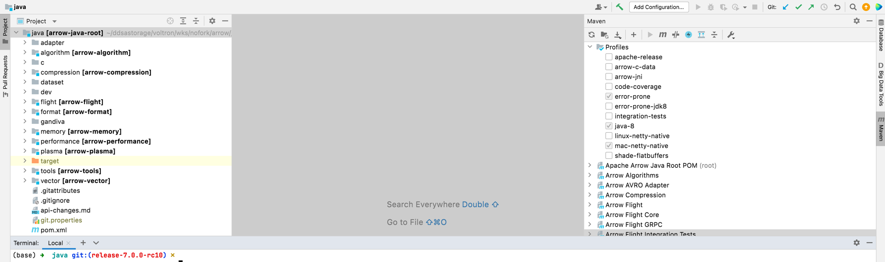
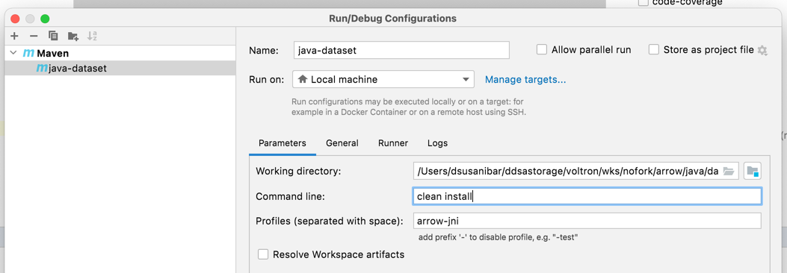
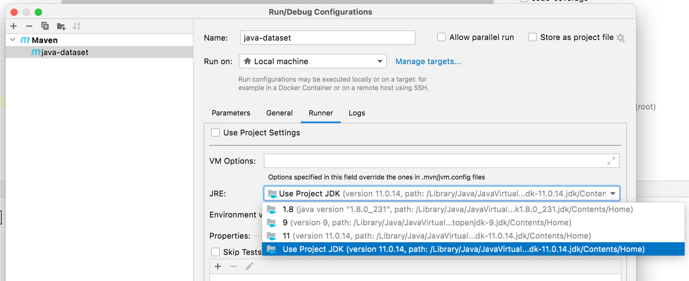
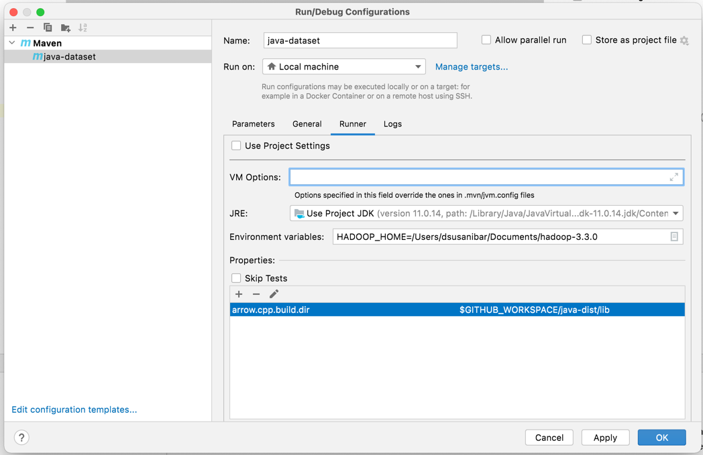
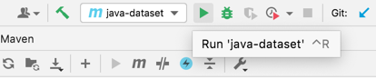
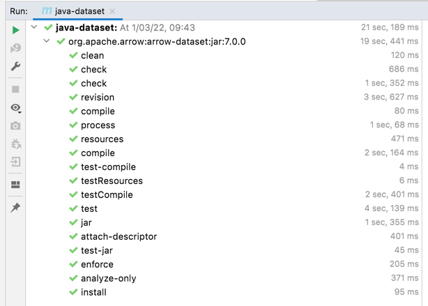

.. Licensed to the Apache Software Foundation (ASF) under one
.. or more contributor license agreements.  See the NOTICE file
.. distributed with this work for additional information
.. regarding copyright ownership.  The ASF licenses this file
.. to you under the Apache License, Version 2.0 (the
.. "License"); you may not use this file except in compliance
.. with the License.  You may obtain a copy of the License at

..   http://www.apache.org/licenses/LICENSE-2.0

.. Unless required by applicable law or agreed to in writing,
.. software distributed under the License is distributed on an
.. "AS IS" BASIS, WITHOUT WARRANTIES OR CONDITIONS OF ANY
.. KIND, either express or implied.  See the License for the
.. specific language governing permissions and limitations
.. under the License.

.. highlight:: console

.. _building-arrow-java:

===================
Building Arrow Java
===================

.. contents::

System setup
============

Arrow Java uses the `Maven <https://maven.apache.org/>`_ build system.

Building requires:

* JRE 8, 9, 10, 11
* Maven 3+

Building
========

All the instructions below assume that you have cloned the Arrow git
repository:

.. code-block::

    $ git clone https://github.com/apache/arrow.git
    $ cd arrow
    $ git submodule update --init --recursive

Basic Installation
------------------

To build the default modules, go to the project root and execute:

.. code-block::

    $ cd arrow/java
    $ export JAVA_HOME=<absolute path to your java home>
    $ java --version
    $ mvn clean install
    [INFO] Reactor Summary for Apache Arrow Java Root POM 8.0.0-SNAPSHOT:
    [INFO]
    [INFO] Apache Arrow Java Root POM ......................... SUCCESS [  4.922 s]
    [INFO] Arrow Format ....................................... SUCCESS [  4.395 s]
    [INFO] Arrow Memory ....................................... SUCCESS [  0.938 s]
    [INFO] Arrow Memory - Core ................................ SUCCESS [ 11.491 s]
    [INFO] Arrow Memory - Unsafe .............................. SUCCESS [  5.449 s]
    [INFO] Arrow Memory - Netty ............................... SUCCESS [  8.754 s]
    [INFO] Arrow Vectors ...................................... SUCCESS [01:37 min]
    [INFO] Arrow Compression .................................. SUCCESS [  5.907 s]
    [INFO] Arrow Tools ........................................ SUCCESS [ 11.015 s]
    [INFO] Arrow JDBC Adapter ................................. SUCCESS [ 13.751 s]
    [INFO] Arrow Plasma Client ................................ SUCCESS [  3.934 s]
    [INFO] Arrow Flight ....................................... SUCCESS [  0.649 s]
    [INFO] Arrow Flight Core .................................. SUCCESS [ 38.331 s]
    [INFO] Arrow Flight GRPC .................................. SUCCESS [  5.894 s]
    [INFO] Arrow Flight SQL ................................... SUCCESS [ 21.862 s]
    [INFO] Arrow Flight Integration Tests ..................... SUCCESS [  7.638 s]
    [INFO] Arrow AVRO Adapter ................................. SUCCESS [ 14.447 s]
    [INFO] Arrow Algorithms ................................... SUCCESS [ 35.105 s]
    [INFO] Arrow Performance Benchmarks ....................... SUCCESS [  5.323 s]
    [INFO] ------------------------------------------------------------------------
    [INFO] BUILD SUCCESS
    [INFO] ------------------------------------------------------------------------\

JNI Libraries
-------------

For Build C Data Interface lib & Build C++ Libs. Consider: Next step requires: Docker, Docker Compose, `archery`_.

.. code-block::

    $ cd arrow
    $ archery docker run java-jni-manylinux-2014
    $ ls -latr java-dist/
    |__ libarrow_cdata_jni.so
    |__ libarrow_dataset_jni.so
    |__ libarrow_orc_jni.so
    |__ libgandiva_jni.so

Building C & C++ JNI Libraries on MacOS
---------------------------------------

To build only the C Data Interface library:

.. code-block::

    $ cd arrow
    $ brew bundle --file=cpp/Brewfile
    Homebrew Bundle complete! 25 Brewfile dependencies now installed.
    $ export JAVA_HOME=<absolute path to your java home>
    $ mkdir -p java-dist java-native-c
    $ cd java-native-c
    $ cmake \
        -DCMAKE_BUILD_TYPE=Release \
        -DCMAKE_INSTALL_LIBDIR=lib \
        -DCMAKE_INSTALL_PREFIX=../java-dist \
        ../java/c
    $ cmake --build . --target install
    $ ls -latr ../java-dist/lib
    |__ libarrow_cdata_jni.dylib

To build other JNI libraries:

.. code-block::

    $ cd arrow
    $ brew bundle --file=cpp/Brewfile
    Homebrew Bundle complete! 25 Brewfile dependencies now installed.
    $ export JAVA_HOME=<absolute path to your java home>
    $ mkdir -p java-dist java-native-cpp
    $ cd java-native-cpp
    $ cmake \
        -DARROW_BOOST_USE_SHARED=OFF \
        -DARROW_BROTLI_USE_SHARED=OFF \
        -DARROW_BZ2_USE_SHARED=OFF \
        -DARROW_GFLAGS_USE_SHARED=OFF \
        -DARROW_GRPC_USE_SHARED=OFF \
        -DARROW_LZ4_USE_SHARED=OFF \
        -DARROW_OPENSSL_USE_SHARED=OFF \
        -DARROW_PROTOBUF_USE_SHARED=OFF \
        -DARROW_SNAPPY_USE_SHARED=OFF \
        -DARROW_THRIFT_USE_SHARED=OFF \
        -DARROW_UTF8PROC_USE_SHARED=OFF \
        -DARROW_ZSTD_USE_SHARED=OFF \
        -DARROW_JNI=ON \
        -DARROW_PARQUET=ON \
        -DARROW_FILESYSTEM=ON \
        -DARROW_DATASET=ON \
        -DARROW_GANDIVA_JAVA=ON \
        -DARROW_GANDIVA_STATIC_LIBSTDCPP=ON \
        -DARROW_GANDIVA=ON \
        -DARROW_ORC=ON \
        -DARROW_PLASMA_JAVA_CLIENT=ON \
        -DARROW_PLASMA=ON \
        -DCMAKE_BUILD_TYPE=Release \
        -DCMAKE_INSTALL_LIBDIR=lib \
        -DCMAKE_INSTALL_PREFIX=../java-dist \
        -DCMAKE_UNITY_BUILD=ON \
        -Dre2_SOURCE=BUNDLED \
        -DBoost_SOURCE=BUNDLED \
        -Dutf8proc_SOURCE=BUNDLED \
        -DSnappy_SOURCE=BUNDLED \
        -DORC_SOURCE=BUNDLED \
        -DZLIB_SOURCE=BUNDLED \
        ../cpp
    $ cmake --build . --target install
    $ ls -latr  ../java-dist/lib
    |__ libarrow_dataset_jni.dylib
    |__ libarrow_orc_jni.dylib
    |__ libgandiva_jni.dylib

Building Arrow JNI Libraries
----------------------------

To compile the JNI bindings, use the ``arrow-c-data`` Maven profile:

.. code-block::

    $ cd arrow/java
    $ mvn -Darrow.c.jni.dist.dir=../java-dist/lib -Parrow-c-data clean install
    [INFO] Reactor Summary for Apache Arrow Java Root POM 7.0.0:
    [INFO]
    [INFO] Apache Arrow Java Root POM ......................... SUCCESS [  4.385 s]
    [INFO] Arrow Format ....................................... SUCCESS [  4.832 s]
    [INFO] Arrow Memory ....................................... SUCCESS [  1.862 s]
    [INFO] Arrow Memory - Core ................................ SUCCESS [ 12.162 s]
    [INFO] Arrow Memory - Unsafe .............................. SUCCESS [  6.768 s]
    [INFO] Arrow Memory - Netty ............................... SUCCESS [  6.897 s]
    [INFO] Arrow Vectors ...................................... SUCCESS [01:43 min]
    [INFO] Arrow Compression .................................. SUCCESS [  6.510 s]
    [INFO] Arrow Tools ........................................ SUCCESS [ 13.280 s]
    [INFO] Arrow JDBC Adapter ................................. SUCCESS [ 13.726 s]
    [INFO] Arrow Plasma Client ................................ SUCCESS [  5.237 s]
    [INFO] Arrow Flight ....................................... SUCCESS [  0.809 s]
    [INFO] Arrow Flight Core .................................. SUCCESS [ 47.461 s]
    [INFO] Arrow Flight GRPC .................................. SUCCESS [  6.864 s]
    [INFO] Arrow Flight SQL ................................... SUCCESS [ 20.334 s]
    [INFO] Arrow Flight Integration Tests ..................... SUCCESS [  7.542 s]
    [INFO] Arrow AVRO Adapter ................................. SUCCESS [ 13.826 s]
    [INFO] Arrow Algorithms ................................... SUCCESS [ 32.442 s]
    [INFO] Arrow Performance Benchmarks ....................... SUCCESS [  5.418 s]
    [INFO] Arrow Java C Data Interface ........................ SUCCESS [  7.907 s]
    [INFO] ------------------------------------------------------------------------
    [INFO] BUILD SUCCESS
    [INFO] ------------------------------------------------------------------------

To compile the JNI bindings for ORC / Gandiva / Dataset, use the ``arrow-jni`` Maven profile:

.. code-block::

    $ cd arrow/java
    $ mvn -Darrow.cpp.build.dir=../java-dist/lib -Parrow-jni clean install
    [INFO] Reactor Summary for Apache Arrow Java Root POM 7.0.0:
    [INFO]
    [INFO] Apache Arrow Java Root POM ......................... SUCCESS [  7.342 s]
    [INFO] Arrow Format ....................................... SUCCESS [  2.417 s]
    [INFO] Arrow Memory ....................................... SUCCESS [  1.967 s]
    [INFO] Arrow Memory - Core ................................ SUCCESS [  4.714 s]
    [INFO] Arrow Memory - Unsafe .............................. SUCCESS [  3.157 s]
    [INFO] Arrow Memory - Netty ............................... SUCCESS [  3.334 s]
    [INFO] Arrow Vectors ...................................... SUCCESS [ 21.791 s]
    [INFO] Arrow Compression .................................. SUCCESS [  3.854 s]
    [INFO] Arrow Tools ........................................ SUCCESS [  8.359 s]
    [INFO] Arrow JDBC Adapter ................................. SUCCESS [  8.847 s]
    [INFO] Arrow Plasma Client ................................ SUCCESS [  2.459 s]
    [INFO] Arrow Flight ....................................... SUCCESS [  2.357 s]
    [INFO] Arrow Flight Core .................................. SUCCESS [ 38.837 s]
    [INFO] Arrow Flight GRPC .................................. SUCCESS [  5.955 s]
    [INFO] Arrow Flight SQL ................................... SUCCESS [ 17.390 s]
    [INFO] Arrow Flight Integration Tests ..................... SUCCESS [  6.148 s]
    [INFO] Arrow AVRO Adapter ................................. SUCCESS [  9.635 s]
    [INFO] Arrow Algorithms ................................... SUCCESS [ 26.949 s]
    [INFO] Arrow Performance Benchmarks ....................... SUCCESS [  4.211 s]
    [INFO] Arrow Orc Adapter .................................. SUCCESS [  6.522 s]
    [INFO] Arrow Gandiva ...................................... SUCCESS [01:20 min]
    [INFO] Arrow Java Dataset ................................. SUCCESS [ 12.949 s]
    [INFO] ------------------------------------------------------------------------
    [INFO] BUILD SUCCESS
    [INFO] ------------------------------------------------------------------------

IDE Configuration
=================

IntelliJ IDE
------------

Go to open java project and select java folder.

This is the initial view for java project loaded with default profiles:

Let's create our maven configuration: java-dataset

Let's define our JRE runner:

Let's configure additional environment properties:

Let's run our java-dataset maven configuration:

Common Errors
=============

1. If the build cannot find dependencies, with errors like these:
    - Could NOT find Boost (missing: Boost_INCLUDE_DIR system filesystem)
    - Could NOT find Lz4 (missing: LZ4_LIB)
    - Could NOT find zstd (missing: ZSTD_LIB)

    Download the dependencies at build time (More details in the `Dependency Resolution`_):

    .. code-block::

        -Dre2_SOURCE=BUNDLED \
        -DBoost_SOURCE=BUNDLED \
        -Dutf8proc_SOURCE=BUNDLED \
        -DSnappy_SOURCE=BUNDLED \
        -DORC_SOURCE=BUNDLED \
        -DZLIB_SOURCE=BUNDLED

.. _archery: https://arrow.apache.org/docs/developers/continuous_integration/archery.html
.. _Dependency Resolution: https://arrow.apache.org/docs/developers/cpp/building.html#individual-dependency-resolution