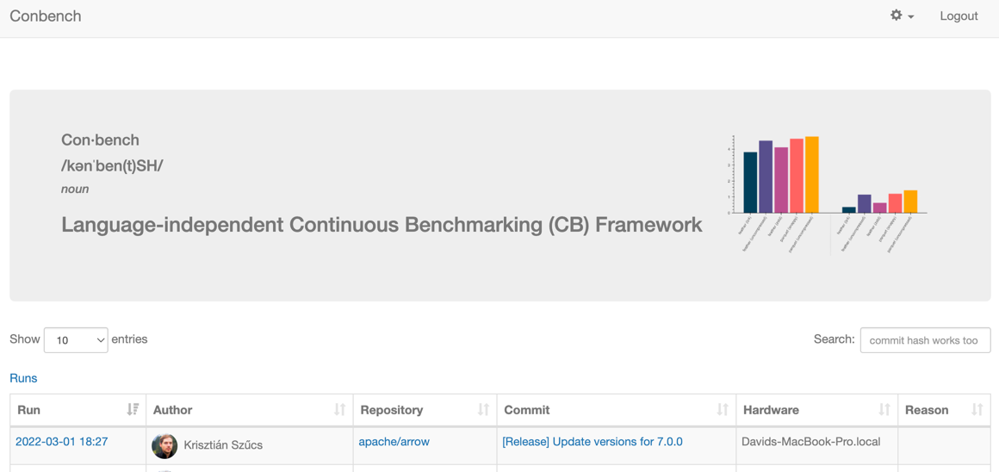
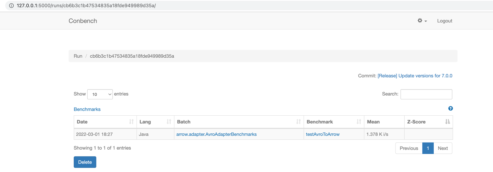
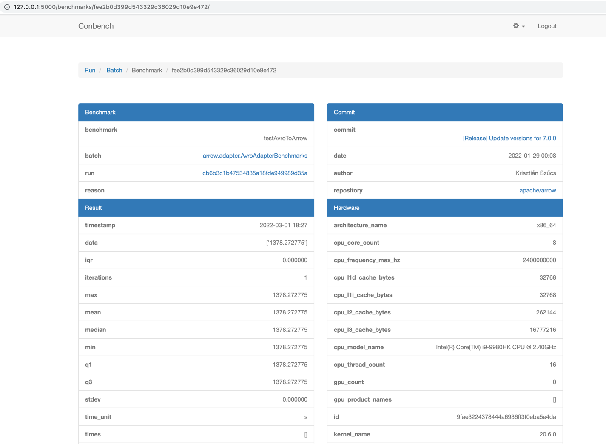

.. Licensed to the Apache Software Foundation (ASF) under one
.. or more contributor license agreements.  See the NOTICE file
.. distributed with this work for additional information
.. regarding copyright ownership.  The ASF licenses this file
.. to you under the Apache License, Version 2.0 (the
.. "License"); you may not use this file except in compliance
.. with the License.  You may obtain a copy of the License at

..   http://www.apache.org/licenses/LICENSE-2.0

.. Unless required by applicable law or agreed to in writing,
.. software distributed under the License is distributed on an
.. "AS IS" BASIS, WITHOUT WARRANTIES OR CONDITIONS OF ANY
.. KIND, either express or implied.  See the License for the
.. specific language governing permissions and limitations
.. under the License.

.. highlight:: console

======================
Development Guidelines
======================

.. contents::

Logger Abstraction
==================

Apache Arrow Java uses the SLF4J API, so please configure SLF4J to see logs (e.g. via Logback/Apache Log4j):

1. If no jar dependencies are added by the user via Logback or Apache Log4j then SLF4J will default
   to no-operation (NOP) logging.

2. If a user adds any dependencies via Logback or Apache Log4j but does not configure/add/define
   logback.xml/log4j2.xml, then logs will default to DEBUG mode.

3. To disable debug logs, the user must define their own rules within their logback.xml/log4j2.xml
   and define their own loggers.

Unit Testing
============
Unit tests are run by Maven during the build.

To speed up the build, you can skip them by passing -DskipTests.

.. code-block::

    $ cd arrow/java
    $ mvn \
        -Darrow.cpp.build.dir=../java-dist/lib -Parrow-jni \
        -Darrow.c.jni.dist.dir=../java-dist/lib -Parrow-c-data \
        clean install

Performance Testing
===================

The ``arrow-performance`` module contains benchmarks.

Let's configure our environment to run performance tests:

- Install `benchmark`_
- Install `archery`_

In case you need to see your performance tests on the UI, then, configure (optional):

- Install `conbench`_

Lets execute benchmark tests:

.. code-block::

    $ cd benchmarks
    $ conbench java-micro --help
    $ conbench java-micro
        --iterations=1
        --commit=e90472e35b40f58b17d408438bb8de1641bfe6ef
        --java-home=<absolute path to your java home>
        --src=<absolute path to your arrow project>
        --benchmark-filter=org.apache.arrow.adapter.AvroAdapterBenchmarks.testAvroToArrow
    Benchmark                              Mode  Cnt       Score   Error  Units
    AvroAdapterBenchmarks.testAvroToArrow  avgt       725545.783          ns/op
    Time to POST http://localhost:5000/api/login/ 0.14911699295043945
    Time to POST http://localhost:5000/api/benchmarks/ 0.06116318702697754

Then go to: http://127.0.0.1:5000/ to see reports:

UI Home:

UI Runs:

UI Benchmark:

Integration Testing
===================

Integration tests can be run :ref:`via Archery <running_integration_tests>`.
For example, assuming you only built Arrow Java and want to run the IPC
integration tests, you would do:

.. code-block:: console

   $ archery integration --run-ipc --with-java 1

Code Style
==========

The current Java code styles are configured as follows:
- Indent: Tabs & spaces (2 spaces per tab)
- Google Java Format: Reformats Java source code to comply with `Google Java Style`_.
- Configure license headers for Java & XML files

Java code style is checked by `Spotless`_ during the build, and the continuous integration build will verify
that changes adhere to the style guide.

.. code-block:: xml

    <java>
      <indent>
        ...
      </indent>
      <googleJavaFormat/>
      <licenseHeader>
        ...
      </licenseHeader>
    </java>
    <pom>
      <indent>
        ...
      </indent>
      <sortPom>
        ...
      </sortPom>
    </pom>

Automatically fixing code style issues
--------------------------------------

- You can also just check the style without building the project with `mvn spotless:check`.
- The Java code style can be corrected from the command line by using the following commands: `mvn spotless:apply`.

.. code-block:: bash

    user@machine repo % mvn spotless:check
    [ERROR]  > The following files had format violations:
    [ERROR]  src\main\java\com\diffplug\gradle\spotless\FormatExtension.java
    [ERROR]    -\t\t····if·(targets.length·==·0)·{
    [ERROR]    +\t\tif·(targets.length·==·0)·{
    [ERROR]  Run 'mvn spotless:apply' to fix these violations.
    user@machine repo % mvn spotless:apply
    [INFO] BUILD SUCCESS
    user@machine repo % mvn spotless:check
    [INFO] BUILD SUCCESS

Code Formatter for Intellij IDEA and Eclipse
--------------------------------------------

Follow the instructions for:
- `Eclipse`_
- `IntelliJ`_

.. _benchmark: https://github.com/ursacomputing/benchmarks
.. _archery: https://github.com/apache/arrow/blob/main/dev/conbench_envs/README.md#L188
.. _conbench: https://github.com/conbench/conbench
.. _Spotless: https://github.com/diffplug/spotless
.. _Google Java Style: https://google.github.io/styleguide/javaguide.html
.. _Eclipse: https://github.com/google/google-java-format?tab=readme-ov-file#eclipse
.. _IntelliJ: https://github.com/google/google-java-format?tab=readme-ov-file#intellij-android-studio-and-other-jetbrains-ides