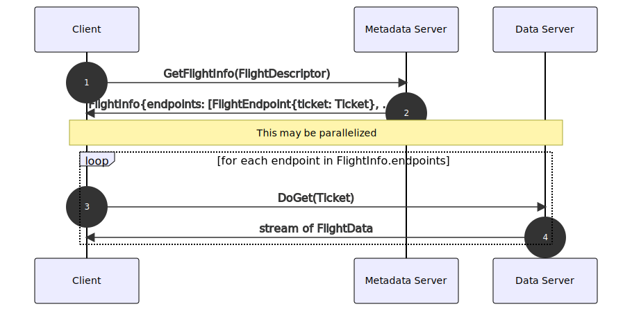
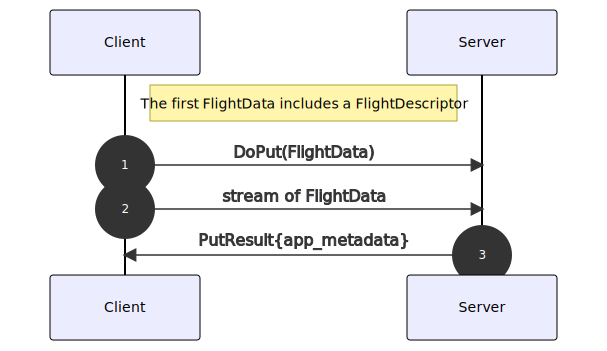
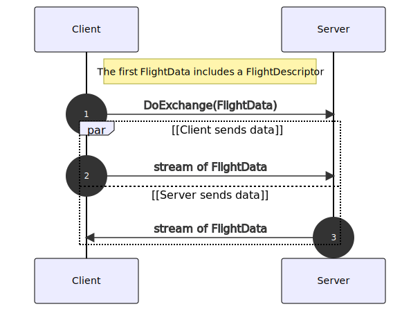

.. Licensed to the Apache Software Foundation (ASF) under one
.. or more contributor license agreements.  See the NOTICE file
.. distributed with this work for additional information
.. regarding copyright ownership.  The ASF licenses this file
.. to you under the Apache License, Version 2.0 (the
.. "License"); you may not use this file except in compliance
.. with the License.  You may obtain a copy of the License at

..   http://www.apache.org/licenses/LICENSE-2.0

.. Unless required by applicable law or agreed to in writing,
.. software distributed under the License is distributed on an
.. "AS IS" BASIS, WITHOUT WARRANTIES OR CONDITIONS OF ANY
.. KIND, either express or implied.  See the License for the
.. specific language governing permissions and limitations
.. under the License.

.. _flight-rpc:

================
Arrow Flight RPC
================

Arrow Flight is an RPC framework for high-performance data services
based on Arrow data, and is built on top of gRPC_ and the :doc:`IPC
format <IPC>`.

Flight is organized around streams of Arrow record batches, being
either downloaded from or uploaded to another service. A set of
metadata methods offers discovery and introspection of streams, as
well as the ability to implement application-specific methods.

Methods and message wire formats are defined by Protobuf_, enabling
interoperability with clients that may support gRPC and Arrow
separately, but not Flight. However, Flight implementations include
further optimizations to avoid overhead in usage of Protobuf (mostly
around avoiding excessive memory copies).

.. _gRPC: https://grpc.io/
.. _Protobuf: https://developers.google.com/protocol-buffers/

RPC Methods and Request Patterns
================================

Flight defines a set of RPC methods for uploading/downloading data,
retrieving metadata about a data stream, listing available data
streams, and for implementing application-specific RPC methods. A
Flight service implements some subset of these methods, while a Flight
client can call any of these methods.

Data streams are identified by descriptors (the ``FlightDescriptor``
message), which are either a path or an arbitrary binary command. For
instance, the descriptor may encode a SQL query, a path to a file on a
distributed file system, or even a pickled Python object; the
application can use this message as it sees fit.

Thus, one Flight client can connect to any service and perform basic
operations. To facilitate this, Flight services are *expected* to
support some common request patterns, described next. Of course,
applications may ignore compatibility and simply treat the Flight RPC
methods as low-level building blocks for their own purposes.

See `Protocol Buffer Definitions`_ for full details on the methods and
messages involved.

Downloading Data
----------------

A client that wishes to download the data would:

   Retrieving data via ``DoGet``.

#. Construct or acquire a ``FlightDescriptor`` for the data set they
   are interested in.

   A client may know what descriptor they want already, or they may
   use methods like ``ListFlights`` to discover them.
#. Call ``GetFlightInfo(FlightDescriptor)`` to get a ``FlightInfo``
   message.

   Flight does not require that data live on the same server as
   metadata. Hence, ``FlightInfo`` contains details on where the data
   is located, so the client can go fetch the data from an appropriate
   server. This is encoded as a series of ``FlightEndpoint`` messages
   inside ``FlightInfo``. Each endpoint represents some location that
   contains a subset of the response data.

   An endpoint contains a list of locations (server addresses) where
   this data can be retrieved from, and a ``Ticket``, an opaque binary
   token that the server will use to identify the data being
   requested. There is no ordering defined on endpoints or the data
   within, so if the dataset is sorted, applications should return
   data in a single endpoint.

   The response also contains other metadata, like the schema, and
   optionally an estimate of the dataset size.
#. Consume each endpoint returned by the server.

   To consume an endpoint, the client should connect to one of the
   locations in the endpoint, then call ``DoGet(Ticket)`` with the
   ticket in the endpoint. This will give the client a stream of Arrow
   record batches.

   If the server wishes to indicate that the data is on the local
   server and not a different location, then it can return an empty
   list of locations. The client can then reuse the existing
   connection to the original server to fetch data. Otherwise, the
   client must connect to one of the indicated locations.

   In this way, the locations inside an endpoint can also be thought
   of as performing look-aside load balancing or service discovery
   functions. And the endpoints can represent data that is partitioned
   or otherwise distributed.

   The client must consume all endpoints to retrieve the complete data
   set. The client can consume endpoints in any order, or even in
   parallel, or distribute the endpoints among multiple machines for
   consumption; this is up to the application to implement.

Uploading Data
--------------

To upload data, a client would:

   Uploading data via ``DoPut``.

#. Construct or acquire a ``FlightDescriptor``, as before.
#. Call ``DoPut(FlightData)`` and upload a stream of Arrow record
   batches.

   The ``FlightDescriptor`` is included with the first message so the
   server can identify the dataset.

``DoPut`` allows the server to send response messages back to the
client with custom metadata. This can be used to implement things like
resumable writes (e.g. the server can periodically send a message
indicating how many rows have been committed so far).

Exchanging Data
---------------

Some use cases may require uploading and downloading data within a
single call. While this can be emulated with multiple calls, this may
be difficult if the application is stateful. For instance, the
application may wish to implement a call where the client uploads data
and the server responds with a transformation of that data; this would
require being stateful if implemented using ``DoGet`` and
``DoPut``. Instead, ``DoExchange`` allows this to be implemented as a
single call. A client would:

   Complex data flow with ``DoExchange``.

#. Construct or acquire a ``FlightDescriptor``, as before.
#. Call ``DoExchange(FlightData)``.

   The ``FlightDescriptor`` is included with the first message, as
   with ``DoPut``. At this point, both the client and the server may
   simultaneously stream data to the other side.

Authentication
==============

Flight supports a variety of authentication methods that applications
can customize for their needs.

"Handshake" authentication
  This is implemented in two parts. At connection time, the client
  calls the ``Handshake`` RPC method, and the application-defined
  authentication handler can exchange any number of messages with its
  counterpart on the server. The handler then provides a binary
  token. The Flight client will then include this token in the headers
  of all future calls, which is validated by the server authentication
  handler.

  Applications may use any part of this; for instance, they may ignore
  the initial handshake and send an externally acquired token (e.g. a
  bearer token) on each call, or they may establish trust during the
  handshake and not validate a token for each call, treating the
  connection as stateful (a "login" pattern).

  .. warning:: Unless a token is validated on every call, this pattern
               is not secure, especially in the presence of a layer
               7 load balancer, as is common with gRPC, or if gRPC
               transparently reconnects the client.

Header-based/middleware-based authentication
  Clients may include custom headers with calls. Custom middleware can
  then be implemented to validate and accept/reject calls on the
  server side.

`Mutual TLS (mTLS)`_
  The client provides a certificate during connection establishment
  which is verified by the server. The application does not need to
  implement any authentication code, but must provision and distribute
  certificates.

  This may only be available in certain implementations, and is only
  available when TLS is also enabled.

Some Flight implementations may expose the underlying gRPC API as
well, in which case any `authentication method supported by gRPC
<https://grpc.io/docs/guides/auth/>`_ is available.

.. _Mutual TLS (mTLS): https://grpc.io/docs/guides/auth/#supported-auth-mechanisms

Transport Implementations
=========================

Flight is primarily defined in terms of its Protobuf and gRPC
specification below, but Arrow implementations may also support
alternative transports (see :ref:`status-flight-rpc`). In that case,
implementations should use the following URI schemes for the given
transport implemenatations:

+----------------------------+----------------------------+
| Transport                  | URI Scheme                 |
+============================+============================+
| gRPC (plaintext)           | grpc: or grpc+tcp:         |
+----------------------------+----------------------------+
| gRPC (TLS)                 | grpc+tls:                  |
+----------------------------+----------------------------+
| gRPC (Unix domain socket)  | grpc+unix:                 |
+----------------------------+----------------------------+
| UCX_ (plaintext)           | ucx:                       |
+----------------------------+----------------------------+

.. _UCX: https://openucx.org/

Error Handling
==============

Arrow Flight defines its own set of error codes. The implementation
differs between languages (e.g. in C++, Unimplemented is a general
Arrow error status while it's a Flight-specific exception in Java),
but the following set is exposed:

+----------------+-------------------------------------------+
|Error Code      |Description                                |
+================+===========================================+
|UNKNOWN         |An unknown error. The default if no other  |
|                |error applies.                             |
+----------------+-------------------------------------------+
|INTERNAL        |An error internal to the service           |
|                |implementation occurred.                   |
+----------------+-------------------------------------------+
|INVALID_ARGUMENT|The client passed an invalid argument to   |
|                |the RPC.                                   |
+----------------+-------------------------------------------+
|TIMED_OUT       |The operation exceeded a timeout or        |
|                |deadline.                                  |
+----------------+-------------------------------------------+
|NOT_FOUND       |The requested resource (action, data       |
|                |stream) was not found.                     |
+----------------+-------------------------------------------+
|ALREADY_EXISTS  |The resource already exists.               |
+----------------+-------------------------------------------+
|CANCELLED       |The operation was cancelled (either by the |
|                |client or the server).                     |
+----------------+-------------------------------------------+
|UNAUTHENTICATED |The client is not authenticated.           |
+----------------+-------------------------------------------+
|UNAUTHORIZED    |The client is authenticated, but does not  |
|                |have permissions for the requested         |
|                |operation.                                 |
+----------------+-------------------------------------------+
|UNIMPLEMENTED   |The RPC is not implemented.                |
+----------------+-------------------------------------------+
|UNAVAILABLE     |The server is not available. May be emitted|
|                |by the client for connectivity reasons.    |
+----------------+-------------------------------------------+

External Resources
==================

- https://arrow.apache.org/blog/2019/10/13/introducing-arrow-flight/
- https://arrow.apache.org/blog/2018/10/09/0.11.0-release/
- https://www.slideshare.net/JacquesNadeau5/apache-arrow-flight-overview

Protocol Buffer Definitions
===========================

.. literalinclude:: ../../../format/Flight.proto
   :language: protobuf
   :linenos:
