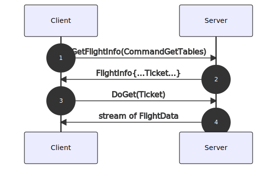
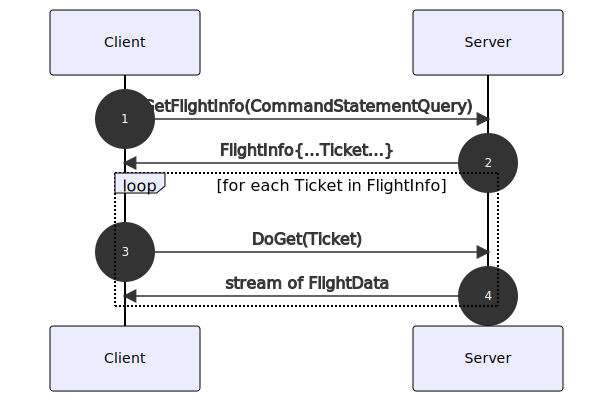
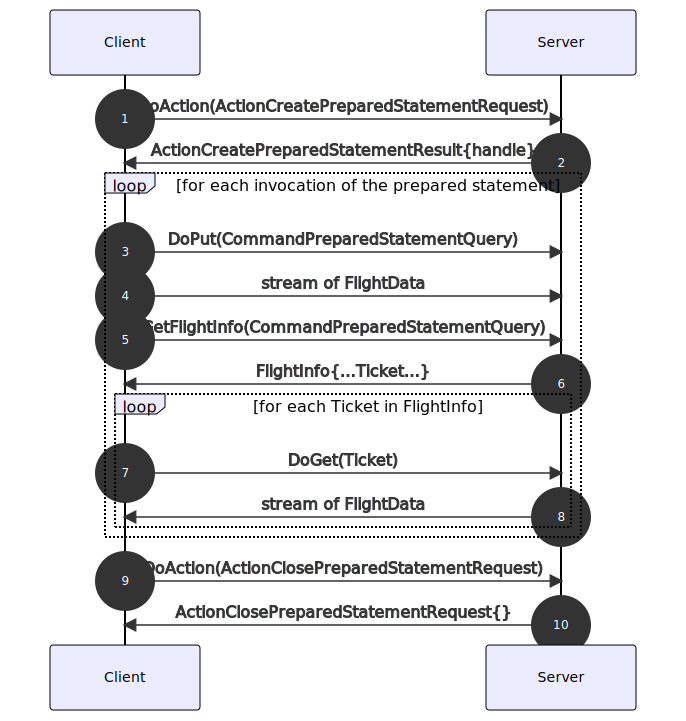

.. Licensed to the Apache Software Foundation (ASF) under one
.. or more contributor license agreements.  See the NOTICE file
.. distributed with this work for additional information
.. regarding copyright ownership.  The ASF licenses this file
.. to you under the Apache License, Version 2.0 (the
.. "License"); you may not use this file except in compliance
.. with the License.  You may obtain a copy of the License at

..   http://www.apache.org/licenses/LICENSE-2.0

.. Unless required by applicable law or agreed to in writing,
.. software distributed under the License is distributed on an
.. "AS IS" BASIS, WITHOUT WARRANTIES OR CONDITIONS OF ANY
.. KIND, either express or implied.  See the License for the
.. specific language governing permissions and limitations
.. under the License.

.. _flight-sql:

================
Arrow Flight SQL
================

Arrow Flight SQL is a protocol for interacting with SQL databases
using the Arrow in-memory format and the :doc:`Flight RPC
<./Flight>` framework.

Generally, a database will implement the RPC methods according to the
specification, but does not need to implement a client-side driver. A
database client can use the provided Flight SQL client to interact
with any database that supports the necessary endpoints. Flight SQL
clients wrap the underlying Flight client to provide methods for the
new RPC methods described here.

.. warning:: Flight SQL is **experimental** and changes to the
             protocol may still be made.

RPC Methods
===========

Flight SQL reuses the predefined RPC methods in Arrow Flight, and
provides various commands that pair those methods with request/response
messages defined via Protobuf (see below).

SQL Metadata
------------

Flight SQL provides a variety of commands to fetch catalog metadata
about the database server.

All of these commands can be used with the GetFlightInfo and GetSchema
RPC methods. The Protobuf request message should be packed into a
google.protobuf.Any message, then serialized and packed as the ``cmd``
field in a CMD-type FlightDescriptor.

If the command is used with GetFlightInfo, the server will return a
FlightInfo response. The client should then use the Ticket(s) in the
FlightInfo with the DoGet RPC method to fetch a Arrow data containing
the results of the command. In other words, SQL metadata is returned as
Arrow data, just like query results themselves.

The Arrow schema returned by GetSchema or DoGet for a particular
command is fixed according to the specification.

``CommandGetCatalogs``
    List the catalogs available in the database. The definition varies
    by vendor.

``CommandGetCrossReference``
    List the foreign key columns in a given table that reference
    columns in a given parent table.

``CommandGetDbSchemas``
    List the schemas (note: a grouping of tables, *not* an Arrow
    schema) available in the database. The definition varies by
    vendor.

``CommandGetExportedKeys``
    List foreign key columns that reference the primary key columns of
    a given table.

``CommandGetImportedKeys``
    List foreign keys of a given table.

``CommandGetPrimaryKeys``
    List the primary keys of a given table.

``CommandGetSqlInfo``
    Fetch metadata about the database server and its supported SQL
    features.

``CommandGetTables``
    List tables in the database.

``CommandGetTableTypes``
    List table types in the database. The list of types varies by
    vendor.

Query Execution
---------------

Flight SQL also provides commands to execute SQL queries and manage
prepared statements.

Many of these commands are also used with GetFlightInfo/GetSchema and
work identically to the metadata methods above. Some of these commands
can be used with the DoPut RPC method, but the command should still be
encoded in the request FlightDescriptor in the same way.

Commands beginning with "Action" are instead used with the DoAction
RPC method, in which case the command should be packed into a
google.protobuf.Any message, then serialized and packed into the
``body`` of a Flight Action. Also, the action ``type`` should be set
to the command name (i.e. for ``ActionClosePreparedStatementRequest``,
the ``type`` should be ``ClosePreparedStatement``).

``ActionClosePreparedStatementRequest``
    Close a previously created prepared statement.

``ActionCreatePreparedStatementRequest``
    Create a new prepared statement for a SQL query.

``CommandPreparedStatementQuery``
    Execute a previously created prepared statement and get the results.

    When used with DoPut: binds parameter values to the prepared statement.

    When used with GetFlightInfo: execute the prepared statement. The
    prepared statement can be reused after fetching results.

``CommandPreparedStatementUpdate``
    Execute a previously created prepared statement that does not
    return results.

    When used with DoPut: execute the query and return the number of
    affected rows. The prepared statement can be reused afterwards.

``CommandStatementQuery``
    Execute an ad-hoc SQL query.

    When used with GetFlightInfo: execute the query (call DoGet to
    fetch results).

    When used with GetSchema: return the schema of the query results.

``CommandStatementUpdate``
    Execute an ad-hoc SQL query that does not return results.

    When used with DoPut: execute the query and return the number of
    affected rows.

Sequence Diagrams
=================

   Listing available tables.

   Executing an ad-hoc query.

   Creating a prepared statement, then executing it.

External Resources
==================

- `Introducing Apache Arrow Flight SQL: Accelerating Database Access
  <https://arrow.apache.org/blog/2022/02/16/introducing-arrow-flight-sql/>`_

Protocol Buffer Definitions
===========================

.. literalinclude:: ../../../format/FlightSql.proto
   :language: protobuf
   :linenos:
