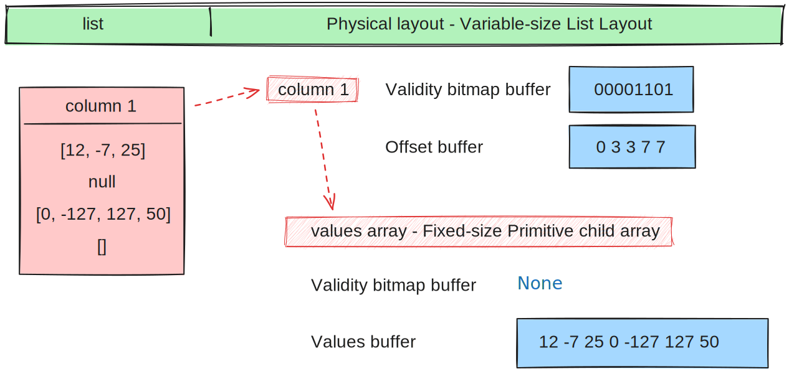
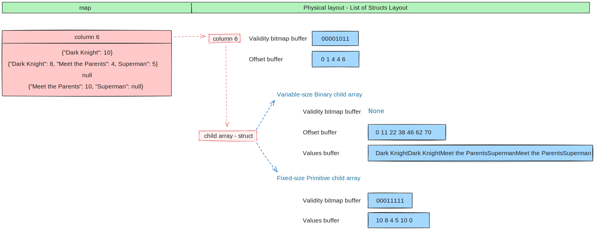

.. Licensed to the Apache Software Foundation (ASF) under one
.. or more contributor license agreements.  See the NOTICE file
.. distributed with this work for additional information
.. regarding copyright ownership.  The ASF licenses this file
.. to you under the Apache License, Version 2.0 (the
.. "License"); you may not use this file except in compliance
.. with the License.  You may obtain a copy of the License at

..   http://www.apache.org/licenses/LICENSE-2.0

.. Unless required by applicable law or agreed to in writing,
.. software distributed under the License is distributed on an
.. "AS IS" BASIS, WITHOUT WARRANTIES OR CONDITIONS OF ANY
.. KIND, either express or implied.  See the License for the
.. specific language governing permissions and limitations
.. under the License.

*****************************************
Introduction to the Arrow Columnar Format
*****************************************

Apache Arrow was born with the idea to define a set of standards for
data representation and interchange between languages and systems to
avoid costs of data serialization/deserialization and in order to
avoid reinventing the wheel on each of those systems and languages.

Each system / language requires their own format definitions, implementation
of common algorithms, etcetera. In our heterogeneous environments we
often have to move data from one system/language to accommodate our
workflows that meant copy&convert the data between them, which is
quite costly.

Apart from this initial vision, Arrow has grown to also develop a
multi-language collection of libraries for solving systems problems
related to in-memory analytical data processing. This includes such
topics as:

* Zero-copy shared memory and RPC-based data movement
* Reading and writing file formats (like CSV, Apache ORC, and Apache Parquet)
* In-memory analytics and query processing

NanoArrow
=========

The Arrow libraries are growing with a lot of functionality and
`nanoarrow <https://github.com/apache/arrow-nanoarrow>`_ was born to
solve the problem where linking to the Arrow implementation is
difficult or impossible.

The NanoArrow library is a set of helper functions to interpret and
generate Arrow C Data Interface and Arrow C Stream Interface structures.
The library is in active development.

The NanoArrow Python bindings are intended to support clients that wish
to produce or interpret Arrow C Data and/or Arrow C Stream structures
in Python, without a dependency on the larger Arrow implementations.

Arrow Columnar Format
=====================

Row format
----------

Traditionally, in order to read the following data into memory you
would have some kind of structure representing the following rows:

.. TODO picture

That means that you have all the information for every row together
in memory.

Columnar format
---------------

A columnar format keeps the data organised by column instead of by row
making analytical operations like filtering, grouping, aggregations and
others much more efficient. CPU can maintain memory locality and require
less memory jumps to process the data. By keeping the data contiguous
in memory it also enables vectorization of the computations. Most modern
CPUs have single instructions, multiple data (SIMD) enabling parallel
processing and execution of instructions on vector data in single CPU
instructions.

.. TODO picture

Compression is another element where columnar format representation can
take high advantage. Data similarity allows for better compression
techniques and algorithms. Having the same data types locality close
allows us to have better compression ratios.

Primitive layouts
=================

Fixed Size Primitive Layout
---------------------------

A primitive value array represents an array of values where each value
has the same physical size measured in bytes.

Support for null values
-----------------------

Arrow supports missing values or "nulls" for all data types: any value
in an array may be semantically null, whether primitive or nested type.

In Arrow, a dedicated buffer, known as the validity (or "null") bitmap,
is used alongside the data indicating whether each value in the array is
null or not. You can think of it as vector of 0 and 1 values, where a 1
means that the value is not-null ("valid"), while a 0 indicates the value
is null.

This validity bitmap is optional, i.e. if there are no missing values in
the array the buffer does not need to be allocated (as in the example
column 1 in the diagram below).

.. figure:: ./images/primitive-diagram.svg
   :alt: Diagram is showing the difference between the primitive data
         type presented in a Table and the data is actually stored in
         computer memory.

   Physical layout diagram for primitive data types.

Variable length binary and string
---------------------------------

The bytes of a binary or string column are stored together consecutively
in a single buffer or region of memory. To know where each element of the
column starts and ends the physical layout also includes integer offsets.
The length of which is one more than the length on the column as the last
two elements define the start and the end of the last element in the
binary/string column.

Binary and string types share the same physical layout with where the string
type is utf-8 binary and will produce an invalid result if the bytes are not
valid utf-8.

The difference between binary/string and large binary/string is in the offset
type. In the first case that is int32 and in the second it is int64.

The limitation of types using 32 bit offsets is that they have a max size of
2GB for one array/column. One can still use the non-large variants for bigger
data, but then multiple chunks are needed.

.. figure:: ./images/var-string-diagram.svg
   :alt: Diagram is showing the difference between the variable length
         string data type presented in a Table and the data is actually
         stored in computer memory.

   Physical layout diagram for variable length string data types.

Variable length binary and string view
--------------------------------------

This layout is adapted from TU Munich's UmbraDB, and similar to the string
layout used in DuckDB and Velox (and sometimes also called "German style strings").

The main differences to classical binary and string types is the views buffer.
It includes the length of the string, and then either contains the characters
inline (for small strings) or either only contains the first 4 bytes of the
string and point to potentially several data buffers. It also supports binary
and strings to be written out of order.

These properties are important for efficient string processing. The prefix
enables a profitable fast path for string comparisons, which are frequently
determined within the first four bytes. Selecting elements is a simple "take"
operations on the fixed-width views buffer and does not need to rewrite the
values buffers.

.. figure:: ./images/var-string-view-diagram.svg
   :alt: Diagram is showing the difference between the variable length
         string view data type presented in a Table and the data is actually
         stored in computer memory.

   Physical layout diagram for variable length string view data type.

Nested layouts
==============

Nested types introduce the concept of parent and child arrays. They express
relationships between physical value arrays in a nested type structure.

Nested types depend on one or more other child data types. For instance, List
is a nested type (parent) that has one child (the data types of the values in
the list).

List
----

The list type enables values of the same type being stacked together in a
sequence of values in each column slot. The layout is similar to binary or
string type as it has offsets buffer to define where the sequence of values
starts and ends with all the values of the column being stored consecutively
in a values child array.

The offsets in the list type are int32 while in the large list the offsets
are int64.

         list data type presented in a Table and the data is actually
         stored in computer memory.

   Physical layout diagram for variable size list data type.

Fixed size list
---------------

Fixed size list is a special case of variable-size list where each column slot
contains a fixed size sequence meaning all lists are the same size and so the
offset buffer is no longer needed.

.. figure:: ./images/fixed-list-diagram.svg
   :alt: Diagram is showing the difference between the fixed size list data
         type presented in a Table and the data is actually stored in computer
         memory.

   Physical layout diagram for fixed size list data type.

List and large list view
------------------------

List view type allows arrays to specify out-of-order offsets.

.. figure:: ./images/var-list-view-diagram.svg
   :alt: Diagram is showing the difference between the variable size list view
         data type presented in a Table and the data is actually stored in
         computer memory.

   Physical layout diagram for variable size list view data type.

Struct
------

A struct is a nested type parameterized by an ordered sequence of types.

* There is one child array for each field
* Child arrays are independent and need not be adjacent to each other in
  memory (only need to have the same length)

One can think of an individual struct field as a key-value pair where the
key is the field name and the child array its values. The field (key) is
saved in the schema and the values of a specific field (key) are saved in
the child array.

.. figure:: ./images/struct-diagram.svg
   :alt: Diagram is showing the difference between the struct data type
         presented in a Table and the data is actually stored in computer
         memory.

   Physical layout diagram for struct data type.

Map
---

Map type represents nested data where each value is a variable number of
key-value pairs. Its physical representation is the same as a list of `{key, value}`
structs.

The difference between a struct and a map type is that a struct holds the key
in the schema therefore needs to be a string, the values are stored in the
child arrays, one for each field. There can be multiple keys and therefore multiple
child arrays. The map, on the other hand, has one child array holding all the
different keys (that thus all need to be of the same type but not necessarily strings)
and a second child array holding all the values, those values need to be of the same
type (which doesn't have to match the one on the keys).

Also, the map stores the struct in a list and needs an offset as the list is
variable shape.

         presented in a Table and the data is actually stored in computer
         memory.

   Physical layout diagram for map data type.

Union
-----

.. TODO

Dictionary Encoded Layout
=========================

.. TODO

Run-End Encoded Layout
======================

.. TODO

All types overview
==================

Extension Types
===============

Overview of Arrow terminology
=============================

The Arrow C Data Interface
==========================

Arrow PyCapsule Interface
=========================
