.. Licensed to the Apache Software Foundation (ASF) under one
.. or more contributor license agreements.  See the NOTICE file
.. distributed with this work for additional information
.. regarding copyright ownership.  The ASF licenses this file
.. to you under the Apache License, Version 2.0 (the
.. "License"); you may not use this file except in compliance
.. with the License.  You may obtain a copy of the License at

..   http://www.apache.org/licenses/LICENSE-2.0

.. Unless required by applicable law or agreed to in writing,
.. software distributed under the License is distributed on an
.. "AS IS" BASIS, WITHOUT WARRANTIES OR CONDITIONS OF ANY
.. KIND, either express or implied.  See the License for the
.. specific language governing permissions and limitations
.. under the License.

************
Introduction
************

Apache Arrow was born from the need for a set of standards around
tabular data representation and interchange between systems.
The adoption of these standards reduces computing costs of data
serialization/deserialization and implementation costs across
systems implemented in different programming languages.

The Apache Arrow specification can be implemented in any programming
language but official implementations for many languages are available.
An implementation consists of format definitions using the constructs
offered by the language and common in-memory data processing algorithms
(e.g. slicing and concatenating). Users can extend and use the utilities
provided by the Apache Arrow implementation in their programming
language of choice. Some implementations are further ahead and feature a
vast set of algorithms for in-memory analytical data processing. More detail
about how implementations differ can be found on the :ref:`status` page.

Apart from this initial vision, Arrow has grown to also develop a
multi-language collection of libraries for solving problems related to
in-memory analytical data processing. This covers topics like:

* Zero-copy shared memory and RPC-based data movement
* Reading and writing file formats (like CSV, `Apache ORC`_, and `Apache Parquet`_)
* In-memory analytics and query processing

.. _Apache ORC: https://orc.apache.org/
.. _Apache Parquet: https://parquet.apache.org/

Arrow Columnar Format
=====================

Apache Arrow focuses on tabular data. For an example, let's consider
we have data that can be organized into a table:

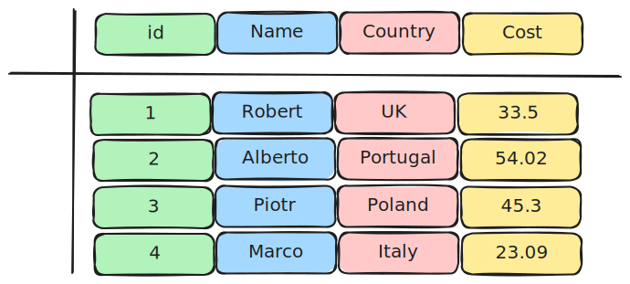

   Diagram of a tabular data structure.

Tabular data can be represented in memory using a row-based format or a
column-based format. The row-based format stores data row-by-row, meaning the rows
are adjacent in the computer memory:

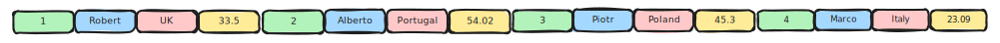

   Tabular data being saved in memory row by row.

In a columnar format, the data is organized column-by-column instead.
This organization makes analytical operations like filtering, grouping,
aggregations and others, more efficient thanks to memory locality.
When processing the data, the memory locations accessed by the CPU tend
be near one another. By keeping the data contiguous in memory, it also
enables vectorization of the computations. Most modern CPUs have
`SIMD instructions`_ (a single instruction that operates on multiple values at
once) enabling parallel processing and execution of operations on vector data
using a single CPU instruction.

.. _SIMD instructions: https://en.wikipedia.org/wiki/Single_instruction,_multiple_data

Apache Arrow is solving this exact problem. It is the specification that
uses the columnar layout.

   The same tabular data being saved in memory column by column.

Each column is called an **Array** in Arrow terminology. Arrays can be of
different data types and the way their values are stored in memory varies among
the data types. The specification of how these values are arranged in memory is
what we call a **physical memory layout**. One contiguous region of memory that
stores data for arrays is called a **Buffer**. An array consists of one or more
buffers.

Next sections give an introduction to Arrow Columnar Format explaining the
different physical layouts. The full specification of the format can be found
at :ref:`format_columnar`.

Support for Null Values
=======================

Arrow supports missing values or "nulls" for all data types: any value
in an array may be semantically null, whether primitive or nested data type.

In Arrow, a dedicated buffer, known as the validity (or "null") bitmap,
is used alongside the data indicating whether each value in the array is
null or not: a value of 1 means that the value is not-null ("valid"), whereas
a value of 0 indicates that the value is null.

This validity bitmap is optional: if there are no missing values in
the array the buffer does not need to be allocated (as in the example
column 1 in the diagram below).

.. note::

   We read validity bitmaps right-to-left within a group of 8 bits due to
   `least-significant bit numbering <https://en.wikipedia.org/wiki/Bit_numbering>`_
   being used.

   This is also how we have represented the validity bitmaps in the
   diagrams included in this document.

Primitive Layouts
=================

Fixed Size Primitive Layout
---------------------------

A primitive column represents an array of values where each value
has the same physical size measured in bytes. Data types that use the
fixed size primitive layout are, for example, signed and unsigned
integer data types, floating point numbers, boolean, decimal and temporal
data types.

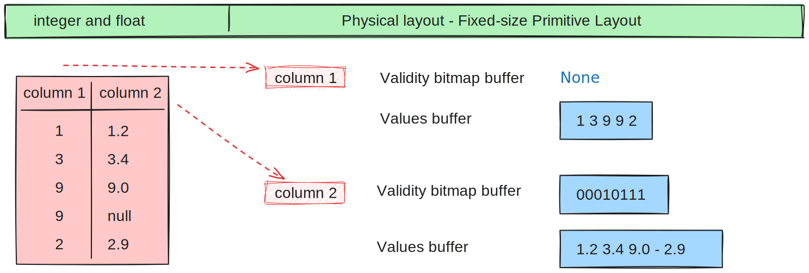
         type presented in a Table and the data actually stored in
         computer memory.

   Physical layout diagram for primitive data types.

.. note::
   The boolean data type is represented with a primitive layout where the
   values are encoded in bits instead of bytes. That means the physical
   layout includes a values bitmap buffer and possibly a validity bitmap
   buffer.

   .. figure:: ./images/bool-diagram.svg
      :alt: Diagram is showing the difference between the boolean data
            type presented in a Table and the data actually stored in
            computer memory.

      Physical layout diagram for boolean data type.

.. note::
   Arrow also has a concept of Null data type where all values are null. In
   this case no buffers are allocated.

Variable length binary and string
---------------------------------

In contrast to the fixed size primitive layout, the variable length layout
allows representing an array where each element can have a variable size
in bytes. This layout is used for binary and string data.

The bytes of all elements in a binary or string column are stored together
consecutively in a single buffer or region of memory. To know where each element
of the column starts and ends, the physical layout also includes integer offsets.
The offsets buffer is always one element longer than the array.
The last two offsets define the start and the end of the last
binary/string element.

Binary and string data types share the same physical layout. The only
difference between them is that a string-typed array is assumed to contain
valid UTF-8 string data.

The difference between binary/string and large binary/string is in the offset
data type. In the first case that is int32 and in the second it is int64.

The limitation of data types using 32 bit offsets is that they have a maximum size of
2GB per array. One can still use the non-large variants for bigger data, but
then multiple chunks are needed.

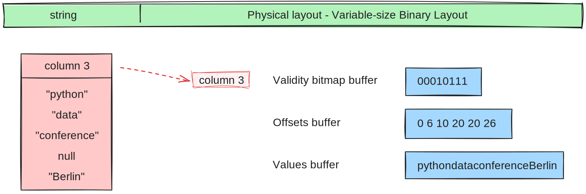
         string data type presented in a Table and the data actually
         stored in computer memory.

   Physical layout diagram for variable length string data types.

Variable length binary and string view
--------------------------------------

.. _UmbraDB: https://umbra-db.com/
.. _DuckDB: https://duckdb.com
.. _Velox: https://velox-lib.io/

This layout is an alternative for the variable length binary layout and is adapted
from TU Munich's `UmbraDB`_ and is similar to the string layout used in `DuckDB`_ and
`Velox`_ (and sometimes also called "German strings").

The main difference to the classical binary and string layout is the views buffer.
It includes the length of the string, and then either its characters appearing
inline (for small strings) or only the first 4 bytes of the string and an offset into
one of the potentially several data buffers. Because it uses an offset and length to refer
to the data buffer, the bytes of all elements do not need to be stored
consecutively in a single buffer. This enables out of order writing of
variable length elements into the array.

These properties are important for efficient string processing. The prefix
enables a profitable fast path for string comparisons, which are frequently
determined within the first four bytes. Selecting elements is a simple "gather"
operation on the fixed-width views buffer and does not need to rewrite the
values buffers.

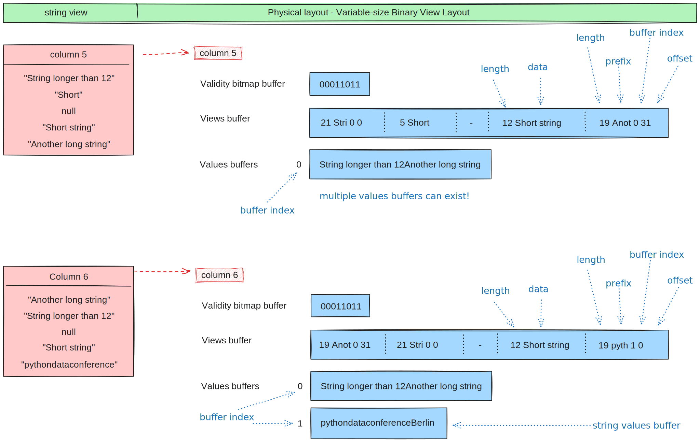
         string view data type presented in a Table and the data actually
         stored in computer memory.

   Physical layout diagram for variable length string view data type.

Nested Layouts
==============

Nested data types introduce the concept of parent and child arrays. They express
relationships between physical value arrays in a nested data type structure.

Nested data types depend on one or more other child data types. For instance, List
is a nested data type (parent) that has one child (the data type of the values in
the list).

List
----

The list data type enables representing an array where each element is a sequence
of elements of the same data type. The layout is similar to variable-size binary
or string layout as it has an offsets buffer to define where the sequence of values
for each element starts and ends, with all the values being stored consecutively
in a values child array.

The offsets in the list data type are int32 while in the large list the offsets
are int64.

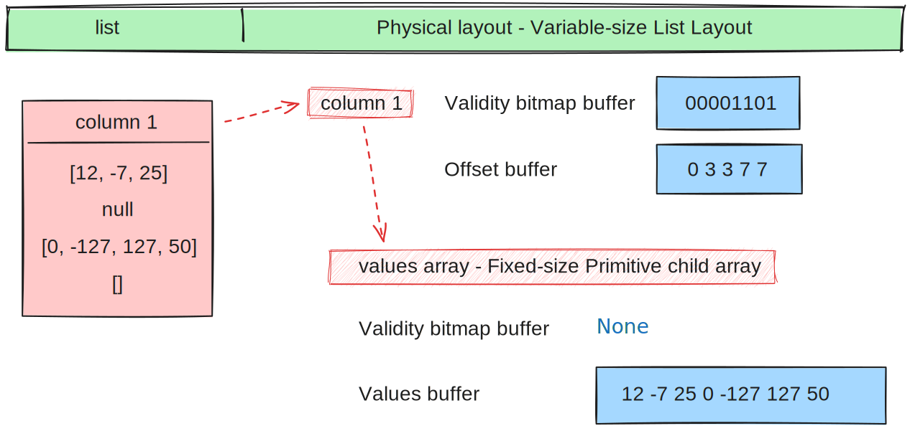
         list data type presented in a Table and the data actually
         stored in computer memory.

   Physical layout diagram for variable size list data type.

Fixed Size List
---------------

Fixed-size list is a special case of variable-size list where each column slot
contains a fixed size sequence meaning all lists are the same size and so the
offset buffer is no longer needed.

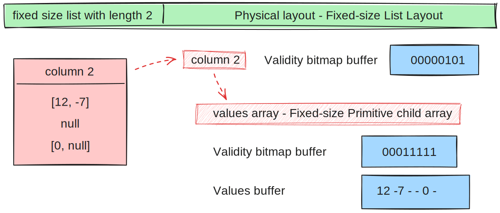
         type presented in a Table and the data actually stored in computer
         memory.

   Physical layout diagram for fixed size list data type.

List View
---------

In contrast to the list type, list view type also has a size buffer together
with an offset buffer. The offsets continue to indicate the start of each
element but size is now saved in a separate size buffer. This allows
out-of-order offsets as the sizes aren't derived from the consecutive
offsets anymore.

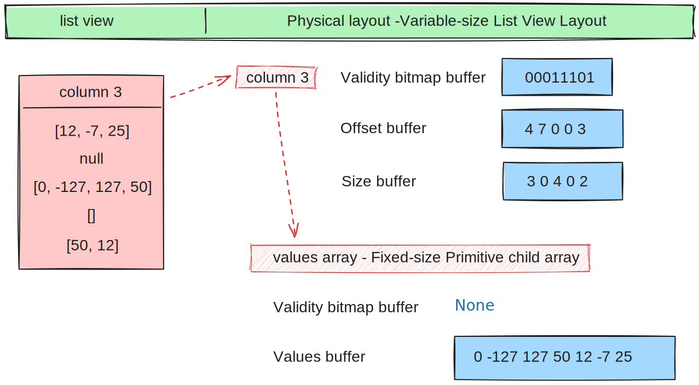
         data type presented in a Table and the data actually stored in
         computer memory.

   Physical layout diagram for variable size list view data type.

Struct
------

A struct is a nested data type parameterized by an ordered sequence of fields
(a data type and a name).

* There is one child array for each field
* Child arrays are independent and need not be adjacent to each other in
  memory. They only need to have the same length.

One can think of an individual struct field as a key-value pair where the
key is the field name and the child array its values. The field (key) is
saved in the schema and the values of a specific field (key) are saved in
the child array.

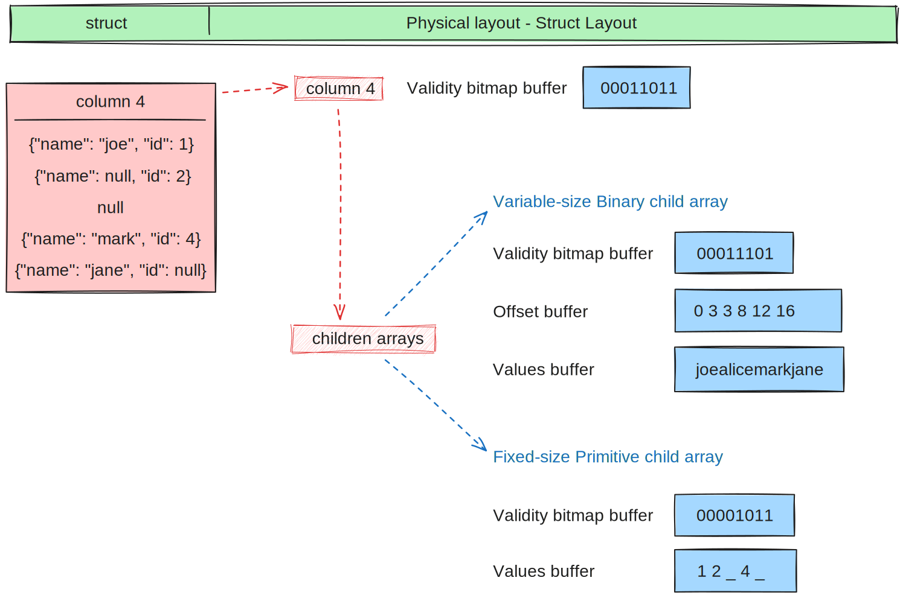
         presented in a Table and the data actually stored in computer
         memory.

   Physical layout diagram for struct data type.

Map
---

The Map data type represents nested data where each value is a variable number of
key-value pairs. Its physical representation is the same as a list of ``{key, value}``
structs.

The difference between the struct and map data types is that a struct holds the key
in the schema, requiring keys to be strings, and the values are stored in the
child arrays,
one for each field. There can be multiple keys and therefore multiple child arrays.
The map, on the other hand, has one child array holding all the different keys (that
thus all need to be of the same data type, but not necessarily strings) and a second
child array holding all the values. The values need to be of the same data type; however,
the data type doesn't have to match that of the keys.

Also, the map stores the struct in a list and needs an offset as the list is
variable shape.

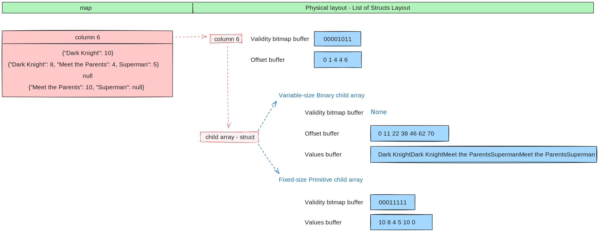
         presented in a Table and the data actually stored in computer
         memory.

   Physical layout diagram for map data type.

Union
-----

The union is a nested data type where each slot in the union has a value with a data type
chosen from a subset of possible Arrow data types. That means that a union array represents
a mixed-type array. Unlike other data types, unions do not have their own validity bitmap
and the nullness is determined by the child arrays.

Arrow defines two distinct union data types, "dense" and "sparse".

Dense Union
^^^^^^^^^^^

A Dense Union has one child array for each data type present in the mixed-type array and
two buffers of its own:

* **Types buffer:** holds data type id for each slot of the array. Data type id is
  frequently the index of the child array; however, the relationship between data type
  ID and the child index is a parameter of the data type.
* **Offsets buffer:** holds relative offset into the respective child array for each
  array slot.

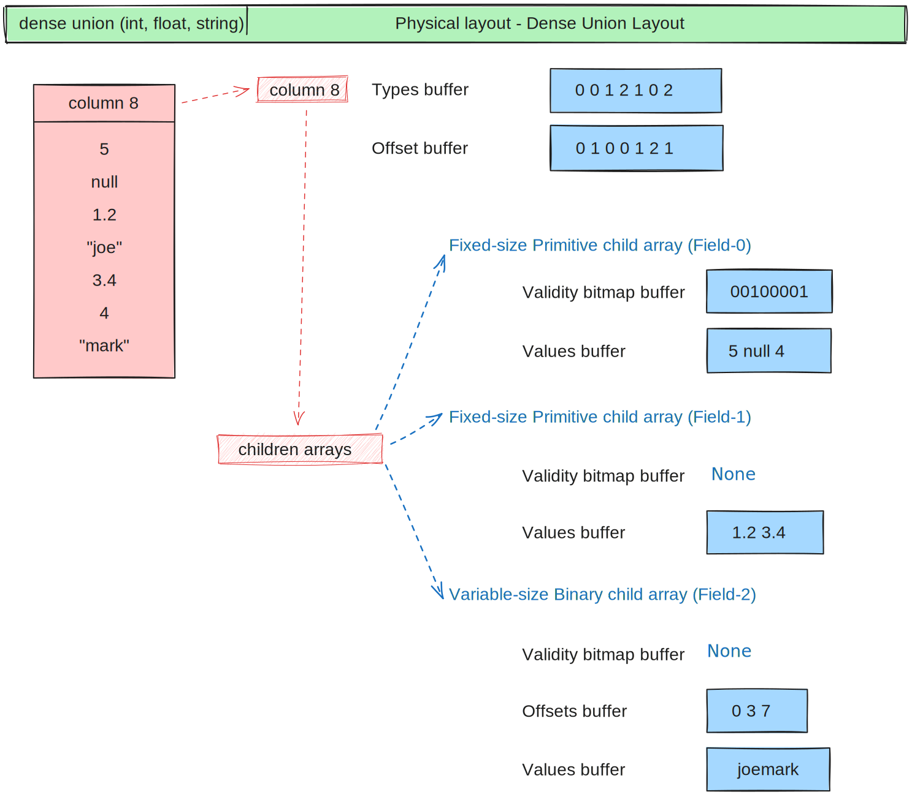
         presented in a Table and the data actually stored in computer
         memory.

   Physical layout diagram for dense union data type.

Sparse union
^^^^^^^^^^^^

A sparse union has the same structure as a dense union, with the omission of the offsets
buffer. In this case, the child arrays are each equal in length to the length of the union.

.. figure:: ./images/sparse-union-diagram.svg
   :alt: Diagram is showing the difference between the sparse union data type
         presented in a Table and the data actually stored in computer
         memory.

   Physical layout diagram for sparse union data type.

Dictionary Encoded Layout
=========================

Dictionary encoding can be effective when one has data with many repeated values.
The values are represented by integers referencing a dictionary usually consisting of
unique values.

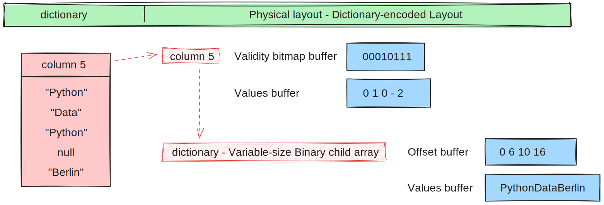
         presented in a Table and the data actually stored in computer
         memory.

   Physical layout diagram for dictionary data type.

Run-End Encoded Layout
======================

Run-end encoding is well-suited for representing data containing sequences of the
same value. These sequences are called runs. A run-end encoded array has no buffers
of its own, but has two child arrays:

*  **Run ends array:** holds the index in the array where each run ends. The number
   of run ends is the same as the length of its parent array.
*  **Values array:** the actual values without repetitions (together with null values).

Note that nulls of the parent array are strictly represented in the values array.

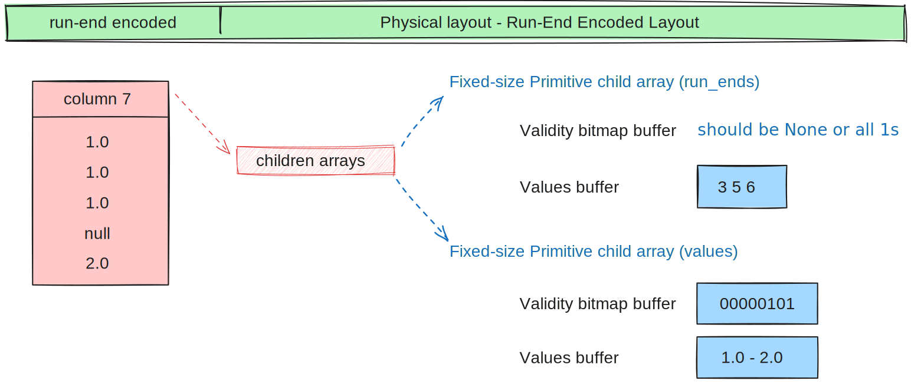
         type presented in a Table and the data actually stored in computer
         memory.

   Physical layout diagram for run-end encoded data type.

.. seealso::
   Table of all Arrow :ref:`data_types`.

Overview of Arrow Terminology
=============================

**Physical layout**
A specification for how to represent values of an array in memory.

**Buffer**
A contiguous region of memory with a given length in bytes. Buffers are used to store data
for arrays. Sometimes we use the notion of number of elements in a buffer which can only be
used if we know the data type of the array that wraps this specific buffer.

**Array**
A contiguous, one-dimensional sequence of values with known length where all values have the
same data type. An array consists of zero or more buffers.

**Chunked Array**
A discontiguous, one-dimensional sequence of values with known length where all values have
the same data type. Consists of zero or more arrays, the “chunks”.

.. note::
   Chunked Array is a concept specific to certain implementations such as Arrow C++ and PyArrow.

**RecordBatch**
A contiguous, two-dimensional data structure which consists of an ordered collection of arrays
of the same length.

**Schema**
An ordered collection of fields that communicates all the data types of an object
like a RecordBatch or Table. Schemas can contain optional key/value metadata.

A Field includes a field name, a data type, a nullability flag and optional key-value metadata
for a specific column in a RecordBatch.

**Table**
A discontiguous, two-dimensional chunk of data consisting of an ordered collection of Chunked
Arrays. All Chunked Arrays have the same length, but may have different types. Different columns
may be chunked differently.

.. note::
   Table is a concept specific to certain implementations such as Arrow C++ and PyArrow. In Java
   implementation, for example, a Table is not a collection of Chunked Arrays but a collection of
   RecordBatches.

.. image:: ../cpp/tables-versus-record-batches.svg
   :alt: A graphical representation of an Arrow Table and a
         Record Batch, with structure as described in text above.

.. seealso::
   The :ref:`glossary` for more terms.

Extension Types
===============

In case the system or application needs to extend standard Arrow data types with
custom semantics, this is enabled by defining extension types.

Examples of an extension type are :ref:`uuid_extension` or
:ref:`fixed_shape_tensor_extension` extension type.

Extension types can be defined by annotating any of the built-in Arrow data types
(the “storage type”) with a custom type name and optional serialized representation
(``'ARROW:extension:name'`` and ``'ARROW:extension:metadata'`` keys in the Field
metadata structure).

.. seealso::
   The :ref:`format_metadata_extension_types` documentation.

Canonical Extension Types
-------------------------

It is beneficial to share the definitions of well-known extension types so as to
improve interoperability between different systems integrating Arrow columnar data.
For this reason canonical extension types are defined in Arrow itself.

.. seealso::
   The :ref:`format_canonical_extensions` documentation.

Community Extension Types
-------------------------
These are Arrow extension types that have been established as standards within specific
domain areas.

Example:

* `GeoArrow`_: A collection of Arrow extension types for representing vector geometries

.. _GeoArrow: https://geoarrow.org

Sharing Arrow data
==================

Arrow memory layout is meant to be a universal standard for representing tabular data in memory,
not tied to a specific implementation. The Arrow standard defines two protocols for
well-defined and unambiguous communication of Arrow data between applications:

* Protocol to share Arrow data between processes or over the network is called :ref:`format-ipc`.
  The specification for sharing data is called IPC message format which defines how Arrow
  array or record batch buffers are stacked together to be serialized and deserialized.

* To share Arrow data in the same process :ref:`c-data-interface` is used, meant for sharing
  the same buffer zero-copy in memory between different libraries within the same process.
