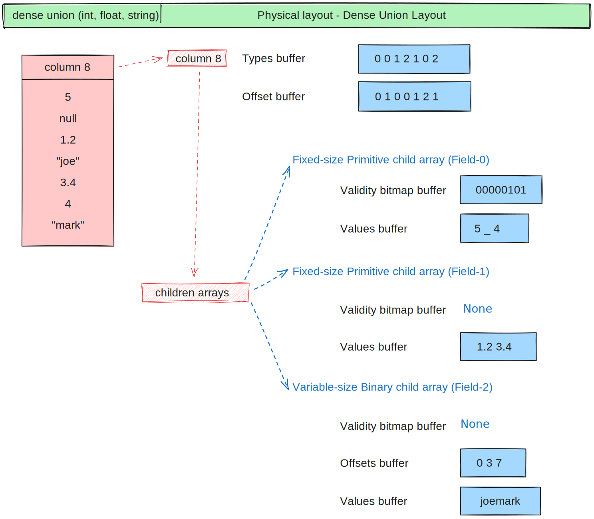

.. Licensed to the Apache Software Foundation (ASF) under one
.. or more contributor license agreements.  See the NOTICE file
.. distributed with this work for additional information
.. regarding copyright ownership.  The ASF licenses this file
.. to you under the Apache License, Version 2.0 (the
.. "License"); you may not use this file except in compliance
.. with the License.  You may obtain a copy of the License at

..   http://www.apache.org/licenses/LICENSE-2.0

.. Unless required by applicable law or agreed to in writing,
.. software distributed under the License is distributed on an
.. "AS IS" BASIS, WITHOUT WARRANTIES OR CONDITIONS OF ANY
.. KIND, either express or implied.  See the License for the
.. specific language governing permissions and limitations
.. under the License.

*****************************************
Introduction to the Arrow Columnar Format
*****************************************

Apache Arrow was born with the idea to define a set of standards for
data representation and interchange between languages and systems to
avoid costs of data serialization/deserialization and in order to
avoid reinventing the wheel in each of those systems and languages.

Each system or language requires their own format definitions, implementation
of common algorithms, etcetera. In our heterogeneous environments we
often have to move data from one system or language to accommodate our
workflows that meant copy and convert the data between them, which is
quite costly.

Apart from this initial vision, Arrow has grown to also develop a
multi-language collection of libraries for solving problems related to
in-memory analytical data processing. This includes such topics as:

* Zero-copy shared memory and RPC-based data movement
* Reading and writing file formats (like CSV, `Apache ORC`_, and `Apache Parquet`_)
* In-memory analytics and query processing

.. _Apache ORC: https://orc.apache.org/
.. _Apache Parquet: https://parquet.apache.org/

Arrow Columnar Format
=====================

Data can be represented in memory using a row based format or a column
based format. The row based format stores data by row meaning the rows
are adjacent in the computer memory:

In a columnar format, on the other hand, the data is organised by column
instead of by row making analytical operations like filtering, grouping,
aggregations and others much more efficient. CPU can maintain memory locality
and require less memory jumps to process the data. By keeping the data contiguous
in memory it also enables vectorization of the computations. Most modern
CPUs have single instructions, multiple data (SIMD) enabling parallel
processing and execution of instructions on vector data in single CPU
instructions.

.. figure:: ./images/columnar-diagram_3.svg
   :alt: Tabular data being structured column by column in computer memory.

Primitive layouts
=================

Fixed Size Primitive Layout
---------------------------

A primitive column represents an array of values where each value
has the same physical size measured in bytes. Data types that share the
same fixed size primitive layout are for example signed and unsigned
integer types, floating point numbers, boolean, decimal and temporal
types.

Support for null values
-----------------------

Arrow supports missing values or "nulls" for all data types: any value
in an array may be semantically null, whether primitive or nested type.

In Arrow, a dedicated buffer, known as the validity (or "null") bitmap,
is used alongside the data indicating whether each value in the array is
null or not. You can think of it as vector of 0 and 1 values, where a 1
means that the value is not-null ("valid"), while a 0 indicates the value
is null.

This validity bitmap is optional, i.e. if there are no missing values in
the array the buffer does not need to be allocated (as in the example
column 1 in the diagram below).

         type presented in a Table and the data actually stored in
         computer memory.

   Physical layout diagram for primitive data types.

.. note::
   Boolean data type is represented with a primitive layout where the
   values are encoded in bits instead of bytes. That means the physical
   layout includes a values bitmap buffer and possibly a validity bitmap
   buffer.

   .. figure:: ./images/bool-diagram.svg
      :alt: Diagram is showing the difference between the boolean data
            type presented in a Table and the data actually stored in
            computer memory.

      Physical layout diagram for boolean data type.

.. note::
   Arrow also has a concept of Null type where all values are null. In
   this case no memory buffers are allocated.

Variable length binary and string
---------------------------------

The bytes of a binary or string column are stored together consecutively
in a single buffer or region of memory. To know where each element of the
column starts and ends the physical layout also includes integer offsets.
The length of the offset buffer is one more than the length of the values
buffer as the last two elements define the start and the end of the last
element in the binary/string column.

Binary and string types share the same physical layout. The one difference
between them is that the string type is utf-8 binary and will produce an
invalid result if the bytes are not valid utf-8.

The difference between binary/string and large binary/string is in the offset
type. In the first case that is int32 and in the second it is int64.

The limitation of types using 32 bit offsets is that they have a max size of
2GB per array. One can still use the non-large variants for bigger data, but
then multiple chunks are needed.

.. figure:: ./images/var-string-diagram.svg
   :alt: Diagram is showing the difference between the variable length
         string data type presented in a Table and the data actually
         stored in computer memory.

   Physical layout diagram for variable length string data types.

Variable length binary and string view
--------------------------------------

This layout is adapted from TU Munich's `UmbraDB`_ and is similar to the string
layout used in `DuckDB`_ and `Velox`_ (and sometimes also called "German style strings").

.. _UmbraDB: https://umbra-db.com/
.. _DuckDB: https://duckdb.com
.. _Velox: https://velox-lib.io/
The main differences to classical binary and string types is the views buffer.
It includes the length of the string, and then either contains the characters
inline (for small strings) or only the first 4 bytes of the string and point to
potentially several data buffers. It also supports binary and strings to be written
out of order.

These properties are important for efficient string processing. The prefix
enables a profitable fast path for string comparisons, which are frequently
determined within the first four bytes. Selecting elements is a simple "take"
operation on the fixed-width views buffer and does not need to rewrite the
values buffers.

         string view data type presented in a Table and the dataactually
         stored in computer memory.

   Physical layout diagram for variable length string view data type.

Nested layouts
==============

Nested types introduce the concept of parent and child arrays. They express
relationships between physical value arrays in a nested type structure.

Nested types depend on one or more other child data types. For instance, List
is a nested type (parent) that has one child (the data types of the values in
the list).

List
----

The list type enables values of the same type being stacked together in a
sequence of values in each column slot. The layout is similar to binary or
string type as it has offsets buffer to define where the sequence of values
starts and ends with all the values of the column being stored consecutively
in a values child array.

The offsets in the list type are int32 while in the large list the offsets
are int64.

.. figure:: ./images/var-list-diagram.svg
   :alt: Diagram is showing the difference between the variable size
         list data type presented in a Table and the dataactually
         stored in computer memory.

   Physical layout diagram for variable size list data type.

Fixed size list
---------------

Fixed size list is a special case of variable-size list where each column slot
contains a fixed size sequence meaning all lists are the same size and so the
offset buffer is no longer needed.

.. figure:: ./images/fixed-list-diagram.svg
   :alt: Diagram is showing the difference between the fixed size list data
         type presented in a Table and the dataactually stored in computer
         memory.

   Physical layout diagram for fixed size list data type.

List and large list view
------------------------

List view type allows arrays to specify out-of-order offsets.

         data type presented in a Table and the dataactually stored in
         computer memory.

   Physical layout diagram for variable size list view data type.

Struct
------

A struct is a nested type parameterized by an ordered sequence of types.

* There is one child array for each field
* Child arrays are independent and need not be adjacent to each other in
  memory (only need to have the same length)

One can think of an individual struct field as a key-value pair where the
key is the field name and the child array its values. The field (key) is
saved in the schema and the values of a specific field (key) are saved in
the child array.

         presented in a Table and the dataactually stored in computer
         memory.

   Physical layout diagram for struct data type.

Map
---

Map type represents nested data where each value is a variable number of
key-value pairs. Its physical representation is the same as a list of ``{key, value}``
structs.

The difference between the struct and map types is that a struct holds the key
in the schema, requiring keys to be strings, and the values are stored in in the
child arrays,
one for each field. There can be multiple keys and therefore multiple child arrays.
The map, on the other hand, has one child array holding all the different keys (that
thus all need to be of the same type but not necessarily strings) and a second
child array holding all the values, those values need to be of the same type (which
doesn't have to match the one on the keys).

Also, the map stores the struct in a list and needs an offset as the list is
variable shape.

.. figure:: ./images/map-diagram.svg
   :alt: Diagram is showing the difference between the map data type
         presented in a Table and the dataactually stored in computer
         memory.

   Physical layout diagram for map data type.

Union
-----

The union is a nested type where each slot in the union has a value with a type chosen
from a subset of possible Arrow data types. That means that a union array represents a
mixed-type array. Unlike other data types, unions do not have their own validity bitmap
and the nullness is determined by the child arrays.

Arrow defines two distinct union types, “dense” and “sparse”.

Dense Union
^^^^^^^^^^^

Dense Union has one child array for each type present in the mixed-type array and

* **Types buffer:** holds type id for each slot of the array. Type id corresponds
  to the number of the child array.
* **Offsets buffer:** holds relative offset into the respective child array for each
  array slot.

         presented in a Table and the dataactually stored in computer
         memory.

   Physical layout diagram for dense union data type.

Sparse union
^^^^^^^^^^^^

A sparse union has the same structure as a dense union, with the omission of the offsets
array. In this case, the child arrays are each equal in length to the length of the union.

.. figure:: ./images/sparse-union-diagram.svg
   :alt: Diagram is showing the difference between the sparse union data type
         presented in a Table and the dataactually stored in computer
         memory.

   Physical layout diagram for sparse union data type.

Dictionary Encoded Layout
=========================

Dictionary encoding can be effective when you have data with many repeated values.
The values are represented by integers referencing a dictionary usually consisting of
unique values.

         presented in a Table and the dataactually stored in computer
         memory.

   Physical layout diagram for dictionary data type.

Run-End Encoded Layout
======================

Run-end encoding is well-suited for representing data containing sequences of the
same value. These sequences are called runs. Run-end encoded array has no buffers
by itself, but has two child arrays:

*  **Run ends array:** holds the index in the array where each run ends.
*  **Values array:** the actual values without repetitions.

         type presented in a Table and the dataactually stored in computer
         memory.

   Physical layout diagram for run-end encoded data type.

.. link to All types overview https://github.com/apache/arrow/issues/14752

Extension Types
===============

In case the system or application needs to extend standard Arrow data types with
custom semantics this is enabled by defining extension types or user-defined types.

For example:

* Universally unique identifiers (UUID) can be represented as a FixedSizeBinary type
* Trading time can be represented as a Timestamp with metadata indicating the market
  trading calendar

Extension types can be defined by annotating any of the built-in Arrow data types
(the “storage type”) with a custom type name and optional serialized representation
(``'ARROW:extension:name'`` and ``'ARROW:extension:metadata'`` keys in the Field
metadata structure).

.. seealso::
   The :ref:`format_metadata_extension_types` documentation.

Canonical Extension Types
-------------------------

It is beneficial to share the definitions of well-known extension types so as to
improve interoperability between different systems integrating Arrow columnar data.
For this reason canonical extension types are defined in Arrow itself.

Examples:

* Fixed and variable shape tensor

  - :ref:`fixed_shape_tensor_extension`
  - :ref:`variable_shape_tensor_extension`

.. seealso::
   The :ref:`format_canonical_extensions` documentation.

Community Extension Types
-------------------------
These are Arrow extension types that have been established as standards within specific domain areas.

Example:

* `GeoArrow`_: A collection of Arrow extension types for representing vector geometries

.. _GeoArrow: https://github.com/geoarrow/geoarrow

Overview of Arrow Terminology
=============================

Buffer
------
A contiguous region of memory with a given length. Buffers are used to store data for arrays.

Array
-----
A contiguous, one-dimensional sequence of values with known length where all values have the
same type. An array consists of zero or more buffers.

Chunked Array
-------------
A discontiguous, one-dimensional sequence of values with known length where all values have
the same type. Consists of zero or more arrays, the “chunks”.

.. note::
   Chunked Array is a concept specific to certain implementations such as Arrow C++ and PyArrow.

RecordBatch
-----------
A contiguous, two-dimensional data structure which consist of ordered collection of arrays
of the same length.

Schema
------
A collection of fields with optional metadata that determines all the data types of an object
like a RecordBatch or Table.

Table
-----
A discontiguous, two-dimensional chunk of data consisting of an ordered collection of Chunked
Arrays. All Chunked Arrays have the same length, but may have different types. Different columns
may be chunked differently.

.. note::
   Table is a concept specific to certain implementations such as Arrow C++ and PyArrow.

.. image:: ../cpp/tables-versus-record-batches.svg
   :alt: A graphical representation of an Arrow Table and a
         Record Batch, with structure as described in text above.

.. seealso::
   The :ref:`glossary` for more terms.

The Arrow C Data Interface
==========================

Arrow memory layout is meant to be a universal standard for tabular data, not tied to a specific
implementation.

While there are specifications to share Arrow data between processes or over the network (e.g. the
IPC messages), the Arrow C Data Interface is meant to actually zero-copy share the data between
different libraries within the same process (i.e. actually share the same buffers in memory).

The Arrow C Data Interface defines a set of small C structures:

.. code-block::

   struct ArrowSchema {
    const char* format;
    const char* name;
    const char* metadata;
    int64_t flags;
    int64_t n_children;
    struct ArrowSchema** children;
    struct ArrowSchema* dictionary;

    // Release callback
    void (*release)(struct ArrowSchema*);
    // Opaque producer-specific data
    void* private_data;
   };

   struct ArrowArray {
    int64_t length;
    int64_t null_count;
    int64_t offset;
    int64_t n_buffers;
    int64_t n_children;
    const void** buffers;
    struct ArrowArray** children;
    struct ArrowArray* dictionary;

    // Release callback
    void (*release)(struct ArrowArray*);
    // Opaque producer-specific data
    void* private_data;
   };

The C Data Interface passes Arrow data buffers through memory pointers. So, by construction, it allows
you to share data from one runtime to another without copying it. Since the data is in standard Arrow
in-memory format, its layout is well-defined and unambiguous.

.. seealso::
   The :ref:`c-data-interface` documentation.

nanoarrow
=========

The Arrow libraries are growing with a lot of functionality and
`nanoarrow <https://github.com/apache/arrow-nanoarrow>`_ was born to
solve the problem where linking to the Arrow implementation is
difficult or impossible.

The nanoarrow library is a set of helper functions to interpret and
generate Arrow C Data Interface and Arrow C Stream Interface structures.
The library is in active development.

The nanoarrow Python bindings are intended to support clients that wish
to produce or interpret Arrow C Data and/or Arrow C Stream structures
in Python, without a dependency on the larger Arrow implementations.
