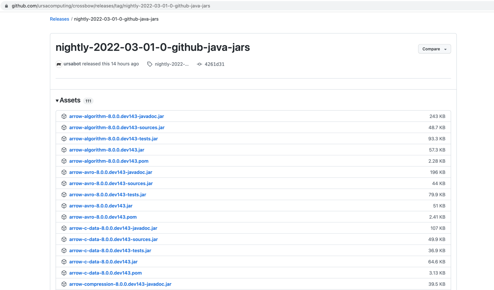

.. Licensed to the Apache Software Foundation (ASF) under one
.. or more contributor license agreements.  See the NOTICE file
.. distributed with this work for additional information
.. regarding copyright ownership.  The ASF licenses this file
.. to you under the Apache License, Version 2.0 (the
.. "License"); you may not use this file except in compliance
.. with the License.  You may obtain a copy of the License at

..   http://www.apache.org/licenses/LICENSE-2.0

.. Unless required by applicable law or agreed to in writing,
.. software distributed under the License is distributed on an
.. "AS IS" BASIS, WITHOUT WARRANTIES OR CONDITIONS OF ANY
.. KIND, either express or implied.  See the License for the
.. specific language governing permissions and limitations
.. under the License.

Installing Java Modules
=======================

System Compatibility
--------------------

Java modules are regularly built and tested on macOS and Linux distributions.

Java Compatibility
------------------

Java modules is currently compatible with JDK 8 / 9 / 10 / 11.

Using Maven
-----------

Downloading in Maven is triggered by a project declaring a dependency that is not present in the local repository.

Central Repository
******************

By default, Maven will download from the central repository: https://repo.maven.apache.org/maven2/org/apache/arrow/

Configure your pom.xml with java module version needed. For example:

.. code-block::

    <dependency>
        <groupId>org.apache.arrow</groupId>
        <artifactId>arrow-vector</artifactId>
        <version>7.0.0</version>
    </dependency

Staging Repository
******************

Configure your maven settings.xml to download artifacts from staging repository with:

.. code-block:: xml

    $ cat ~/.m2/settings.xml
    <?xml version="1.0" encoding="UTF-8"?>
    <settings xsi:schemaLocation="http://maven.apache.org/SETTINGS/1.1.0 http://maven.apache.org/xsd/settings-1.1.0.xsd" xmlns="http://maven.apache.org/SETTINGS/1.1.0"
        xmlns:xsi="http://www.w3.org/2001/XMLSchema-instance">
      <profiles>
        <profile>
          <repositories>
            <repository>
               <id>staged</id>
               <name>staged-releases</name>
               <url>https://repository.apache.org/content/repositories/staging/</url>
               <releases>
                 <enabled>true</enabled>
               </releases>
               <snapshots>
                 <enabled>true</enabled>
               </snapshots>
             </repository>
          </repositories>
          <id>arrowrc</id>
        </profile>
      </profiles>
    </settings>
    $ mvn -Parrowrc clean install -X
    Downloading from staged: https://repository.apache.org/content/repositories/staging/

Installing from source
----------------------

See :ref:`java-development`.

Installing Nightly Packages
---------------------------

.. warning::
    These packages are not official releases. Use them at your own risk.

All arrow nightly version are uploaded to github assets for example for March 01 it is uploading to `Github Nightly`_

For example if you need to test your code with these artifacts, then, you need to configure maven settings with:

.. code-block:: xml

    $ cat ~/.m2/settings.xml
    <?xml version="1.0" encoding="UTF-8"?>
    <settings xsi:schemaLocation="http://maven.apache.org/SETTINGS/1.1.0 http://maven.apache.org/xsd/settings-1.1.0.xsd" xmlns="http://maven.apache.org/SETTINGS/1.1.0"
        xmlns:xsi="http://www.w3.org/2001/XMLSchema-instance">
      <profiles>
        <profile>
          <repositories>
            <repository>
               <id>staged</id>
               <name>staged-releases</name>
               <url>https://repository.apache.org/content/repositories/staging/</url>
               <releases>
                 <enabled>true</enabled>
               </releases>
               <snapshots>
                 <enabled>true</enabled>
               </snapshots>
             </repository>
          </repositories>
          <id>arrowrc</id>
        </profile>
        <profile>
          <repositories>
            <repository>
               <id>staged</id>
               <name>staged-releases</name>
               <url>https://github.com/ursacomputing/crossbow/releases/tag/nightly-2022-03-01-0-github-java-jars/</url>
               <releases>
                 <enabled>true</enabled>
               </releases>
               <snapshots>
                 <enabled>true</enabled>
               </snapshots>
             </repository>
          </repositories>
          <id>arrownightly</id>
        </profile>
      </profiles>
    </settings>
    $ mvn -Parrownightly clean install -X
    Downloading from staged: https://github.com/ursacomputing/crossbow/releases/tag/nightly-2022-03-01-0-github-java-jars/org/apache/arrow/arrow-vector/8.0.0.dev143/arrow-vector-8.0.0.dev143.pom

Consider that you could see arrow nightly builds at `Arrow Nightly`_.

.. _Arrow Nightly: https://lists.apache.org/list.html?builds@arrow.apache.org
.. _Github Nightly: https://github.com/ursacomputing/crossbow/releases/tag/nightly-2022-03-01-0-github-java-jars