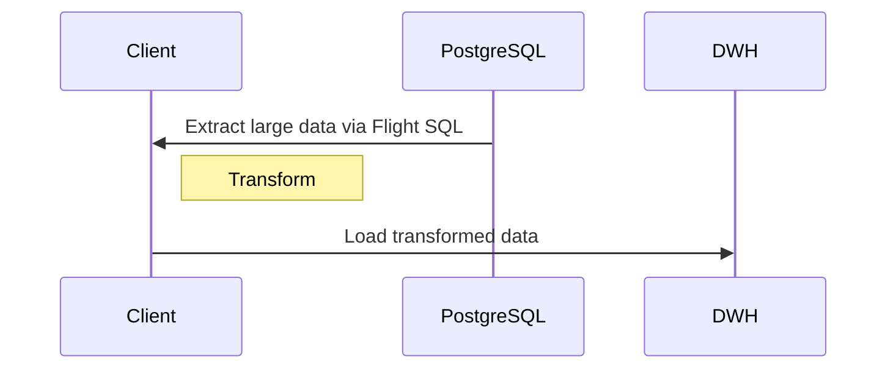
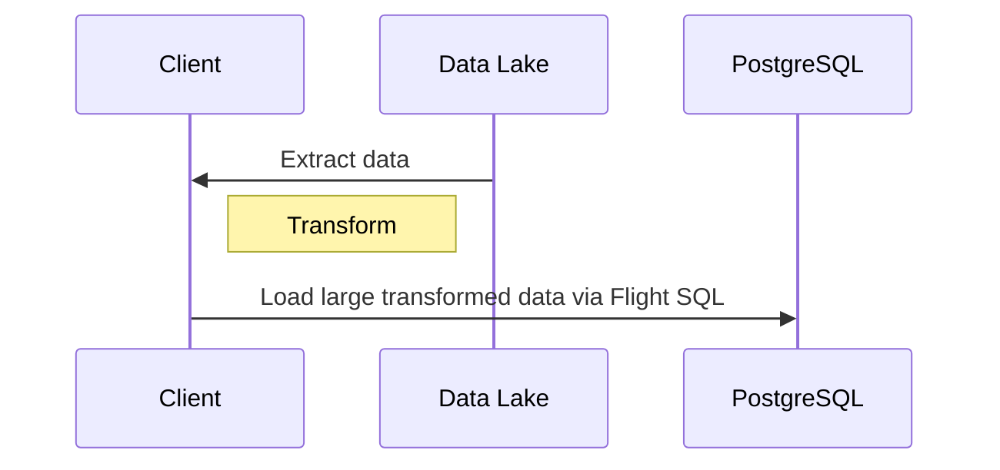
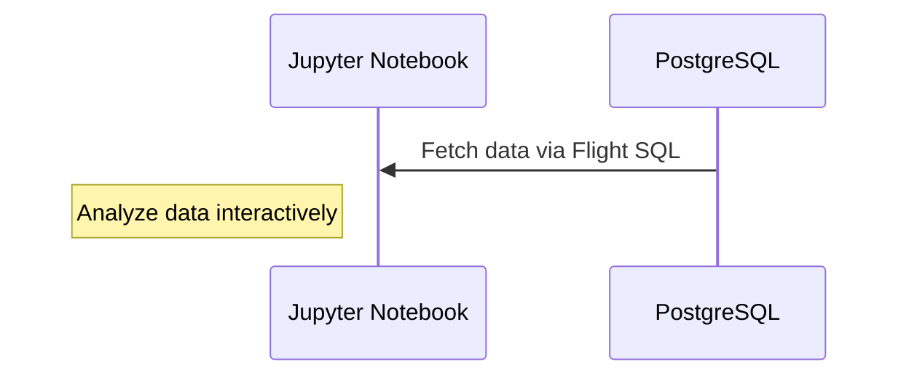
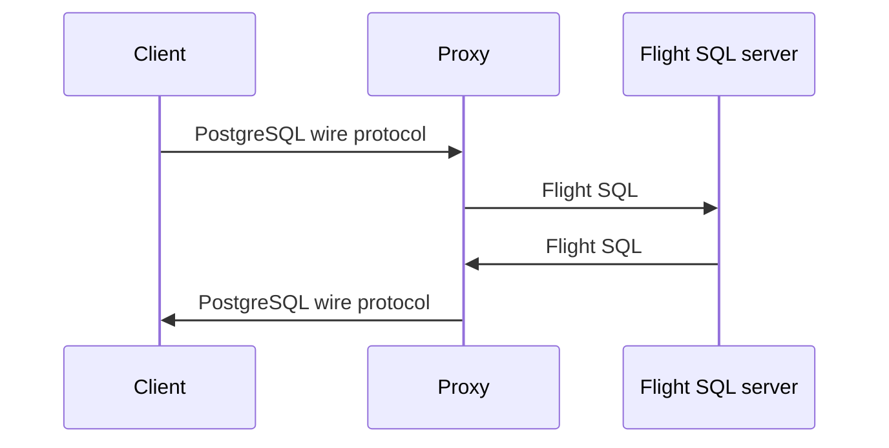

# Apache Arrow Flight SQL adapter for PostgreSQL

## Use cases

### ETL (Extract, Transform, Load)

Fast large data extraction from PostgreSQL:

Fast large data load to PostgreSQL:

### Interactive/exploratory data analysis

Fast large data fetch from PostgreSQL and interactive/exploratory
in-memory data analysis with analyze libraries such as data frame and
visualizer:

## Not goals

This project doesn't provide a PostgreSQL wire protocol proxy for
a Flight SQL server:

## Approach

MySQL has a plugin API to open a new socket, that is used for
implementing MySQL's X protocol, but PostgreSQL doesn't provide such
API. So we need to implement it with background worker process API.

https://www.postgresql.org/docs/current/bgworker.html

We can access one database by one user per background worker process
with SPI (Server Programming Interface).

See also: https://www.postgresql.org/docs/current/spi.html

We can also use libpg to connect local PostgreSQL but it has
performance penalty because it uses the PostgreSQL protocol to connect
to local PostgreSQL.  (Serializations/deserializations are happen.)

If we use SPI, we need to create one background worker process per
Apache Arrow Flight SQL connection. We will be able to use background
worker process' "shared memory" feature to communicate between a
Apache Arrow Flight SQL server process and a process that uses SPI.

### Concerns

* We need to implement authentication feature by ourselves because
  PostgreSQL's authentication related API is based on the PostgreSQL
  protocol.

  See also:
  https://git.postgresql.org/gitweb/?p=postgresql.git;a=blob;f=src/backend/libpq/auth.c

* gRPC server's multi-thread model may cause some problems because
  PostgreSQL uses multi-process model. fork() and thread aren't good
  friend.

### Plan

1. Create apache/arrow-flight-sql-postgresql repository for this
   project

2. Implement Apache Arrow Flight SQL adapter for PostgreSQL as an
   PostgreSQL extension that uses background worker process and SPI
   with minimum features:

   * No authentication support.
   * Simple SELECT is only supported.
   * One type such as Int64 is only supported.
   * No concurrent session support.

3. Evaluate whether this approach is reasonable or not. If this
   approach isn't reasonable, we stop this approach.

4. Add support for authentication.

5. Add support for concurrent session.

6. Add support for more features and types...

7 ...

## Another approach

1. Add support for Apache Arrow data in PostgreSQL's `COPY`.

   See also:
   * https://www.postgresql.org/docs/current/sql-copy.html
   * https://github.com/apache/arrow-nanoarrow/issues/94

2. Implement Apache Arrow Flight SQL adapter for PostgreSQL as an
   external program that listens gRPC socket and communicates
   PostgreSQL with PostgreSQL wire protocol. PostgREST uses similar
   architecture.

   https://postgrest.org/en/stable/

   This approach uses PostgreSQL wire protocol internally but data are
   interchanged as Apache Arrow data. So overhead will be small.

### Concerns

* We need at least 1-2 years to implement 1. because PostgreSQL
  releases one major release per year.
* 1. may be rejected by PostgreSQL.
* 2. may have more overhead we assume.
