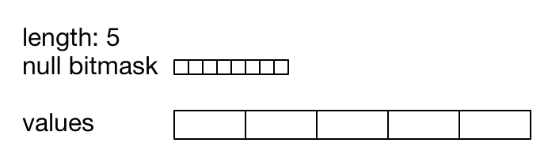
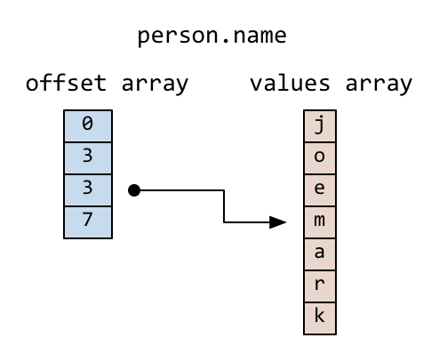
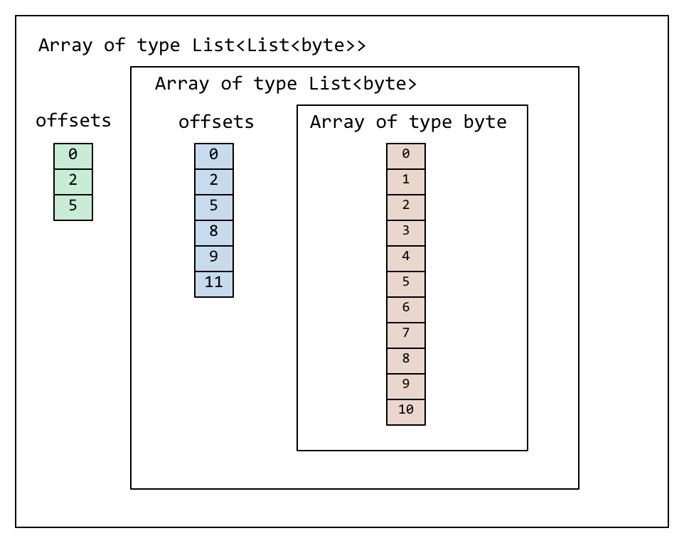
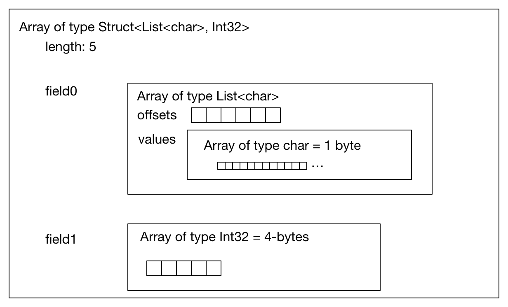
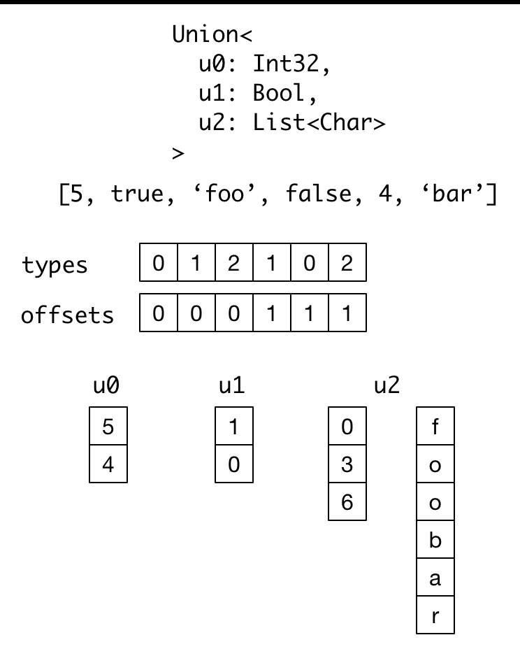

# Arrow: Physical memory layout

## Definitions / Terminology

Since different projects have used differents words to describe various
concepts, here is a small glossary to help disambiguate.

* Array: a sequence of values with known length all having the same type.
* Slot or array slot: a single logical value in an array of some particular data type
* Contiguous memory region: a sequential virtual address space with a given
  length. Any byte can be reached via a single pointer offset less than the
  region’s length.
* Primitive type: a data type that occupies a fixed-size memory slot specified
  in bit width or byte width
* Nested or parametric type: a data type whose full structure depends on one or
  more other child relative types. Two fully-specified nested types are equal
  if and only if their child types are equal. For example, `List<U>` is distinct
  from `List<V>` iff U and V are different relative types.
* Relative type or simply type (unqualified): either a specific primitive type
  or a fully-specified nested type. When we say slot we mean a relative type
  value, not necessarily any physical storage region.
* Logical type: A data type that is implemented using some relative (physical)
  type. For example, a Decimal value stored in 16 bytes could be stored in a
  primitive array with slot size 16 bytes. Similarly, strings can be stored as
  `List<1-byte>`.
* Parent and child arrays: names to express relationships between physical
  value arrays in a nested type structure. For example, a `List<T>`-type parent
  array has a T-type array as its child (see more on lists below).
* Leaf node or leaf: A primitive value array that may or may not be a child
  array of some array with a nested type.

## Requirements, goals, and non-goals

Base requirements

* A physical memory layout enabling zero-deserialization data interchange
  amongst a variety of systems handling flat and nested columnar data, including
  such systems as Spark, Drill, Impala, Kudu, Ibis, Spark, ODBC protocols, and
  proprietary systems that utilize the open source components.
* All array slots are accessible in constant time, with complexity growing
  linearly in the nesting level
* Capable of representing fully-materialized and decoded / decompressed Parquet
  data
* All leaf nodes (primitive value arrays) use contiguous memory regions
* Any relative type can be have null slots
* Arrays are immutable once created. Implementations can provide APIs to mutate
  an array, but applying mutations will require a new array data structure to
  be built.
* Arrays are relocatable (e.g. for RPC/transient storage) without pointer
  swizzling. Another way of putting this is that contiguous memory regions can
  be migrated to a different address space (e.g. via a memcpy-type of
  operation) without altering their contents.

## Goals (for this document)

* To describe relative types (physical value types and a preliminary set of
  nested types) sufficient for an unambiguous implementation
* Memory layout and random access patterns for each relative type
* Null value representation

## Non-goals (for this document

* To enumerate or specify logical types that can be implemented as primitive
  (fixed-width) value types. For example: signed and unsigned integers,
  floating point numbers, boolean, exact decimals, date and time types,
  CHAR(K), VARCHAR(K), etc.
* To specify standardized metadata or a data layout for RPC or transient file
  storage.
* To define a selection or masking vector construct
* Implementation-specific details
* Details of a user or developer C/C++/Java API.
* Any “table” structure composed of named arrays each having their own type or
  any other structure that composes arrays.
* Any memory management or reference counting subsystem
* To enumerate or specify types of encodings or compression support

## Array lengths

Any array has a known and fixed length, stored as a 32-bit signed integer, so a
maximum of 2^31 - 1 elements. We choose a signed int32 for a couple reasons:

* Enhance compatibility with Java and client languages which may have varying
  quality of support for unsigned integers.
* To encourage developers to compose smaller arrays (each of which contains
  contiguous memory in its leaf nodes) to create larger array structures
  possibly exceeding 2^31 - 1 elements, as opposed to allocating very large
  contiguous memory blocks.

## Null count

The number of null value slots is a property of the physical array and
considered part of the data structure. The null count is stored as a 32-bit
signed integer, as it may be as large as the array length.

## Null bitmaps

Any relative type can have null value slots, whether primitive or nested type.

An array with nulls must have a contiguous memory buffer, known as the null (or
validity) bitmap, whose length is a multiple of 8 bytes (to avoid
word-alignment concerns) and large enough to have at least 1 bit for each array
slot.

Whether any array slot is valid (non-null) is encoded in the respective bits of
this bitmap. A 1 (set bit) for index `j` indicates that the value is not null,
while a 0 (bit not set) indicates that it is null. Bitmaps are to be
initialized to be all unset at allocation time.

```
is_valid[j] -> bitmap[j / 8] & (1 << (j % 8))
```

We use [least-significant bit (LSB) numbering][1] (also known as
bit-endianness). This means that within a group of 8 bits, we read
right-to-left:

```
values = [0, 1, null, 2, null, 3]

bitmap
j mod 8   7  6  5  4  3  2  1  0
          0  0  1  0  1  0  1  1
```

Arrays having a 0 null count may choose to not allocate the null
bitmap. Implementations may choose to always allocate one anyway as a matter of
convenience, but this should be noted when memory is being shared.

Nested type arrays have their own null bitmap and null count regardless of
the null count and null bits of their child arrays.

## Primitive value arrays

A primitive value array represents a fixed-length array of values each having
the same physical slot width typically measured in bytes, though the spec also
provides for bit-packed types (e.g. boolean values encoded in bits).

Internally, the array contains a contiguous memory buffer whose total size is
equal to the slot width multiplied by the array length. For bit-packed types,
the size is rounded up to the nearest byte.

The associated null bitmap is contiguously allocated (as described above) but
does not need to be adjacent in memory to the values buffer.

(diagram not to scale)



## List type

List is a nested type in which each array slot contains a variable-size
sequence of values all having the same relative type (heterogeneity can be
achieved through unions, described later).

A list type is specified like `List<T>`, where `T` is any relative type
(primitive or nested).

A list-array is represented by the combination of the following:

* A values array, a child array of type T. T may also be a nested type.
* An offsets array containing 32-bit signed integers with length equal to the
  length of the top-level array plus one. Note that this limits the size of the
  values array to 2^31 -1.

The offsets array encodes a start position in the values array, and the length
of the value in each slot is computed using the first difference with the next
element in the offsets array. For example. the position and length of slot j is
computed as:

```
slot_position = offsets[j]
slot_length = offsets[j + 1] - offsets[j]  // (for 0 <= j < length)
```

The first value in the offsets array is 0, and the last element is the length
of the values array.

Let’s consider an example, the type `List<Char>`, where Char is a 1-byte
logical type.

For an array of length 3 with respective values:

[[‘j’, ‘o’, ‘e’], null, [‘m’, ‘a’, ‘r’, ‘k’]]

We have the following offsets and values arrays



Let’s consider an array of a nested type, `List<List<byte>>`



## Struct type

A struct is a nested type parameterized by an ordered sequence of relative
types (which can all be distinct), called its fields.

Typically the fields have names, but the names and their types are part of the
type metadata, not the physical memory layout.

A struct does not have any additional allocated physical storage.

Physically, a struct type has one child array for each field.

For example, the struct (field names shown here as strings for illustration
purposes)

```
Struct <
  name: String (= List<char>),
  age: Int32
>
```

has two child arrays, one List<char> array (layout as above) and one 4-byte
physical value array having Int32 logical type. Here is a diagram showing the
full physical layout of this struct:



While a struct does not have physical storage for each of its semantic slots
(i.e. each scalar C-like struct), an entire struct slot can be set to null via
the null bitmap. Any of the child field arrays can have null values according
to their respective independent null bitmaps.

## Dense union type

A dense union is semantically similar to a struct, and contains an ordered
sequence of relative types. While a struct contains multiple arrays, a union is
semantically a single array in which each slot can have a different type.

The union types may be named, but like structs this will be a matter of the
metadata and will not affect the physical memory layout.

We define two distinct union types that are optimized for different use
cases. This first, the dense union, represents a mixed-type array with 6 bytes
of overhead for each value. Its physical layout is as follows:

* One child array for each relative type
* Types array: An array of unsigned integers, enumerated from 0 corresponding
  to each type, with the smallest byte width capable of representing the number
  of types in the union.
* Offsets array: An array of signed int32 values indicating the relative offset
  into the respective child array for the type in a given slot. The respective
  offsets for each child value array must be in order / increasing.

Alternate proposal (TBD): the types and offset values may be packed into an
int48 with 2 bytes for the type and 4 bytes for the offset.

Critically, the dense union allows for minimal overhead in the ubiquitous
union-of-structs with non-overlapping-fields use case (Union<s1: Struct1, s2:
Struct2, s3: Struct3, …>)

Here is a diagram of an example dense union:



## Sparse union type

A sparse union has the same structure as a dense union, with the omission of
the offsets array. In this case, the child arrays are each equal in length to
the length of the union.

While a sparse union may use significantly more space compared with a dense
union, it has some advantages that may be desirable in certain use cases:


More amenable to vectorized expression evaluation in some use cases.
Equal-length arrays can be interpreted as a union by only defining the types array

Note that nested types in a sparse union must be internally consistent
(e.g. see the List in the diagram), i.e. random access at any index j yields
the correct value.

## References

Drill docs https://drill.apache.org/docs/value-vectors/

[1]: https://en.wikipedia.org/wiki/Bit_numbering