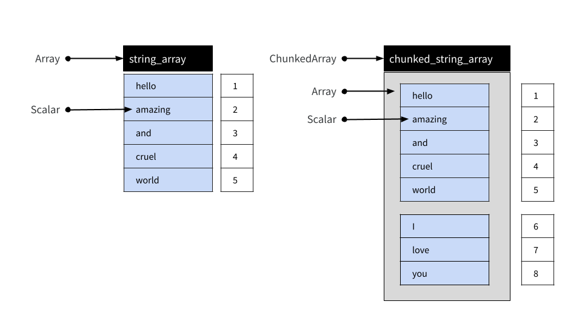
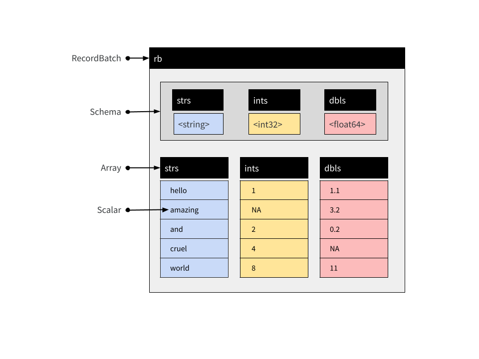
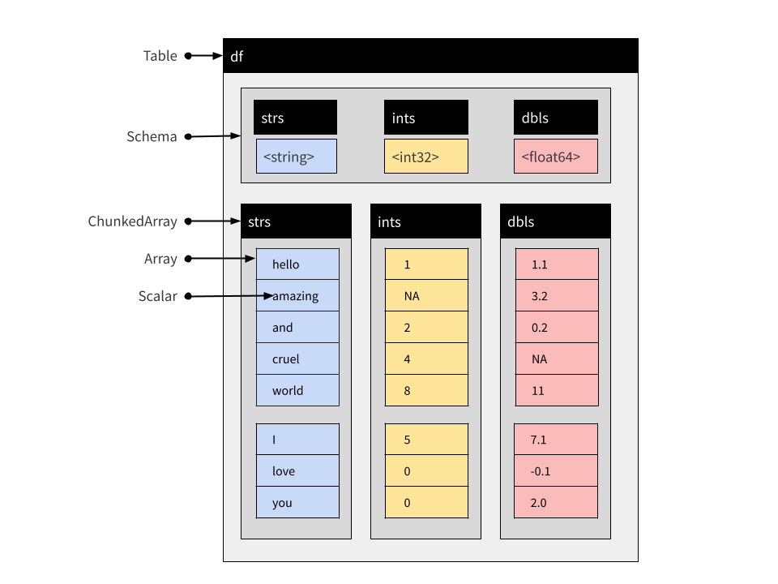

This article describes the various data object types supplied by arrow, and documents how these objects are structured. 

```{r include=FALSE}
library(arrow, warn.conflicts = FALSE)
library(dplyr, warn.conflicts = FALSE)
```

The arrow package supplies several object classes that are used to represent data. `RecordBatch`, `Table`, and `Dataset` objects are two-dimensional rectangular data structures used to store tabular data. For columnar, one-dimensional data, the `Array` and `ChunkedArray` classes are provided. Finally, `Scalar` objects represent individual values. The table below summarizes these objects and shows how you can create new instances using the [`R6`](https://r6.r-lib.org/) class object, as well as convenience functions that provide the same functionality in a more traditional R-like fashion:

| Dim | Class          | How to create an instance                     | Convenience function                          |
| --- | -------------- | ----------------------------------------------| --------------------------------------------- |
| 0   | `Scalar`       | `Scalar$create(value, type)`                  |                                               |
| 1   | `Array`        | `Array$create(vector, type)`                  | `as_arrow_array(x)`                           |
| 1   | `ChunkedArray` | `ChunkedArray$create(..., type)`              | `chunked_array(..., type)`                    |
| 2   | `RecordBatch`  | `RecordBatch$create(...)`                     | `record_batch(...)`                           |
| 2   | `Table`        | `Table$create(...)`                           | `arrow_table(...)`                            |
| 2   | `Dataset`      | `Dataset$create(sources, schema)`             | `open_dataset(sources, schema)`               |
  
Later in the article we'll look at each of these in more detail. For now we note that each of these object classes corresponds to a class of the same name in the underlying Arrow C++ library. 

In addition to these data objects, arrow defines the following classes for representing metadata:

- A `Schema` is a list of `Field` objects used to describe the structure of a tabular data object; where
- A `Field` specifies a character string name and a `DataType`; and
- A `DataType` is an attribute controlling how values are represented

These metadata objects play an important role in making sure data are represented correctly, and all three of the tabular data object types (Record Batch, Table, and Dataset) include explicit Schema objects used to represent metadata. To learn more about these metadata classes, see the [metadata article](./metadata.html).

## Scalars

A Scalar object is simply a single value that can be of any type. It might be an integer, a string, a timestamp, or any of the different `DataType` objects that Arrow supports. Most users of the arrow R package are unlikely to create Scalars directly, but should there be a need you can do this by calling the `Scalar$create()` method:

```{r}
Scalar$create("hello")
```


## Arrays

Array objects are ordered sets of Scalar values. As with Scalars most users will not need to create Arrays directly, but if the need arises there is an `Array$create()` method that allows you to create new Arrays:

```{r}
integer_array <- Array$create(c(1L, NA, 2L, 4L, 8L))
integer_array
```

```{r}
string_array <- Array$create(c("hello", "amazing", "and", "cruel", "world"))
string_array
```

An Array can be subset using square brackets as shown below:

```{r}
string_array[4:5]
```

Arrays are immutable objects: once an Array has been created it cannot be modified or extended. 

## Chunked Arrays

In practice, most users of the arrow R package are likely to use Chunked Arrays rather than simple Arrays. Under the hood, a Chunked Array is a collection of one or more Arrays that can be indexed _as if_ they were a single Array. The reasons that Arrow provides this functionality are described in the [data object layout article](./developers/data_object_layout.html) but for the present purposes it is sufficient to notice that Chunked Arrays behave like Arrays in regular data analysis.

To illustrate, let's use the `chunked_array()` function:

```{r}
chunked_string_array <- chunked_array(
  string_array,
  c("I", "love", "you")
)
```

The `chunked_array()` function is just a wrapper around the functionality that `ChunkedArray$create()` provides. Let's print the object:

```{r}
chunked_string_array
```

The double bracketing in this output is intended to highlight the fact that Chunked Arrays are wrappers around one or more Arrays. However, although comprised of multiple distinct Arrays, a Chunked Array can be indexed as if they were laid end-to-end in a single "vector-like" object. This is illustrated below:

```{r, echo=FALSE, out.width="100%"}

```

We can use `chunked_string_array` to illustrate this: 

```{r}
chunked_string_array[4:7]
```

An important thing to note is that "chunking" is not semantically meaningful. It is an implementation detail only: users should never treat the chunk as a meaningful unit. Writing the data to disk, for example, often results in the data being organized into different chunks. Similarly, two Chunked Arrays that contain the same values assigned to different chunks are deemed equivalent. To illustrate this we can create a Chunked Array that contains the same four same four values as `chunked_string_array[4:7]`, but organized into one chunk rather than split into two:

```{r}
cruel_world <- chunked_array(c("cruel", "world", "I", "love"))
cruel_world
```

Testing for equality using `==` produces an element-wise comparison, and the result is a new Chunked Array of four (boolean type) `true` values:

```{r}
cruel_world == chunked_string_array[4:7]
```

In short, the intention is that users interact with Chunked Arrays as if they are ordinary one-dimensional data structures without ever having to think much about the underlying chunking arrangement. 

Chunked Arrays are mutable, in a specific sense: Arrays can be added and removed from a Chunked Array.

## Record Batches

A Record Batch is tabular data structure comprised of named Arrays, and an accompanying Schema that specifies the name and data type associated with each Array. Record Batches are a fundamental unit for data interchange in Arrow, but are not typically used for data analysis. Tables and Datasets are usually more convenient in analytic contexts.

These Arrays can be of different types but must all be the same length. Each Array is referred to as one of the "fields" or "columns" of the Record Batch. You can create a Record Batch using the `record_batch()` function or by using the `RecordBatch$create()` method. These functions are flexible and can accept inputs in several formats: you can pass a data frame, one or more named vectors, an input stream, or even a raw vector containing appropriate binary data. For example:

```{r}
rb <- record_batch(
  strs = string_array,
  ints = integer_array,
  dbls = c(1.1, 3.2, 0.2, NA, 11)
)
rb
```

This is a Record Batch containing 5 rows and 3 columns, and its conceptual structure is shown below:

```{r, echo=FALSE, out.width="100%"}

```

The arrow package supplies a `$` method for Record Batch objects, used to extract a single column by name:

```{r}
rb$strs
```

You can use double brackets `[[` to refer to columns by position. The `rb$ints` array is the second column in our Record Batch so we can extract it with this:

```{r}
rb[[2]]
```

There is also `[` method that allows you to extract subsets of a record batch in the same way you would for a data frame. The command `rb[1:3, 1:2]` extracts the first three rows and the first two columns:

```{r}
rb[1:3, 1:2]
```

Record Batches cannot be concatenated: because they are comprised of Arrays, and Arrays are immutable objects, new rows cannot be added to Record Batch once created.

## Tables

A Table is comprised of named Chunked Arrays, in the same way that a Record Batch is comprised of named Arrays. Like Record Batches, Tables include an explicit Schema specifying the name and data type for each Chunked Array.

You can subset Tables with `$`, `[[`, and `[` the same way you can for Record Batches. Unlike Record Batches, Tables can be concatenated (because they are comprised of Chunked Arrays). Suppose a second Record Batch arrives:

```{r}
new_rb <- record_batch(
  strs = c("I", "love", "you"),
  ints = c(5L, 0L, 0L),
  dbls = c(7.1, -0.1, 2)
)
```

It is not possible to create a Record Batch that appends the data from `new_rb` to the data in `rb`, not without creating entirely new objects in memory. With Tables, however, we can:

```{r}
df <- arrow_table(rb)
new_df <- arrow_table(new_rb)
```

We now have the two fragments of the data set represented as Tables. The difference between the Table and the Record Batch is that the columns are all represented as Chunked Arrays. Each Array from the original Record Batch is one chunk in the corresponding Chunked Array in the Table:

```{r}
rb$strs
df$strs
```

It's the same underlying data -- and indeed the same immutable Array is referenced by both -- just enclosed by a new, flexible Chunked Array wrapper. However, it is this wrapper that allows us to concatenate Tables:

```{r}
concat_tables(df, new_df)
```

The resulting object is shown schematically below:

```{r, echo=FALSE, out.width="100%"}

```

Notice that the Chunked Arrays within the new Table retain this chunking structure, because none of the original Arrays have been moved:

```{r}
df_both <- concat_tables(df, new_df)
df_both$strs
```


## Datasets

Like Record Batch and Table objects, a Dataset is used to represent tabular data. At an abstract level, a Dataset can be viewed as an object comprised of rows and columns, and just like Record Batches and Tables, it contains an explicit Schema that specifies the name and data type associated with each column.

However, where Tables and Record Batches are data explicitly represented in-memory, a Dataset is not. Instead, a Dataset is an abstraction that refers to data stored on-disk in one or more files. Values stored in the data files are loaded into memory as a batched process. Loading takes place only as needed, and only when a query is executed against the data. In this respect Arrow Datasets are a very different kind of object to Arrow Tables, but the dplyr commands used to analyze them are essentially identical. In this section we'll talk about how Datasets are structured. If you want to learn more about the practical details of analyzing Datasets, see the article on [analyzing multi-file datasets](./dataset.html).

### The on-disk data files

Reduced to its simplest form, the on-disk structure of a Dataset is simply a collection of data files, each storing one subset of the data. These subsets are sometimes referred to as "fragments", and the partitioning process is sometimes referred to as "sharding". By convention, these files are organized into a folder structure called a Hive-style partition: see `hive_partition()` for details. 

To illustrate how this works, let's write a multi-file dataset to disk manually, without using any of the Arrow Dataset functionality to do the work. We'll start with three small data frames, each of which contains one subset of the data we want to store: 

```{r}
df_a <- data.frame(id = 1:5, value = rnorm(5), subset = "a")
df_b <- data.frame(id = 6:10, value = rnorm(5), subset = "b")
df_c <- data.frame(id = 11:15, value = rnorm(5), subset = "c")
```

Our intention is that each of the data frames should be stored in a separate data file. As you can see, this is a quite structured partitioning: all data where `subset = "a"` belong to one file, all data where `subset = "b"` belong to another file, and all data where `subset = "c"` belong to the third file. 

The first step is to define and create a folder that will hold all the files:

```{r, include=FALSE}
ds_dir <- "mini-dataset"
if (dir.exists(ds_dir)) {
  unlink(ds_dir, recursive = TRUE)
}
```

```{r}
ds_dir <- "mini-dataset"
dir.create(ds_dir)
```

The next step is to manually create the Hive-style folder structure:

```{r}
ds_dir_a <- file.path(ds_dir, "subset=a")
ds_dir_b <- file.path(ds_dir, "subset=b")
ds_dir_c <- file.path(ds_dir, "subset=c")

dir.create(ds_dir_a)
dir.create(ds_dir_b)
dir.create(ds_dir_c)
```

Notice that we have named each folder in a "key=value" format that exactly describes the subset of data that will be written into that folder. This naming structure is the essence of Hive-style partitions. 

Now that we have the folders, we'll use `write_parquet()` to create a single parquet file for each of the three subsets:

```{r}
write_parquet(df_a, file.path(ds_dir_a, "part-0.parquet"))
write_parquet(df_b, file.path(ds_dir_b, "part-0.parquet"))
write_parquet(df_c, file.path(ds_dir_c, "part-0.parquet"))
```

If we had wanted to, we could have further subdivided the dataset. A folder could contain multiple files (`part-0.parquet`, `part-1.parquet`, etc) if we wanted it to. Similarly, there is no particular reason to name the files `part-0.parquet` this way at all: it would have been fine to call these files `subset-a.parquet`, `subset-b.parquet`, and `subset-c.parquet` if we had wished. We could have written other file formats if we wanted, and we don't necessarily have to use Hive-style folders. You can learn more about the supported formats by reading the help documentation for `open_dataset()`, and learn about how to exercise fine grained control with `help("Dataset", package = "arrow")`. 

In any case, we have created an on-disk parquet Dataset using Hive-style partitioning. Our Dataset is defined by these files:

```{r}
list.files(ds_dir, recursive = TRUE)
```

To verify that everything has worked, let's open the data with `open_dataset()` and call `glimpse()` to inspect its contents:

```{r}
ds <- open_dataset(ds_dir)
glimpse(ds)
```

As you can see, the `ds` Dataset object aggregates the three separate data files. In fact, in this particular case the Dataset is so small that values from all three files appear in the output of `glimpse()`.

It should be noted that in everyday data analysis work, you wouldn't need to do write the data files manually in this fashion. The example above is entirely for illustrative purposes. The exact same dataset could be created with the following command:

```{r, eval=FALSE}
ds |>
  group_by(subset) |>
  write_dataset("mini-dataset")
```

In fact, even if `ds` happens to refer to a data source that is larger than memory, this command should still work because the Dataset functionality is written to ensure that during a pipeline such as this the data is loaded piecewise in order to avoid exhausting memory. 

### The Dataset object

In the previous section we examined the on-disk structure of a Dataset. We now turn to the in-memory structure of the Dataset object itself (i.e., `ds` in the previous example). When the Dataset object is created, arrow searches the dataset folder looking for appropriate files, but does not load the contents of those files. Paths to these files are stored in an active binding `ds$files`:

```{r}
ds$files
```

The other thing that happens when `open_dataset()` is called is that an explicit Schema for the Dataset is constructed and stored as `ds$schema`:

```{r}
ds$schema
```

By default this Schema is inferred by inspecting the first file only, though it is possible to construct a unified schema after inspecting all files. To do this, set `unify_schemas = TRUE` when calling `open_dataset()`. It is also possible to use the `schema` argument to `open_dataset()` to specify the Schema explicitly (see the `schema()` function for details). 

The act of reading the data is performed by a Scanner object. When analyzing a Dataset using the dplyr interface you never need to construct a Scanner manually, but for explanatory purposes we'll do it here:

```{r}
scan <- Scanner$create(dataset = ds)
```

Calling the `ToTable()` method will materialize the Dataset (on-disk) as a Table (in-memory):

```{r}
scan$ToTable()
```

This scanning process is multi-threaded by default, but if necessary threading can be disabled by setting `use_threads = FALSE` when calling `Scanner$create()`.

### Querying a Dataset

When a query is executed against a Dataset a new scan is initiated and the results pulled back into R. As an example, consider the following dplyr expression:

```{r}
ds |>
  filter(value > 0) |>
  mutate(new_value = round(100 * value)) |>
  select(id, subset, new_value) |>
  collect()
```

We can replicate this using the low-level Dataset interface by creating a new scan by specifying the `filter` and `projection` arguments to `Scanner$create()`. To use these arguments you need to know a little about Arrow Expressions, for which you may find it helpful to read the help documentation in `help("Expression", package = "arrow")`. 

The scanner defined below mimics the dplyr pipeline shown above,

```{r}
scan <- Scanner$create(
  dataset = ds,
  filter = Expression$field_ref("value") > 0,
  projection = list(
    id = Expression$field_ref("id"),
    subset = Expression$field_ref("subset"),
    new_value = Expression$create("round", 100 * Expression$field_ref("value"))
  )
)
```

and if we were to call `as.data.frame(scan$ToTable())` it would produce the same result as the dplyr version, though the rows may not appear in the same order. 

To get a better sense of what happens when the query executes, what we'll do here is call `scan$ScanBatches()`. Much like the `ToTable()` method, the `ScanBatches()` method executes the query separately against each of the files, but it returns a list of Record Batches, one for each file. In addition, we'll convert these Record Batches to data frames individually:

```{r}
lapply(scan$ScanBatches(), as.data.frame)
```

If we return to the dplyr query we made earlier, and use `compute()` to return a Table rather use `collect()` to return a data frame, we can see the evidence of this process at work. The Table object is created by concatenating the three Record Batches produced when the query executes against three data files, and as a consequence of this the Chunked Array that defines a column of the Table mirrors the partitioning structure present in the data files:

```{r}
tbl <- ds |>
  filter(value > 0) |>
  mutate(new_value = round(100 * value)) |>
  select(id, subset, new_value) |>
  compute()

tbl$subset
```

### Additional notes

- A distinction ignored in the previous discussion is between `FileSystemDataset` and `InMemoryDataset` objects. In the usual case, the data that comprise a Dataset are stored in files on-disk. That is, after all, the primary advantage of Datasets over Tables. However, there are cases where it may be useful to make a Dataset from data that are already stored in-memory. In such cases the object created will have type `InMemoryDataset`. 

- The previous discussion assumes that all files stored in the Dataset have the same Schema. In the usual case this will be true, because each file is conceptually a subset of a single rectangular table. But this is not strictly required.

For more information about these topics, see `help("Dataset", package = "arrow")`.

## Further reading 

- To learn more about the internal structure of Arrays, see the article on [data object layout](./developers/data_object_layout.html).
- To learn more about the different data types used by Arrow, see the article on [data types](./data_types.html).
- To learn more about how Arrow objects are implemented, see the [Arrow specification](https://arrow.apache.org/docs/format/Columnar.html) page.

