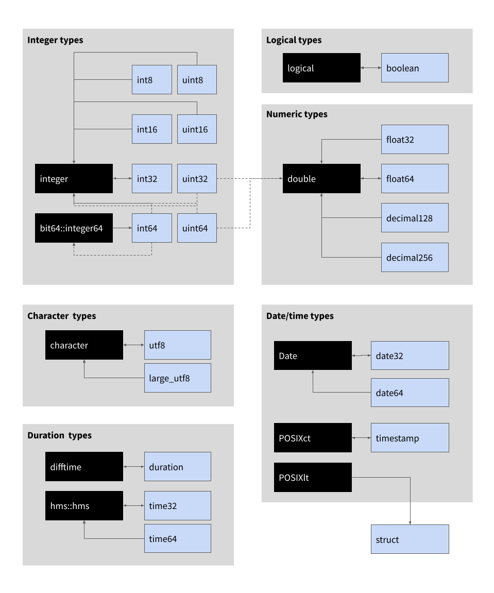

Arrow has a rich data type system that includes direct analogs of many R data types, and many data types that do not have a counterpart in R. This vignette describes the Arrow type system, compares it to R data types, and outlines the default mappings used when data are transferred from Arrow to R. At the end of the vignette there are two lookup tables: one describing the default "R to Arrow" type mappings and the other describing the "Arrow to R" mappings.

## Motivating example

To illustrate the conversion that needs to take place, consider the differences between the output when obtain we use `dplyr::glimpse()` to inspect the `starwars` data in its original format -- as a data frame in R -- and the output we obtain when we convert it to an Arrow Table first by calling `arrow_table()`:

```{r}
library(dplyr, warn.conflicts = FALSE)
library(arrow, warn.conflicts = FALSE)

glimpse(starwars)
glimpse(arrow_table(starwars))
```

The data represented are essentially the same, but the descriptions of the data types for the columns have changed. For example:

- `name` is labelled `<chr>` (character vector) in the data frame; it is labelled `<string>` (a string type, also referred to as utf8 type) in the Arrow Table 
- `height` is labelled `<int>` (integer vector) in the data frame; it is labelled `<int32>` (32-bit signed integer) in the Arrow Table
- `mass` is labelled `<dbl>` (numeric vector) in the data frame; it is labelled `<double>` (64-bit floating point number) in the Arrow Table

Some of these differences are purely cosmetic: integers in R are in fact 32-bit signed integers, so the underlying data types in Arrow and R are direct analogs of one another. In other cases the differences are purely about the implementation: Arrow and R have different ways to store a vector of strings, but at a high level of abstraction the R character type and the Arrow string type can be viewed as direct analogs. In some cases, however, there are no clear analogs: while Arrow has an analog of POSIXct (the timestamp type) it does not have an analog of POSIXlt; converselt, while R can represent 32 bit signed integers, it does not have an equivalent of a 64 bit unsigned integer.

When the `arrow` package converts between R data and Arrow data, it will first check to see if a Schema has been provided -- see `schema()` for more information -- and if none is available it will attempt to guess the appropriate type by following the default mappings. A complete listing of these mappings is provided at the end of the vignette, but the most common cases are depicted in the illustration below:


```{r, echo=FALSE, out.width="100%"}

```

In this image, black boxes refer to R data types and light blue boxes refer to Arrow data types. Directional arrows specify conversions (e.g., the bidirectional arrow between the logical R type and the boolean Arrow type means that R logicals convert to Arrow booleans and vice versa). Solid lines indicate that the this conversion rule is always the default; dashed lines mean that it only sometimes applies (the rules and special cases are described below). 


## Data types in Arrow and R


### Logical/boolean types

### Integer types

### Float and decimal types

### String/character types

### Date/time types

### Duration types


## List of default translations

The discussion above covers the most common cases. The two tables in this section provide a more complete list of how `arrow` translates between R data types and Arrow data types.

### Translations from R to Arrow

| Original R type          | Arrow type after translation |
|--------------------------|------------------------------|
| logical                  | boolean                      |
| integer                  | int32                        |
| double ("numeric")       | float64 ^1^                  |
| character                | utf8 ^2^                     |
| factor                   | dictionary                   |
| raw                      | uint8                        |
| Date                     | date32                       |
| POSIXct                  | timestamp                    |
| POSIXlt                  | struct                       |
| data.frame               | struct                       |
| list ^3^                 | list                         |
| bit64::integer64         | int64                        |
| hms::hms                 | time32                       |
| difftime                 | duration                     |
| vctrs::vctrs_unspecified | null                         |


^1^: `float64` and `double` are the same concept and data type in Arrow C++; 
however, only `float64()` is used in `arrow` as the function `double()` already 
exists in base R

^2^: If the character vector exceeds 2GB of strings, it will be converted to a 
`large_utf8` Arrow type

^3^: Only lists where all elements are the same type are able to be translated 
to Arrow list type (which is a "list of" some type).

### Translations from Arrow to R

In this table, entries with a `-` are not currently implemented.


| Original Arrow type | R type after translation     |
|---------------------|------------------------------|
| boolean             | logical                      |
| int8                | integer                      |
| int16               | integer                      |
| int32               | integer                      |
| int64               | integer ^1^                  |
| uint8               | integer                      |
| uint16              | integer                      |
| uint32              | integer ^1^                  |
| uint64              | integer ^1^                  |
| float16             | - ^2^                        |
| float32             | double                       |
| float64             | double                       |
| utf8                | character                    |
| large_utf8          | character                    |
| binary              | arrow_binary ^3^             |
| large_binary        | arrow_large_binary ^3^       |
| fixed_size_binary   | arrow_fixed_size_binary ^3^  |
| date32              | Date                         |
| date64              | POSIXct                      |
| time32              | hms::hms                     |
| time64              | hms::hms                     |
| timestamp           | POSIXct                      |
| duration            | difftime                     |
| decimal             | double                       |
| dictionary          | factor ^4^                   |
| list                | arrow_list ^5^               |
| large_list          | arrow_large_list ^5^         |
| fixed_size_list     | arrow_fixed_size_list ^5^    |
| struct              | data.frame                   |
| null                | vctrs::vctrs_unspecified     |
| map                 | arrow_list ^5^               |
| union               | - ^2^                       |

^1^: These integer types may contain values that exceed the range of R's 
`integer` type (32-bit signed integer). When they do, `uint32` and `uint64` are 
converted to `double` ("numeric") and `int64` is converted to 
`bit64::integer64`. This conversion can be disabled (so that `int64` always
yields a `bit64::integer64` vector) by setting `options(arrow.int64_downcast = FALSE)`.

^2^: Some Arrow data types do not currently have an R equivalent and will raise an error
if cast to or mapped to via a schema.

^3^: `arrow*_binary` classes are implemented as lists of raw vectors. 

^4^: Due to the limitation of R factors, Arrow `dictionary` values are coerced
to string when translated to R if they are not already strings.

^5^: `arrow*_list` classes are implemented as subclasses of `vctrs_list_of` 
with a `ptype` attribute set to what an empty Array of the value type converts to. 


