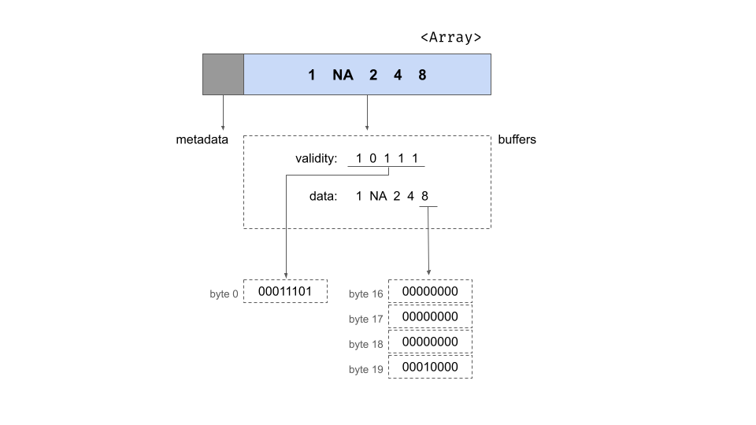
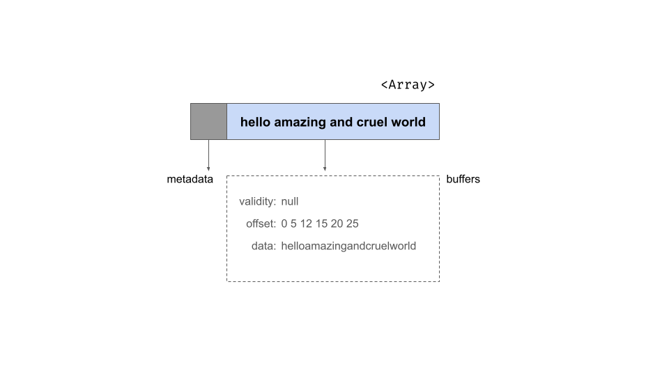
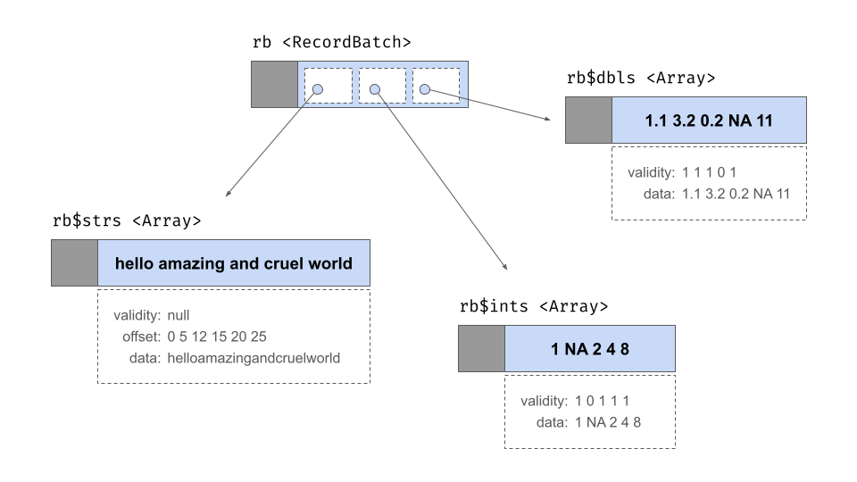
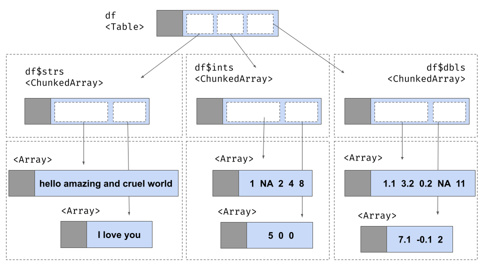

This article describes the internal structure of Arrow data objects. Users of the arrow R package will not generally need to understand the internal structure of Arrow data objects. We include it here to help orient those R users and Arrow developers who wish to understand the [Arrow specification](https://arrow.apache.org/docs/format/Columnar.html). This article provides a deeper dive into some of the topics described in the [data objects article](../data_objects.html), and is intended mostly for developers. It is not necessary knowledge for using the arrow package. 


```{r include=FALSE}
library(arrow, warn.conflicts = FALSE)
```


We begin by describing two key concepts:

- Values in an array are stored in one or more **buffers**. A buffer is a sequential virtual address space (i.e., block of memory) with a given length. Given a pointer specifying the memory address where the buffer starts, you can reach any byte in the buffer with an "offset" value that specifies a location relative to the start of the buffer. 
- The **physical layout** of an array is a term used to describe how data in an array is laid out in memory, without taking into account how that information is interpreted. As an example: a 32-bit signed integer and 32-bit floating point number have the same layout: they are both 32 bits, represented as 4 contiguous bytes in memory. The meaning is different, but the layout is the same.

We can unpack these ideas using a simple array of integer values:

```{r}
integer_array <- Array$create(c(1L, NA, 2L, 4L, 8L))
integer_array
```

We can inspect the `integer_array$type` attribute to see that the values in the Array are stored as signed 32 bit integers. When laid out in memory by the Arrow C++ library, an integer array consists of two pieces of metadata and two buffers that store the data. The metadata specify the length of the array and a count of the number of null values, both stored as 64-bit integers. These metadata can be viewed from R using `integer_array$length()` and `integer_array$null_count` respectively. The number of buffers associated with an array depends on the exact type of data being stored. For an integer array there are two: a "validity bitmap buffer" and a "data value buffer". Schematically we could depict the array as follows:

```{r, echo=FALSE, out.width="100%"}

```

This image shows the array as a rectangle subdivided into two parts, one for the metadata and the other for the buffers. Underneath the rectangle we've unpacked the contents of the buffers for you, showing the contents of the two buffers in the area enclosed in a dotted line. At the very bottom of the figure, you can see the contents of specific bytes.

## Validity bitmap buffer

The validity bitmap is binary-valued, and contains a 1 whenever the corresponding slot in the array contains a valid, non-null value. At an abstract level we can assume this contains the following five bits: 

```
10111
```

However this is a slight over-simplification for three reasons. First, because memory is allocated in byte-size units there are three trailing bits at the end (assumed to be zero), giving us the bitmap `10111000`. Second, while we have written this from left-to-right, this written format is typically presumed to represent [big endian format](https://en.wikipedia.org/wiki/Endianness) where the most-significant bit is written first (i.e., to the lowest-valued memory address). Arrow adopts a little-endian convention, which would more naturally correspond toa right-to-left ordering when written in English. To reflect this we write the bits in right-to-left order: `00011101`. Finally, Arrow encourages [naturally aligned data structures](https://en.wikipedia.org/wiki/Data_structure_alignment) in which allocated memory addresses are a multiple of the data block sizes. Arrow uses *64 byte alignment*, so each data structure must be a multiple of 64 bytes in size. This design feature exists to allow efficient use of modern hardware, as discussed in the [Arrow specification](https://arrow.apache.org/docs/format/Columnar.html#buffer-alignment-and-padding). This is what the buffer looks like this in memory:

::: {.grid}
::: {.g-col-6}
|Byte 0 (validity bitmap) | Bytes 1-63            |
|-------------------------|-----------------------|
| `00011101`              | `0` (padding)         |
:::
:::

## Data buffer

The data buffer, like the validity bitmap, is padded out to a length of 64 bytes to preserve natural alignment. Here's the diagram showing the physical layout:

::: {.grid}
::: {.g-col-12}
| Bytes 0-3 | Bytes 4-7   | Bytes 8-11 | Bytes 12-15 | Bytes 16-19 | Bytes 20-63 |
|-----------|-------------|------------|-------------|-------------|-------------|
| `1`       | unspecified | `2`        | `4`         | `8`         | unspecified |
:::
:::

Each integer occupies 4 bytes, as per the requirements of a 32-bit signed integer. Notice that the bytes associated with the missing value are left unspecified: space is allocated for the value but those bytes are not filled. 

## Offset buffer

Some types of Arrow array include a third buffer known as the offset buffer. This is most frequently encountered in the context of string arrays, such as this one:

```{r}
string_array <- Array$create(c("hello", "amazing", "and", "cruel", "world"))
string_array
```

Using the same schematic notation as before, this is the structure of the object. It has the same metadata as before but as shown below, there are now three buffers:

```{r, echo=FALSE, out.width="100%"}

```

To understand the role of the offset buffer, it helps to note the format of the data buffer for a string array: it concatenates all strings end to end in one contiguous section of memory. For the `string_array` object, the contents of the data buffer would look like one long utf8-encoded string:

```
helloamazingandcruelworld
```

Because individual strings can be of variable length, the role of the offset buffer is to specify where the boundaries between the slots are. The second slot in our array is the string `"amazing"`. If the positions in the data array are indexed like this

|  h |  e |  l |  l |  o |  a |  m |  a |  z |  i |  n |  g |  a |  n |  d | ... |
| -- | -- | -- | -- | -- | -- | -- | -- | -- | -- | -- | -- | -- | -- | -- | --- |
|  0 |  1 |  2 |  3 |  4 |  5 |  6 |  7 |  8 |  9 | 10 | 11 | 12 | 13 | 14 | ... |

then we can see that the string of interest begins at position 5 and ends at position 11. The offset buffer consists integers that store these break point locations. For `string_array` it might look like this:

```
0 5 12 15 20 25
```

The difference between the `utf8()` data type and the `large_utf8()` data type is that these the `utf8()` data type stores these as 32-bit integers whereas the `large_utf8()` type stores them as 64-bit integers.

## Chunked arrays

Arrays are immutable objects: once an Array has been initialized the values it stores cannot be altered. This ensures that multiple entities can safely refer to an Array via pointers, and not run the risk that the values will change. Using immutable Arrays makes it possible for Arrow to avoid unnecessary copies of data objects. 

There are limitations to immutable Arrays, most notably when new batches of data arrive. Because an array is immutable, you can't add the new information to an existing array. The only thing you can do if you don't want to disturb or copy your existing array is create a new array that contains the new data. Doing that preserves the immutability of arrays and doesn't lead to any unnecessary copying but now we have a new problem: the data are split across two arrays. Each array contains only one "chunk" of the data. What would be ideal is an abstraction layer that allows us to treat these two Arrays as though they were a single "Array-like" object.

This is the problem that chunked arrays solve. A chunked array is a wrapper around a list of arrays, and allows you to index their contents "as if" they were a single array. Physically, the data are still stored in separate places -- each array is one chunk, and these chunks don't have to be adjacent to each other in memory -- but the chunked array provides us will a layer of abstraction that allows us to pretend that they are all one thing. 

To illustrate, let's use the `chunked_array()` function:

```{r}
chunked_string_array <- chunked_array(
  c("hello", "amazing", "and", "cruel", "world"),
  c("I", "love", "you")
)
```

The `chunked_array()` function is just a wrapper around the functionality that `ChunkedArray$create()` provides. Let's take a look at the object:

```{r}
chunked_string_array
```

The double bracketing in this output is intended to highlight the "list-like" nature of chunked arrays. There are three separate arrays, wrapped in a container object that is secretly a list of arrays, but allows that list to behave just like a regular one-dimensional data structure. Schematically it looks like this:

```{r, echo=FALSE, out.width="100%"}
knitr::include_graphics("./chunked_array_layout.png")
```

As this figure illustrates, there really are three arrays here, each with its own validity bitmap, offset buffer, and data buffer. 

## Record batches

A record batch is table-like data structure comprised of a sequence of arrays. The arrays can be of different types but they must all be the same length. Each array is referred to as one of the "fields" or "columns" of the record batch. Each field must have a (UTF8-encoded) name, and these names form part of the metadata for the record batch. When stored in memory, the record batch does not include physical storage for the values stored in each field: instead it contains pointers to the relevant array objects. It does, however, contain its own validity bitmap. 

Here is a record batch containing 5 rows and 3 columns:

```{r}
rb <- record_batch(
  strs = c("hello", "amazing", "and", "cruel", "world"),
  ints = c(1L, NA, 2L, 4L, 8L),
  dbls = c(1.1, 3.2, 0.2, NA, 11)
)
rb
```

At an abstract level the `rb` object behaves like a two dimensional structure with rows and columns, but in terms of how it is represented in memory it is fundamentally a list of arrays as shown below:

```{r, echo=FALSE, out.width="100%"}

```

## Tables 

To deal with situations where a rectangular data set can grow over time (as more data are added), we need a tabular data structure that is similar to a record batch with one exception: instead of storing each column as an array, we now want to store it as a chunked array. This is what the `Table` class in **arrow** does. 

To illustrate, suppose we have a second set of data that arrives as a record batch: 
```{r}
new_rb <- record_batch(
  strs = c("I", "love", "you"),
  ints = c(5L, 0L, 0L),
  dbls = c(7.1, -0.1, 2)
)

df <- concat_tables(arrow_table(rb), arrow_table(new_rb))
df
```

Here is the underlying structure of this Table: 

```{r, echo=FALSE, out.width="100%"}

```


