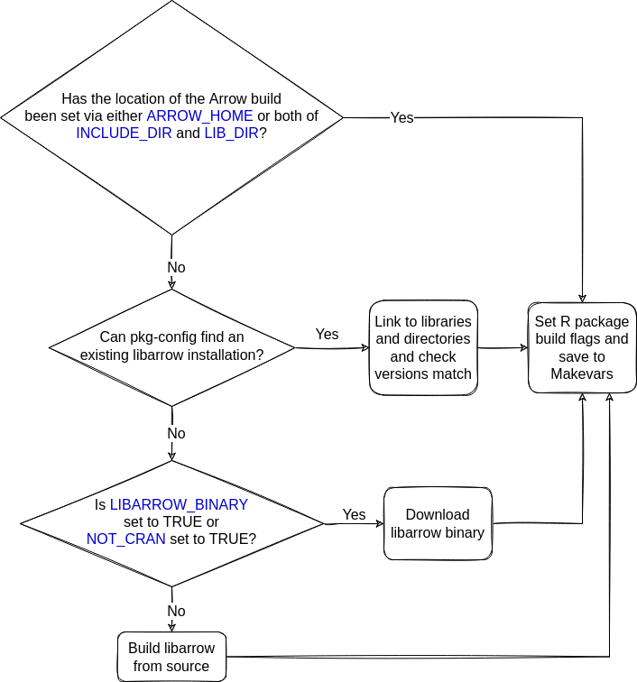

This document is intended specifically for arrow _developers_ who wish to know 
more about these scripts.  If you are an arrow _user_ looking for help with 
installing arrow, please see [the installation guide](../install.html)

The arrow R package requires that Arrow C++ library (also known as libarrow) to 
be installed in order to work properly.  There are a number of different ways 
in which libarrow could be installed:

* as part of the R package installation process
* a system package
* a library you've built yourself outside of the context of installing the R package

Below, we discuss each of these setups in turn.

# Installing libarrow during R package installation

There are a number of scripts that are triggered 
when `R CMD INSTALL .` is run and for Arrow users, these should all just work 
without configuration and pull in the most complete pieces (e.g. official 
binaries that we host).  One of the jobs of these scripts is to work out
if libarrow is installed, and if not, install it.

An overview of these scripts is shown below:

* `configure` and `configure.win` - these scripts are triggered during
`R CMD INSTALL .` on non-Windows and Windows platforms, respectively. They
handle finding the libarrow, setting up the build variables necessary, and
writing the package Makevars file that is used to compile the C++ code in the R
package.

* `tools/nixlibs.R` - this script is sometimes called by `configure` on Linux
(or on any non-windows OS with the environment variable
`FORCE_BUNDLED_BUILD=true`) if an existing libarrow installation cannot be found.
This sets up the build process for our bundled builds (which is the default on 
linux) and checks for binaries or downloads libarrow from source depending on 
dependency availability and build configuration.

* `tools/winlibs.R` - this script is sometimes called by `configure.win` on Windows
when environment variable `ARROW_HOME` is not set.  It looks for an existing libarrow
installation, and if it can't find one downloads an appropriate libarrow binary.

* `inst/build_arrow_static.sh` - called by `tools/nixlibs.R` when libarrow  
needs to be built.  It builds libarrow for a bundled, static build, and
mirrors the steps described in the [Arrow R developer guide](./setup.html)
This build script is also what is used to generate our prebuilt binaries.

The actions taken by these scripts to resolve dependencies and install the 
correct components are described below.

## How the R package finds libarrow

### Windows

The diagram below shows how the R package finds a libarrow installation on Windows.

```{r, echo=FALSE, out.width="70%", fig.alt = "Flowchart of libarrow installation on Windows systems - find full descriptions in sections 'Checking for existing libarrow installations' and 'Downloading libarrow' below"}
knitr::include_graphics("./install_diagram_windows.png")
```

#### Checking for existing libarrow installations

When you install the arrow R package on Windows, if the `ARROW_HOME` environment variable has not been set, the install script looks for an existing libarrow installation.  If this cannot be find, it then checks whether the `R_WINLIB_LOCAL` environment variable has been set to point to a local installation.

#### Downloading libarrow

If no existing libarrow installations can be found, the script proceeds to try to download the required version of libarrow, first from the nightly builds repository and then from Rwinlib.  The script first tries to find a version of libarrow which is matches the most components according to semantic versioning, and in the case of a failure becomes less specific (i.e. if there are no binaries found for version 0.14.1.1, then try to find one for 0.14.1).

### Non-Windows

The diagram below shows how the R package finds a libarrow installation on non-Windows systems.

```{r, echo=FALSE, out.width="70%", fig.alt = "Flowchart of libarrow installation on non-Windows systems - find full description in sections 'Using pkg-config', 'Prebuilt binaries' and 'Building from source' below"}

```

More information about these steps can be found below.

#### Using pkg-config

When you install the arrow R package on non-Windows systems, if no environment variables 
relating to the location of an existing libarrow installation have already by 
set, the installation code will attempt to find libarrow on
your system using the `pkg-config` command.

This will find either installed system packages or libraries you've built yourself.
In order for `install.packages("arrow")` to work with these system packages,
you'll need to install them before installing the R package.

#### Prebuilt binaries

If libarrow is not found on the system, the R package installation 
script will next attempt to download prebuilt libarrow binaries
that match your both your local operating system, required 
dependencies (e.g. openssl version) and arrow R package version. 

These are used automatically on many Linux distributions (x86_64 architecture only),
according to the [allowlist](https://github.com/apache/arrow/blob/main/r/tools/nixlibs-allowlist.txt).
If your distribution isn't in the list, you can opt-in by setting the `NOT_CRAN`
environment variable before you call `install.packages()`. If found, they will be
downloaded and bundled when your R package compiles.

#### Building from source

If no libarrow binary is found, it will attempt to build it locally.
First, it will also look to see if you are in a checkout of the `apache/arrow` 
git repository and thus have the libarrow source files there.
Otherwise, it builds from the source files included in the package.
Depending on your system, building libarrow from source may be slow. If 
libarrow is built from source, `inst/build_arrow_static.sh` is executed.

# Using the R package with libarrow installed as a system package

If you are authorized to install system packages and you're installing a CRAN release,
you may want to use the official Apache Arrow release packages corresponding to 
the R package version via software distribution tools such as `apt` or `yum` 
(though there are some drawbacks: see the 
["Troubleshooting" section in the main installation docs](../install.html#troubleshooting)).
See the [Arrow project installation page](https://arrow.apache.org/install/)
to find pre-compiled binary packages for some common Linux distributions,
including Debian, Ubuntu, and CentOS.

Generally, we do not recommend this method of working with libarrow with the R 
package unless you have a specific reason to do so. 

# Using the R package with an existing libarrow build

This setup is much more common for arrow developers, who may be needing to make
changes to both the R package and libarrow source code.  See 
the [developer setup docs](./setup.html) for more information.
