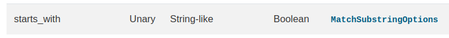
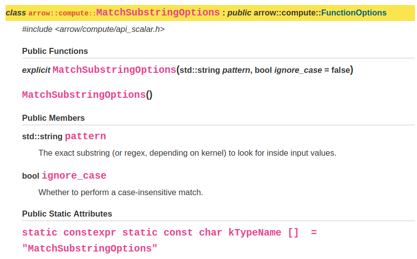

```{r, include=FALSE}
library(arrow, warn.conflicts = FALSE)
library(dplyr, warn.conflicts = FALSE)
```

When writing bindings between C++ compute functions and R functions, the aim is 
to expose the C++ functionality via the same interface as existing R functions. The syntax and
functionality should match that of the existing R functions 
(though there are some exceptions) so that users are able to use existing tidyverse 
or base R syntax, whilst taking advantage of the speed and functionality of the 
underlying arrow package.

One of main ways in which users interact with arrow is via 
[dplyr](https://dplyr.tidyverse.org/) syntax called on Arrow objects.  For 
example, when a user calls `dplyr::mutate()` on an Arrow Tabular, 
Dataset, or arrow data query object, the Arrow implementation of `mutate()` is 
used and under the hood, translates the dplyr code into Arrow C++ code.

When using `dplyr::mutate()` or `dplyr::filter()`, you may want to use functions
from other packages.  The example below uses `stringr::str_detect()`.

```{r}
library(dplyr)
library(stringr)
starwars %>%
  filter(str_detect(name, "Darth"))
```
This functionality has also been implemented in Arrow, e.g.:

```{r}
library(arrow)
arrow_table(starwars) %>%
  filter(str_detect(name, "Darth")) %>%
  collect()
```

This is possible as a **binding** has been created between the call to the 
stringr function `str_detect()` and the Arrow C++ code, here as a direct mapping
to `match_substring_regex`.  You can see this for yourself by inspecting the 
arrow data query object without retrieving the results via `collect()`.


```{r}
arrow_table(starwars) %>%
  filter(str_detect(name, "Darth"))
```

In the following sections, we'll walk through how to create a binding between an 
R function and an Arrow C++ function.

# Walkthrough

Imagine you are writing the bindings for the C++ function 
[`starts_with()`](https://arrow.apache.org/docs/cpp/compute.html#containment-tests) 
and want to bind it to the (base) R function `startsWith()`.

First, take a look at the docs for both of those functions.

## Examining the R function

Here are the docs for R's `startsWith()` (also available at https://stat.ethz.ch/R-manual/R-devel/library/base/html/startsWith.html)

```{r, echo=FALSE, out.width="50%"}
knitr::include_graphics("./startswithdocs.png")
```

It takes 2 parameters; `x` - the input, and `prefix` - the characters to check 
if `x` starts with.

## Examining the C++ function

Now, go to 
[the compute function documentation](https://arrow.apache.org/docs/cpp/compute.html#containment-tests)
and look for the Arrow C++ library's `starts_with()` function:

```{r, echo=FALSE, out.width="100%"}

```

The docs show that `starts_with()` is a unary function, which means that it takes a
single data input. The data input must be a string-like class, and the returned 
value is boolean, both of which match up to R's `startsWith()`.

There is an options class associated with `starts_with()` - called [`MatchSubstringOptions`](https://arrow.apache.org/docs/cpp/api/compute.html#_CPPv4N5arrow7compute21MatchSubstringOptionsE)
- so let's take a look at that.

```{r, echo=FALSE, out.width="100%"}

```

Options classes allow the user to control the behaviour of the function.  In 
this case, there are two possible options which can be supplied - `pattern` and 
`ignore_case`, which are described in the docs shown above.

## Comparing the R and C++ functions

What conclusions can be drawn from what you've seen so far?

Base R's `startsWith()` and Arrow's `starts_with()` operate on equivalent data 
types, return equivalent data types, and as there are no options implemented in 
R that Arrow doesn't have, this should be fairly simple to map without a great 
deal of extra work.  

As `starts_with()` has an options class associated with it, we'll need to make 
sure that it's linked up with this in the R code.

In case you're wondering about the difference between arguments in R and options
in Arrow, in R, arguments to functions can include the actual data to be 
analysed as well as options governing how the function works, whereas in the 
C++ compute functions, the arguments are the data to be analysed and the 
options are for specifying how exactly the function works.

So let's get started.

## Step 1 - add unit tests

We recommend a test-driven-development approach - write failing tests first, 
then check that they fail, and then write the code needed to make them pass.
Thinking up-front about the behavior which needs testing can make it easier to 
reason about the code which needs writing later.

Look up the R function that you want to bind the compute kernel to, and write a 
set of unit tests that use a dplyr pipeline and `compare_dplyr_binding()` (and 
perhaps even `compare_dplyr_error()` if necessary.  These functions compare the 
output of the original function with the dplyr bindings and make sure they match.  
We recommend looking at the [documentation next to the source code for these 
functions](https://github.com/apache/arrow/blob/main/r/tests/testthat/helper-expectation.R)
to get a better understanding of how they work.

You should make sure you're testing all parameters of the R function in your 
tests.

Below is a possible example test for `startsWith()`.

```{r, eval = FALSE}
test_that("startsWith behaves identically in dplyr and Arrow", {
  df <- tibble(x = c("Foo", "bar", "baz", "qux"))
  compare_dplyr_binding(
    .input %>%
        filter(startsWith(x, "b")) %>%
        collect(),
    df
  )

})
```

## Step 2 - Hook up the compute function with options class if necessary

If the C++ compute function can have options specified, make sure that the 
function is linked with its options class in `make_compute_options()` in the 
file `arrow/r/src/compute.cpp`.  You can find out if a compute function requires
options by looking in the docs here: https://arrow.apache.org/docs/cpp/compute.html

In the case of `starts_with()`, it looks something like this:

```cpp
  if (func_name == "starts_with") {
    using Options = arrow::compute::MatchSubstringOptions;
    bool ignore_case = false;
    if (!Rf_isNull(options["ignore_case"])) {
      ignore_case = cpp11::as_cpp<bool>(options["ignore_case"]);
    }
    return std::make_shared<Options>(cpp11::as_cpp<std::string>(options["pattern"]),
                                     ignore_case);
  }
```

You can usually copy and paste from a similar existing example.  In this case, 
as the option `ignore_case` doesn't map to any parameters of `startsWith()`, we 
give it a default value of `false` but if it's been set, use the set value 
instead.  As the `pattern` argument maps directly to `prefix` in `startsWith()`
we can pass it straight through.

## Step 3 - Map the R function to the C++ kernel

The next task is writing the code which binds the R function to the C++ kernel.

### Step 3a - See if direct mapping is appropriate
Compare the C++ function and R function.  If they are simple functions with no 
options, it might be possible to directly map between the C++ and R in 
`unary_function_map`, in the case of compute functions that operate on single 
columns of data, or `binary_function_map` for those which operate on 2 columns 
of data. 

As `startsWith()` requires options, direct mapping is not appropriate.

### Step 3b - If direct mapping not possible, try a modified implementation
If the function cannot be mapped directly, some extra work may be needed to 
ensure that calling the arrow version of the function results in the same result
as calling the R version of the function.  In this case, the function will need 
adding to the `nse_funcs` function registry. Here is how this might look for 
`startsWith()`:

```{r, eval = FALSE}
register_binding("base::startsWith", function(x, prefix) {
  Expression$create(
    "starts_with",
    x,
    options = list(pattern = prefix)
  )
})
```

In the source files, all the `register_binding()` calls are wrapped in functions
that are called on package load. These are separated into files based on
subject matter (e.g., `R/dplyr-funcs-math.R`, `R/dplyr-funcs-string.R`): find the
closest analog to the function whose binding is being defined and define the
new binding in a similar location. For example, the binding for `startsWith()`
is registered in `dplyr-funcs-string.R` next to the binding for `endsWith()`.

Note: we use the namespace-qualified name (i.e. `"base::startsWith"`) for a 
binding. This will register the same binding both as `startsWith()` and as 
`base::startsWith()`, which will allow us to use the `pkg::` prefix in a call.

```{r}
arrow_table(starwars) %>%
  filter(stringr::str_detect(name, "Darth"))
```

Hint:  you can use `call_function()` to call a compute function directly from R.
This might be useful if you want to experiment with a compute function while 
you're writing bindings for it, e.g.

```{r}
call_function(
  "starts_with",
  Array$create(c("Apache", "Arrow", "R", "package")),
  options = list(pattern = "A")
)
```

## Step 4 - Run (and potentially add to) your tests.

In the process of implementing the function, you will need at least one test
to make sure that your binding works and that future changes to the Arrow R
package don't break it! Bindings are tested in files that correspond to
the file in which they were defined (e.g., `startsWith()` is tested in
`tests/testthat/test-dplyr-funcs-string.R`) next to the tests for `endsWith()`.

You may end up implementing more tests, for example if you discover unusual 
edge cases.  This is fine - add them  to the ones you wrote originally,
and run them all.  If they pass, you're done and you can submit a PR. 
If you've modified the C++ code in the 
R package (for example, when hooking up a binding to its options class), you 
should make sure to run `arrow/r/lint.sh` to lint the code.
