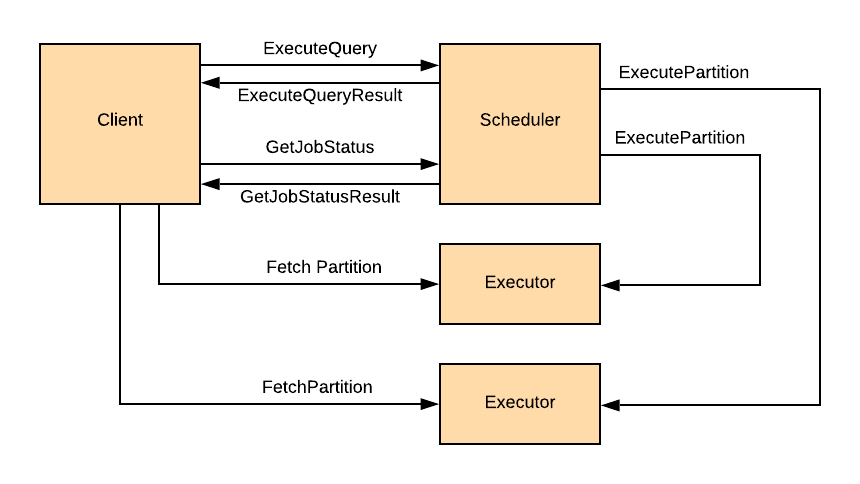

<!---
  Licensed to the Apache Software Foundation (ASF) under one
  or more contributor license agreements.  See the NOTICE file
  distributed with this work for additional information
  regarding copyright ownership.  The ASF licenses this file
  to you under the Apache License, Version 2.0 (the
  "License"); you may not use this file except in compliance
  with the License.  You may obtain a copy of the License at

    http://www.apache.org/licenses/LICENSE-2.0

  Unless required by applicable law or agreed to in writing,
  software distributed under the License is distributed on an
  "AS IS" BASIS, WITHOUT WARRANTIES OR CONDITIONS OF ANY
  KIND, either express or implied.  See the License for the
  specific language governing permissions and limitations
  under the License.
-->
# Ballista Architecture

## Overview

Ballista allows queries to be executed in a distributed cluster. A cluster consists of one or 
more scheduler processes and one or more executor processes. See the following sections in this document for more
details about these components.

The scheduler accepts logical query plans and translates them into physical query plans using DataFusion and then 
runs a secondary planning/optimization process to translate the physical query plan into a distributed physical 
query plan. 

This process breaks a query down into a number of query stages that can be executed independently. There are 
dependencies between query stages and these dependencies form a directionally-acyclic graph (DAG) because a query 
stage cannot start until its child query stages have completed.

Each query stage has one or more partitions that can be processed in parallel by the available 
executors in the cluster. This is the basic unit of scalability in Ballista.

The following diagram shows the flow of requests and responses between the client, scheduler, and executor 
processes. 

## Scheduler Process

The scheduler process implements a gRPC interface (defined in 
[ballista.proto](../rust/ballista/proto/ballista.proto)). The interface provides the following methods:

| Method               | Description                                                          |
|----------------------|----------------------------------------------------------------------|
| ExecuteQuery         | Submit a logical query plan or SQL query for execution               |
| GetExecutorsMetadata | Retrieves a list of executors that have registered with a scheduler  |
| GetFileMetadata      | Retrieve metadata about files available in the cluster file system   |
| GetJobStatus         | Get the status of a submitted query                                  |
| RegisterExecutor     | Executors call this method to register themselves with the scheduler |

The scheduler can run in standalone mode, or can be run in clustered mode using etcd as backing store for state.

## Executor Process

The executor process implements the Apache Arrow Flight gRPC interface and is responsible for:

- Executing query stages and persisting the results to disk in Apache Arrow IPC Format
- Making query stage results available as Flights so that they can be retrieved by other executors as well as by 
  clients

## Rust Client

The Rust client provides a DataFrame API that is a thin wrapper around the DataFusion DataFrame and provides
the means for a client to build a query plan for execution.

The client executes the query plan by submitting an `ExecuteLogicalPlan` request to the scheduler and then calls
`GetJobStatus` to check for completion. On completion, the client receives a list of locations for the Flights 
containing the results for the query and will then connect to the appropriate executor processes to retrieve 
those results.

