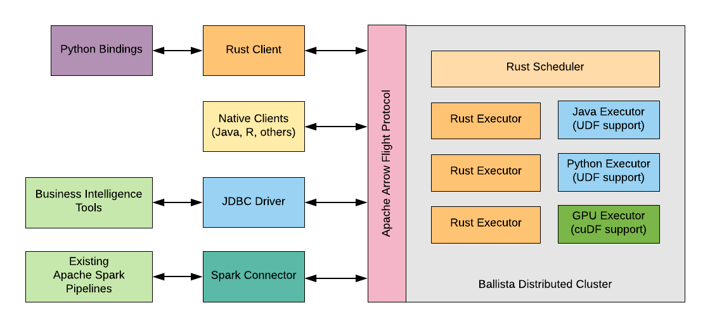

<!---
  Licensed to the Apache Software Foundation (ASF) under one
  or more contributor license agreements.  See the NOTICE file
  distributed with this work for additional information
  regarding copyright ownership.  The ASF licenses this file
  to you under the Apache License, Version 2.0 (the
  "License"); you may not use this file except in compliance
  with the License.  You may obtain a copy of the License at

    http://www.apache.org/licenses/LICENSE-2.0

  Unless required by applicable law or agreed to in writing,
  software distributed under the License is distributed on an
  "AS IS" BASIS, WITHOUT WARRANTIES OR CONDITIONS OF ANY
  KIND, either express or implied.  See the License for the
  specific language governing permissions and limitations
  under the License.
-->

## Overview

Ballista is a distributed compute platform primarily implemented in Rust, and powered by Apache Arrow. It is 
built on an architecture that allows other programming languages to be supported as first-class citizens without paying
a penalty for serialization costs.

The foundational technologies in Ballista are:

- [Apache Arrow](https://arrow.apache.org/) memory model and compute kernels for efficient processing of data.
- [Apache Arrow Flight Protocol](https://arrow.apache.org/blog/2019/10/13/introducing-arrow-flight/) for efficient data transfer between processes.
- [Google Protocol Buffers](https://developers.google.com/protocol-buffers) for serializing query plans.
- [Docker](https://www.docker.com/) for packaging up executors along with user-defined code.

## Architecture

The following diagram highlights some of the integrations that will be possible with this unique architecture. Note that not all components shown here are available yet.

## How does this compare to Apache Spark?

Although Ballista is largely inspired by Apache Spark, there are some key differences.

- The choice of Rust as the main execution language means that memory usage is deterministic and avoids the overhead of GC pauses.
- Ballista is designed from the ground up to use columnar data, enabling a number of efficiencies such as vectorized 
processing (SIMD and GPU) and efficient compression. Although Spark does have some columnar support, it is still 
largely row-based today.
- The combination of Rust and Arrow provides excellent memory efficiency and memory usage can be 5x - 10x lower than Apache Spark in some cases, which means that more processing can fit on a single node, reducing the overhead of distributed compute.
- The use of Apache Arrow as the memory model and network protocol means that data can be exchanged between executors in any programming language with minimal serialization overhead.
  
## Status

Ballista is at the proof-of-concept phase currently but is under active development by a growing community.