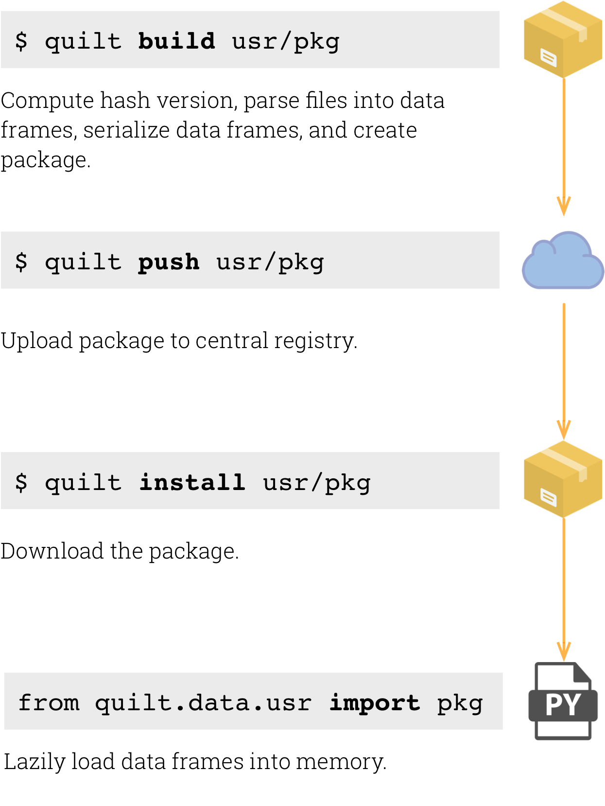

<!--

Licensed to the Apache Software Foundation (ASF) under one or more
contributor license agreements.  See the NOTICE file distributed with
this work for additional information regarding copyright ownership.
The ASF licenses this file to you under the Apache License, Version 2.0
(the "License"); you may not use this file except in compliance with
the License.  You may obtain a copy of the License at

http://www.apache.org/licenses/LICENSE-2.0

Unless required by applicable law or agreed to in writing, software
distributed under the License is distributed on an "AS IS" BASIS,
WITHOUT WARRANTIES OR CONDITIONS OF ANY KIND, either express or implied.
See the License for the specific language governing permissions and
limitations under the License.

-->

*[Kevin Moore][1] is a co-founder and CEO of [Quilt Data][2]*

Building a Package Manager for Data with Apache Arrow
========================
Late last year, our 3-person team set out to create something like "npm for big data." We wanted to make versioned data frames of any size available across a variety of languages, including Python, Spark, and R. We chose Apache Arrow as the foundation for our project for three reasons: (1) Arrow is being written from the start to have strong <b>cross-platform support</b> (2) Arrow’s columnar data format is designed to be <b>efficient</b> for transfer and analysis and (3) Arrow specifies a portable <b>in-memory</b> format and includes libraries to read and write data. Building on Arrow has let our small team get Quilt up and running quickly and will soon help us make data portable across platforms.

# A Package Manager for Data
On our last project, my teammates and I worked with large genomics datasets and were frustrated by the process of searching for and downloading the data in files. As Python programmers, we wanted the process of working with a new dataset to be as easy as: `pip install the_data_I_want`. Furthermore, the idea of [data packages][3] seemed a convenient way to combine data of many types--structured data, unstructured text, images, etc.--as well as metadata that describe their contents and relationships. What we missed was a package manager to host and distribute data packages for our analysis.

## Docker Analogy
We’re big users of Docker. As we started working with data packages, we realized we wanted to create and deploy them like we do with Docker containers. Docker makes it easy to build containers and saved versioned snapshots. We wanted to do the same with data packages so we modeled the command-line interface on Docker.

## DataFrames for Tabular Data
We chose to focus special attention on tabular data. For Python data scientists, the `pandas.DataFrame` is the workhorse for columnar data. Whether data are coming from CSVs, databases, or from a web API, the first step for us (and seemingly most data scientists) is usually to load it into Pandas. Our goal was to make DataFrames part of packages so users can skip right to analysis without worrying about getting data into and out of files.

## Cross Platform Data
We wanted Quilt packages to work across the core languages of data science. A DataFrame in a package should be accessible as a DataFrame in Python, R and Spark.

# The Challenge: Efficient Cross-Platform Data
For unstructured data and images, we knew we could simply wrap and transport files in their native format. The trick was how we would handle tabular data in a way that felt natural to users in any language. In other words, how could we store and deliver DataFrames efficiently on all platforms.

## Storing Tabular Data in <b>Parquet</b>
We chose [Apache Parquet][4] to store tabular data because of its efficiency and widespread support, especially in the Hadoop and Spark communities. Parquet stores data in column chunks packed into row groups. Each column can be encoded in its own format and compressed. Columnar data formats like Parquet save storage and bandwidth because (1) they tend to be more easily and effectively compressed and, (2) they make it easy to read only a subset of columns.  In addition to being commonly used in Hadoop and Spark applications, Parquet is readable by several popular open-source SQL in-place query engines, including Hive, Impala and PrestoDB.

When we started, Parquet support in Python was limited. In fact, searching for an open-source library to read and write Parquet files was how we discovered the Arrow project in the first place. We tested two Parquet libraries, fastparquet and pyarrow. The two libraries performed similarly for serializing and deserializing Pandas DataFrames to and from Parquet and in early versions we included hooks for both.

## Bringing Data Packages into Memory with <b>Arrow</b>
In addition to a storage format, to present tabular data in a consistent, ready-to-analyze state across platforms, we need to define a common <b>in-memory</b> representation of tabular data in packages. Arrow is exactly that. With Arrow, tabular data can be packaged as Arrow tables, ensuring that they have the exact same presentation in Python, R and Spark.

We built the  Quilt client for Python on top of Pandas and pyarrow, which in turn builds on Arrow C++ and Parquet C++. We’re currently working with the open-source community to write clients for R and Spark. Those efforts will be able to leverage the same core libraries (Arrow C++ and Parquet C++). In addition to saving code and development effort, using the same foundation libraries will ensure that the resulting Quilt clients represent data from Quilt packages in the same way.

# Quilt
[Quilt](https://github.com/quiltdata/quilt) is an open-source tool that lets users bundle data and metadata into data packages that are directly importable into Python--and soon R and Spark. The basic process includes the following steps:

# How it Works Today (in Python)
<b>Build:</b>
Quilt uses Pandas to read data from text files (e.g., CSV), databases and other sources into DataFrames. Arrow converts from DataFrames (e.g., Pandas in Python) into Arrow Tables. The Arrow Tables are then saved to Parquet using:  pyarrow.parquet.write_table.

<b>Push:</b>
Quilt users can push data packages to a [registry](https://github.com/quiltdata/quilt-registry) (like a Docker registry).

<b>Install:</b>
Install downloads package metadata and data from the registry and installs them locally.

<b>Import:</b>
Resident packages (either built locally or installed from a registry) can be imported as objects into Python (e.g., from quilt.data.uciml import iris). For tabular data nodes, Quilt uses Arrow to load data from Parquet into a ParquetDataSet. Quilt then loads the ParquetDataset into an Arrow Table using ParquetDataset.read. By default, Quilt converts the Arrow Table to a Pandas DataFrame using pyarrow.table.to_pandas(). In the future, we plan to add a method to quilt.DataNode that returns the Arrow Table so that Quilt packages can be used with Arrow-compatible analysis tools.

# Next Steps
We bet on Arrow because of its active community, rapid evolution and cross-platform compatibility. In addition to R and Spark support, we’re eager to see it integrated into querying and analysis tools, e.g., fast snapshotting of database queries in turbodc. We hope that Quilt will be a valuable complement to Arrow and the ecosystem it creates. Quilt users will be able to share and publish datasets in a form that’s readily importable to Python, R and Spark and compatible with all applications built on Apache Arrow.

[1]: https://www.linkedin.com/in/kevinemoore/
[2]: https://quiltdata.com
[3]: http://frictionlessdata.io/data-packages/
[4]: https://parquet.apache.org/